# Agent 责任链

## 概述

Snail AI 的 Agent 执行引擎基于**责任链模式（Chain of Responsibility）** 设计。每次用户对话请求在 Server 端依次经过 10 个处理器（Handler），每个 Handler 负责一个独立的关注点，处理完毕后将上下文传递给下一个 Handler，最终由 `LlmCallHandler` 将请求分发到 Client 节点执行。

```mermaid
graph LR
    A["InitContext<br/>order=0"] --> B["Conversation<br/>order=5"]
    B --> C["ModelResolve<br/>order=10"]
    C --> D["SystemPrompt<br/>order=15"]
    D --> E["Mcp<br/>order=20"]
    E --> F["SkillAgent<br/>order=30"]
    F --> G["WebSearch<br/>order=35"]
    G --> H["ContextCollector<br/>order=40"]
    H --> I["Rag<br/>order=50"]
    I --> J["LlmCall<br/>order=80"]

    style A fill:#1abc9c,color:#fff
    style B fill:#2ecc71,color:#fff
    style C fill:#3498db,color:#fff
    style D fill:#9b59b6,color:#fff
    style E fill:#e74c3c,color:#fff
    style F fill:#f39c12,color:#fff
    style G fill:#e67e22,color:#fff
    style H fill:#16a085,color:#fff
    style I fill:#8e44ad,color:#fff
    style J fill:#c0392b,color:#fff
```

## 完整调用时序

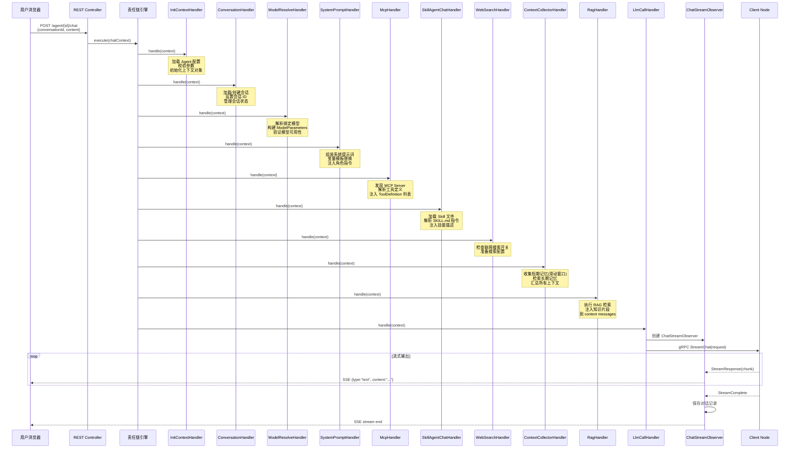

## Handler 详解

### 1. InitContextHandler (order=0)

**职责：** 初始化整个对话请求的上下文对象。

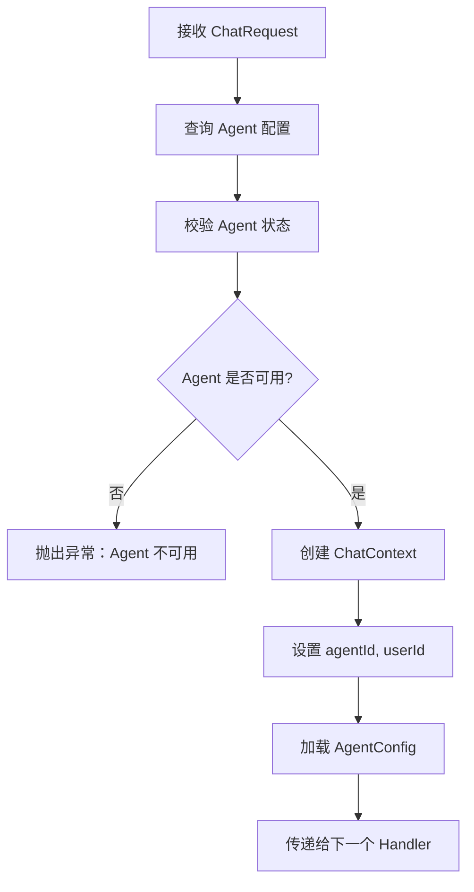

**ChatContext 核心字段：**

| 字段 | 类型 | 说明 |
|------|------|------|
| `agentId` | Long | 智能体 ID |
| `userId` | Long | 当前用户 ID |
| `conversationId` | String | 会话 ID |
| `agentConfig` | AgentConfig | 智能体完整配置 |
| `messages` | List\<Message\> | 消息列表（逐步填充） |
| `tools` | List\<ToolDefinition\> | 工具列表（MCP/Skill 注入） |
| `modelParameters` | ModelParameters | 模型调用参数 |
| `systemPrompt` | String | 系统提示词 |
| `metadata` | Map | 扩展元数据 |

### 2. ConversationHandler (order=5)

**职责：** 管理会话状态，加载或创建会话。

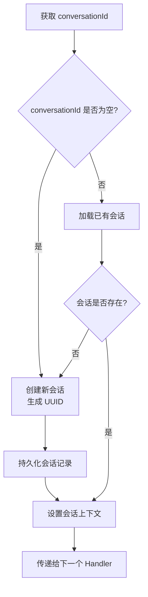

### 3. ModelResolveHandler (order=10)

**职责：** 解析智能体绑定的模型配置，构建模型调用参数。

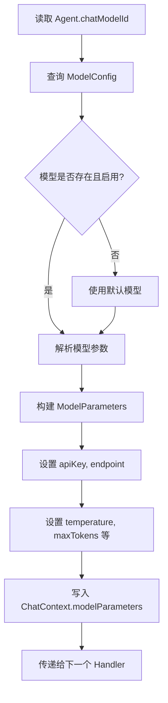

**ModelParameters 结构：**

| 参数 | 说明 | 默认值 |
|------|------|--------|
| `modelName` | 模型名称 | Agent 绑定的模型 |
| `apiKey` | API 密钥 | 加密存储，运行时解密 |
| `apiEndpoint` | API 地址 | 模型配置中的 endpoint |
| `temperature` | 温度系数 | 0.7 |
| `maxTokens` | 最大输出 Token | 4096 |

### 4. SystemPromptHandler (order=15)

**职责：** 组装系统提示词。

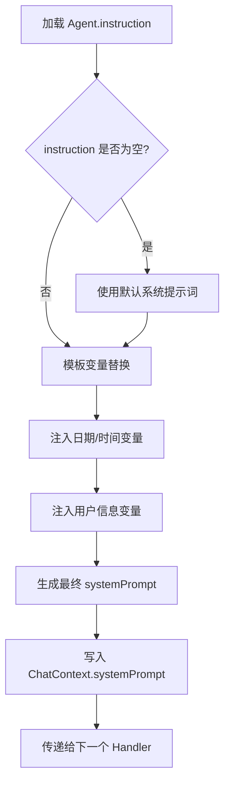

### 5. McpHandler (order=20)

**职责：** 发现并注册智能体绑定的 MCP 工具。

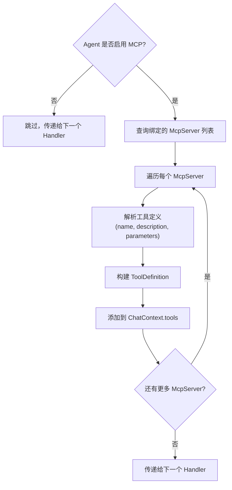

### 6. SkillAgentChatHandler (order=30)

**职责：** 加载技能指令，将技能内容注入到上下文中。

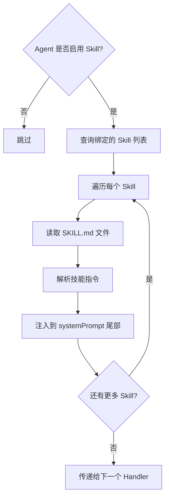

### 7. WebSearchHandler (order=35)

**职责：** 准备 Web 搜索能力。

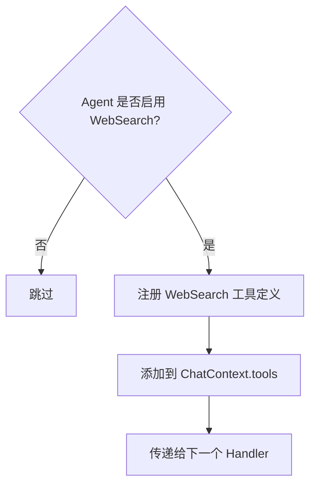

### 8. ContextCollectorHandler (order=40)

**职责：** 收集历史对话和长期记忆，构建完整的消息上下文。

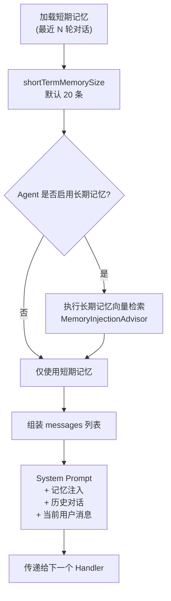

### 9. RagHandler (order=50)

**职责：** 执行 RAG 知识检索，将相关知识片段注入到上下文中。

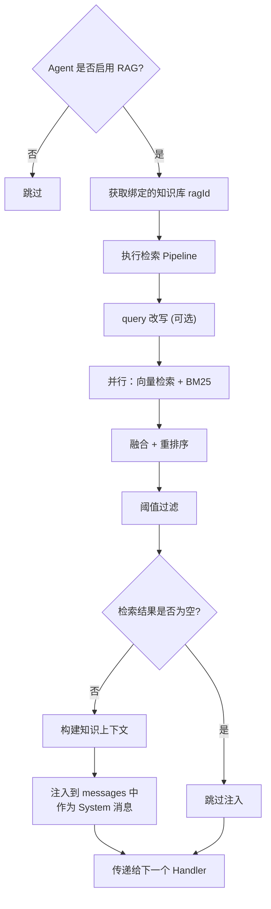

### 10. LlmCallHandler (order=80)

**职责：** 将准备好的上下文通过 gRPC 分发到 Client 节点执行。这是责任链的终端节点。

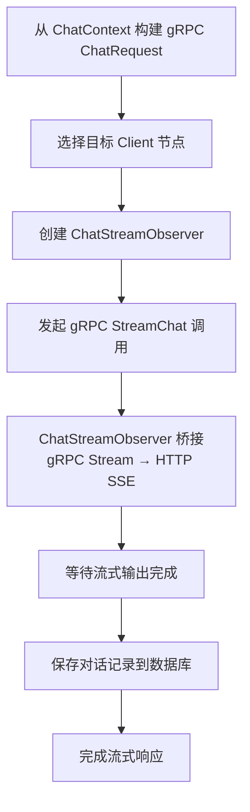

## ChatStreamObserver：gRPC 到 SSE 的桥接

`ChatStreamObserver` 是连接 gRPC 双向流与 HTTP SSE 的核心组件，负责将 Client 端的流式模型输出实时转发给前端。

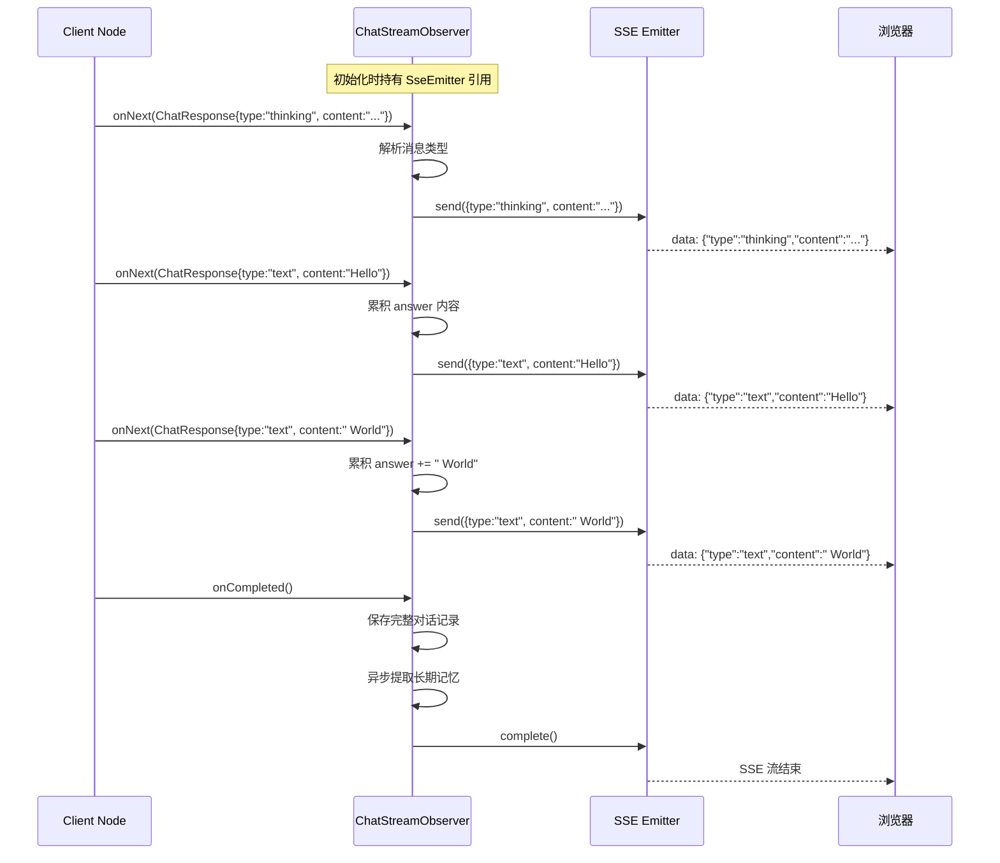

**Observer 消息类型：**

| type | 说明 | 前端处理 |
|------|------|----------|
| `thinking` | 模型思考过程（推理模型） | 显示在折叠的"思考过程"区域 |
| `text` | 正文内容 | 实时追加到回答区域 |
| `tool_call` | 工具调用信息 | 显示工具调用状态 |
| `error` | 错误信息 | 显示错误提示 |
| `done` | 流结束标记 | 结束加载状态 |

## Client 端 Advisor 流水线

当请求通过 gRPC 到达 Client 节点后，Client 端的 **Advisor 流水线**（基于 Spring AI Advisor 机制）会对请求进行二次处理。当前开源版本内置 5 个主要 Advisor：

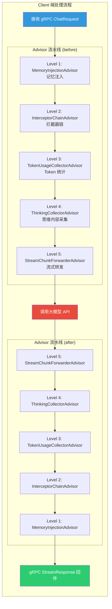

### Advisor 层级说明

| 层级 | Advisor | 阶段 | 职责 |
|------|---------|------|------|
| Level 1 | **MemoryInjectionAdvisor** | Before | 注入对话历史与记忆上下文 |
| Level 2 | **InterceptorChainAdvisor** | Before/After | 桥接 `SnailAiInterceptor` 拦截器链 |
| Level 3 | **TokenUsageCollectorAdvisor** | Stream | 统计输入/输出 Token 用量 |
| Level 4 | **ThinkingCollectorAdvisor** | Stream | 收集模型思考内容 |
| Level 5 | **StreamChunkForwarderAdvisor** | Stream | 转发流式响应并累积完整文本 |

### Agentic Loop（工具调用循环）

当大模型返回工具调用请求时，Client 端会进入 **Agentic Loop**：

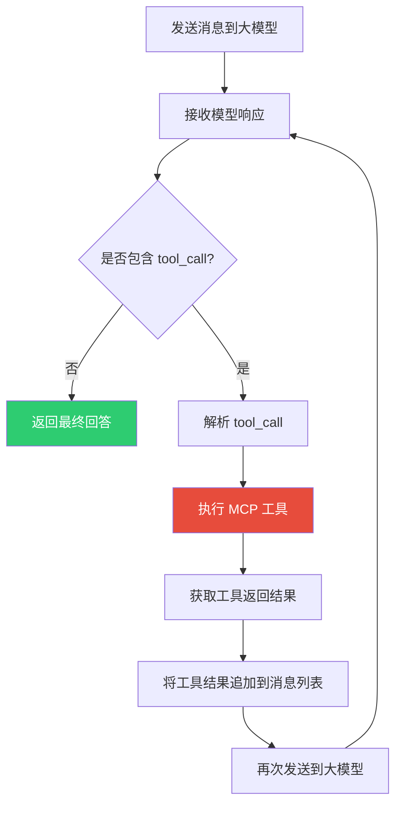

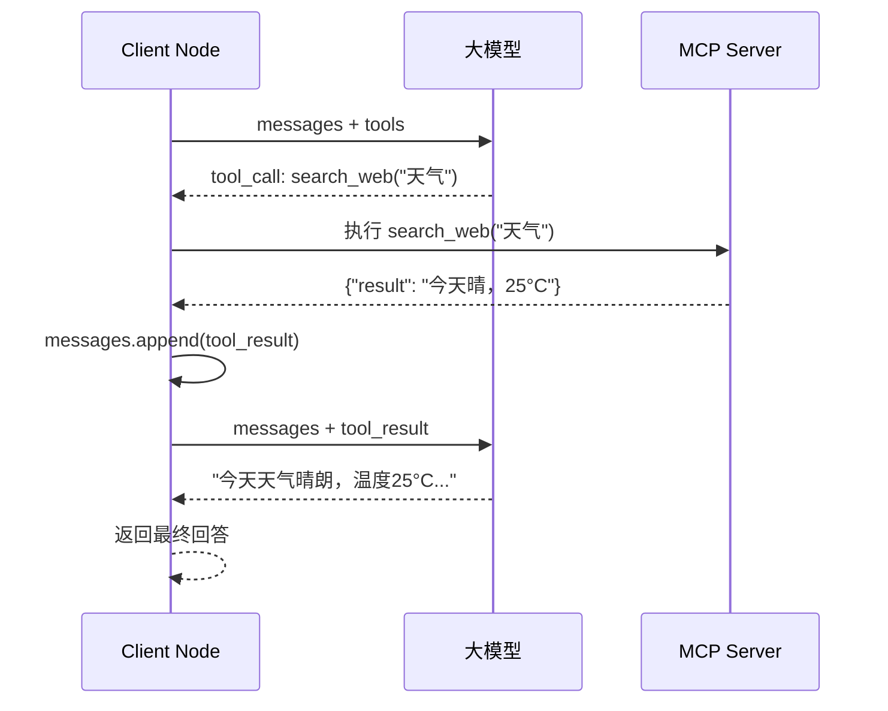

## 扩展点

### 自定义 Handler

开发者可以通过实现 `ChatHandler` 接口并设置 `order` 值来插入自定义 Handler：

```java
@Component
public class CustomHandler implements ChatHandler {
    
    @Override
    public int getOrder() {
        return 25; // 在 McpHandler(20) 之后，SkillHandler(30) 之前
    }
    
    @Override
    public void handle(ChatContext context) {
        // 自定义逻辑
        // 例如：企业合规检查、请求限流、审计日志等
    }
}
```

**可用的 order 空位：**

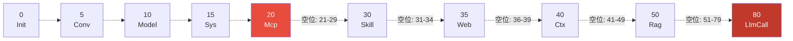

### 自定义 Advisor

Client 端的 Advisor 流水线同样支持扩展：

```java
@Component
public class AuditAdvisor implements ChatClientAdvisor {
    
    @Override
    public int getOrder() {
        return 45; // Level 4-5 之间
    }
    
    @Override
    public AdvisedRequest adviseRequest(AdvisedRequest request) {
        // 请求前处理：审计日志记录
        auditLog.record(request);
        return request;
    }
    
    @Override
    public AdvisedResponse adviseResponse(AdvisedResponse response) {
        // 响应后处理：合规检查
        complianceCheck(response);
        return response;
    }
}
```

## 责任链 vs Advisor 流水线

两者共同构成 Snail AI 的完整处理流水线，但运行在不同节点、关注不同层面：

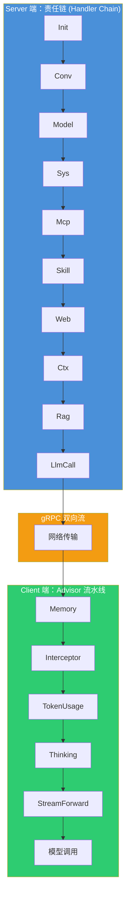

| 维度 | 责任链 (Server) | Advisor 流水线 (Client) |
|------|-----------------|------------------------|
| **运行节点** | Server | Client |
| **处理对象** | 业务上下文 (ChatContext) | 模型请求/响应 (Request/Response) |
| **关注层面** | 业务编排（知识检索、记忆注入、上下文组装） | 执行控制（日志、Token 统计、思维内容采集） |
| **扩展方式** | 实现 ChatHandler 接口 | 实现 ChatClientAdvisor 接口 |
| **配置方式** | Spring Bean 自动发现 | Spring Bean 自动发现 |
