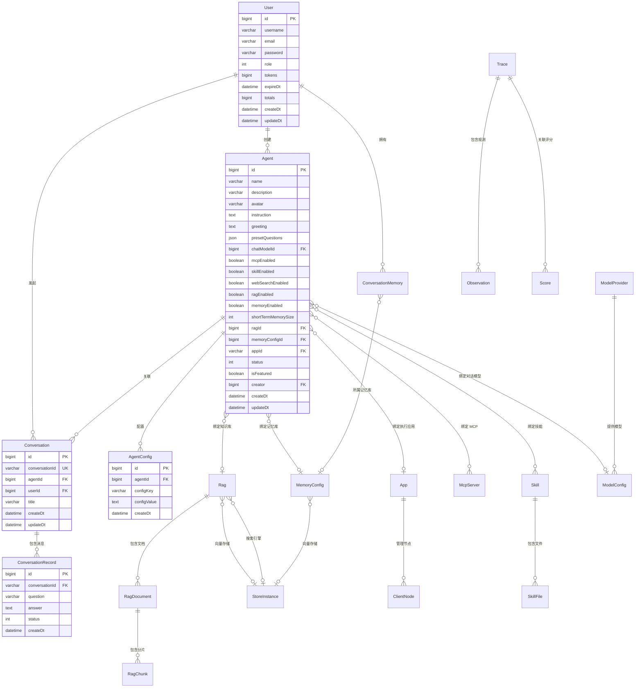
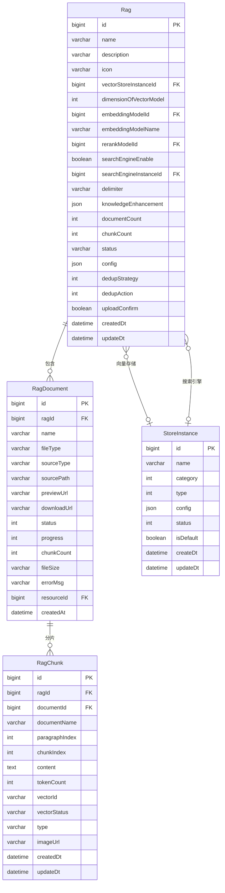
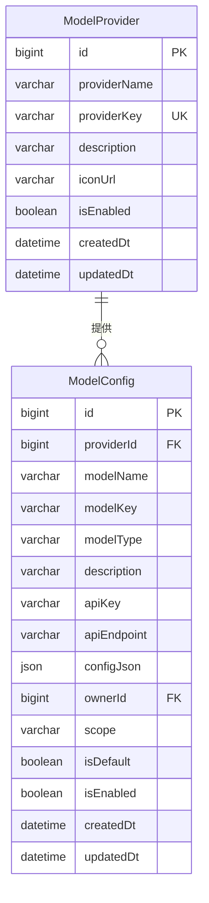
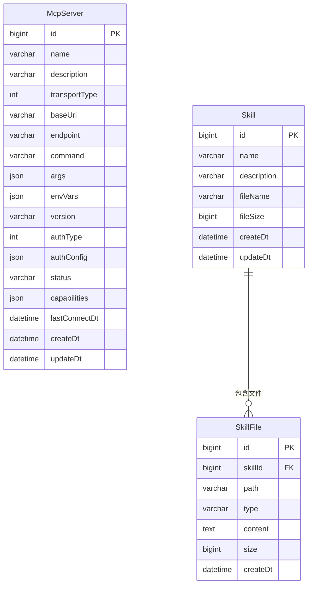
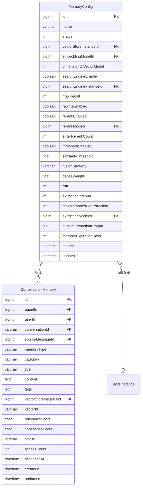
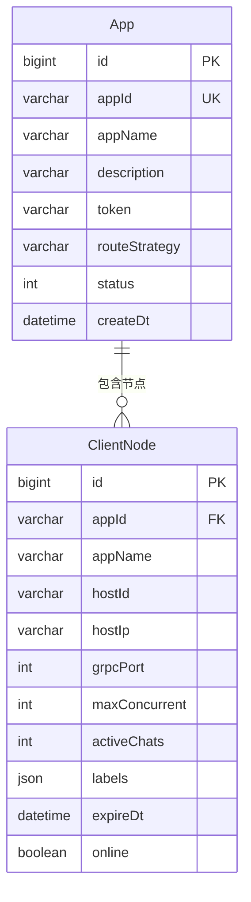
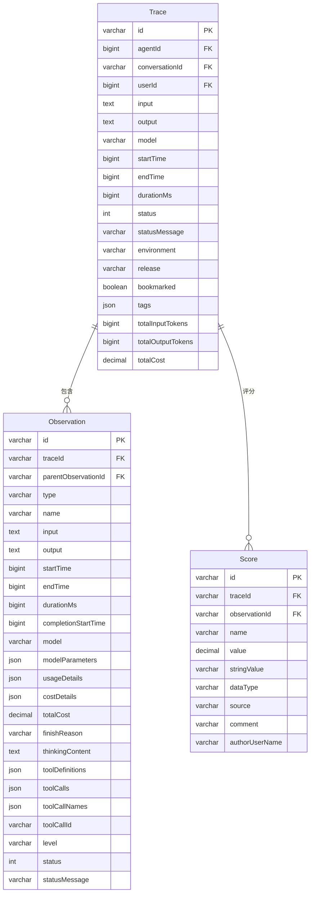
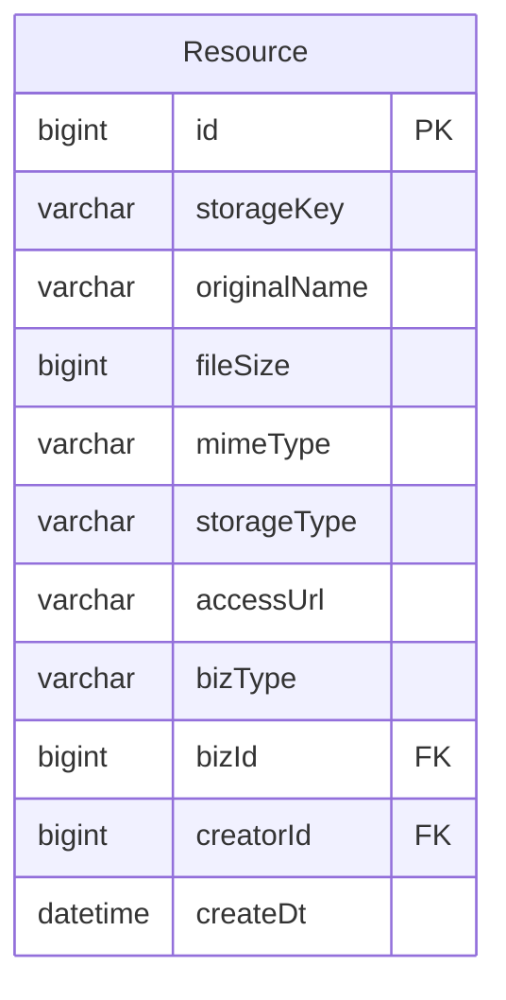
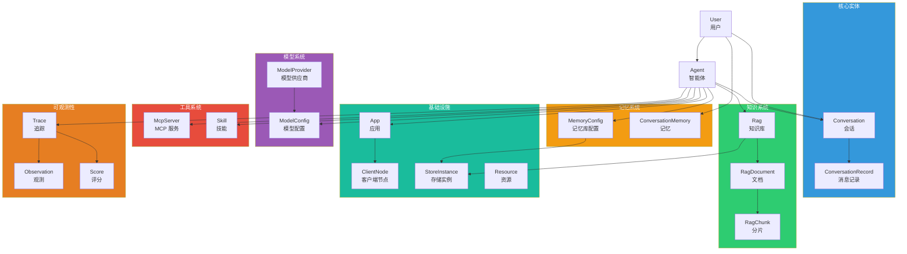

# 数据模型

## 概述

Snail AI 的数据模型围绕 **Agent（智能体）** 这一核心实体展开，通过关联关系连接对话、知识库、模型、工具、技能、记忆等子系统。本文档使用 ER 图展示核心实体及其关系，并说明数据库设计规范。

## 核心 ER 图

## 知识库相关实体

## 模型相关实体

**模型类型枚举（ModelType）：**

| 值 | 说明 | 用途 |
|----|------|------|
| `CHAT` | 对话模型 | Agent 对话、记忆抽取、Query 改写 |
| `EMBEDDING` | 嵌入模型 | RAG 向量化、记忆向量化 |
| `RERANKER` | 重排序模型 | RAG 检索精排、记忆检索精排 |
| `IMAGE` | 图像模型 | 图像生成 |
| `SPEECH` | 语音模型 | 语音合成/识别 |

**模型作用域（ModelScope）：**

| 值 | 说明 |
|----|------|
| `GLOBAL` | 全局模型，所有用户可用 |
| `PERSONAL` | 个人模型，仅创建者可用 |

## MCP 与技能实体

**MCP 传输类型（TransportType）：**

| 值 | 说明 |
|----|------|
| `1` | SSE (Server-Sent Events) |
| `2` | Streamable HTTP |
| `3` | Stdio（本地进程） |

**MCP 认证类型（AuthType）：**

| 值 | 说明 |
|----|------|
| `0` | 无认证 |
| `1` | API Key |
| `2` | Bearer Token |
| `3` | OAuth 2.0 |

## 记忆相关实体

## 应用与分布式实体

## 追踪与可观测性实体

**Observation 类型（ObservationType）：**

| 类型 | 说明 |
|------|------|
| `GENERATION` | 大模型调用（含输入/输出 Token、费用） |
| `TOOL` | 工具调用（MCP 工具执行） |
| `THINKING` | 思考过程（推理模型的 chain-of-thought） |
| `SPAN` | 通用执行段（如责任链某个 Handler） |
| `EVENT` | 事件节点 |
| `AGENT` | Agent 级别的观测 |
| `RETRIEVER` | RAG 检索 |
| `EMBEDDING` | 向量嵌入 |

**Score 数据类型：**

| 类型 | 说明 |
|------|------|
| `NUMERIC` | 数值型（如 1-5 星评分） |
| `CATEGORICAL` | 分类型（如 "positive" / "negative"） |
| `BOOLEAN` | 布尔型（如 "有帮助" / "无帮助"） |
| `TEXT` | 文本型（自由评论） |

## 资源管理实体

**bizType 业务类型：**

| 值 | 说明 |
|----|------|
| `AGENT_AVATAR` | 智能体头像 |
| `RAG_DOCUMENT` | RAG 文档 |
| `SKILL_FILE` | 技能文件 |
| `CHAT_IMAGE` | 对话中的图片 |

## 全局 ER 关系总览

## 数据库设计规范

### 表命名约定

| 前缀 | 所属模块 | 示例 |
|------|----------|------|
| `t_agent_` | 智能体 | `t_agent_info`, `t_agent_config` |
| `t_conversation_` | 对话 | `t_conversation_info`, `t_conversation_record` |
| `t_rag_` | 知识库 | `t_rag_info`, `t_rag_document`, `t_rag_chunk` |
| `t_model_` | 模型 | `t_model_provider`, `t_model_config` |
| `t_mcp_` | MCP | `t_mcp_server` |
| `t_skill_` | 技能 | `t_skill_info`, `t_skill_file` |
| `t_memory_` | 记忆 | `t_memory_info`, `t_memory_config` |
| `t_app_` | 应用 | `t_app_info`, `t_app_client_node` |
| `t_trace_` | 追踪 | `t_trace_info`, `t_trace_observation`, `t_trace_score` |
| `t_resource_` | 资源 | `t_resource_info` |
| `t_user_` | 用户 | `t_user_info` |
| `t_store_` | 存储 | `t_store_instance` |

### 通用字段规范

| 字段 | 类型 | 说明 |
|------|------|------|
| `id` | BIGINT AUTO_INCREMENT | 主键 |
| `create_dt` | DATETIME | 创建时间 |
| `update_dt` | DATETIME | 更新时间 |
| `is_deleted` | TINYINT(1) | 逻辑删除标记（0=未删除, 1=已删除） |

