# 分布式架构

## 架构概述

Snail AI 采用 **Server-Agent Client** 分布式拓扑结构。Server 作为中央调度节点负责请求编排、知识检索、对话管理等业务逻辑；Agent Client 作为执行节点负责实际的大模型调用、MCP 工具执行等计算密集型任务。两者通过 gRPC 双向流通信，实现了关注点分离和水平扩展。

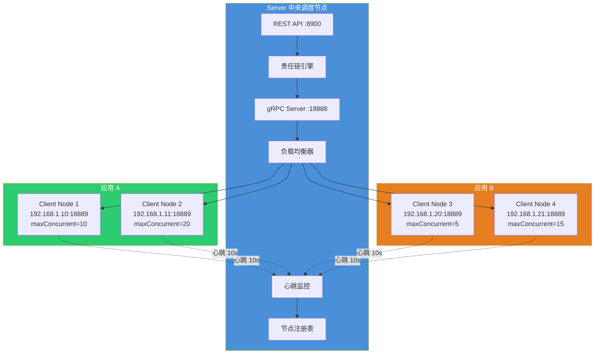

## Server 与 Client 职责划分

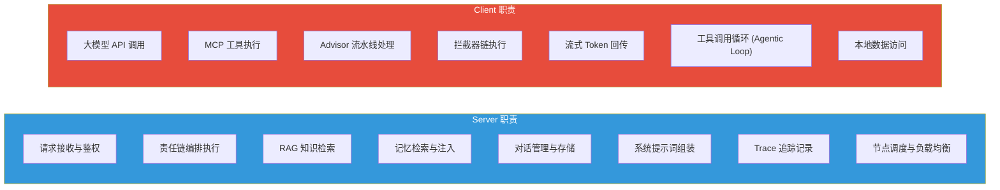

| 维度 | Server | Client |
|------|--------|--------|
| **核心定位** | 编排调度 | 执行计算 |
| **部署方式** | 单节点/高可用 | 多节点水平扩展 |
| **数据访问** | 数据库 + 向量库 + 文件存储 | 本地资源 + 外部 API |
| **计算特征** | I/O 密集（数据库查询） | 计算密集（模型调用） |
| **网络通信** | HTTP 入口 + gRPC 出口 | gRPC 入口 + HTTPS 出口（模型API） |
| **扩展方式** | 垂直扩展 | 水平扩展（加节点） |

## gRPC 双向流通信

Server 与 Client 之间通过 gRPC **双向流（Bidirectional Streaming）** 通信，支持大模型流式输出的实时回传。

### 通信流程

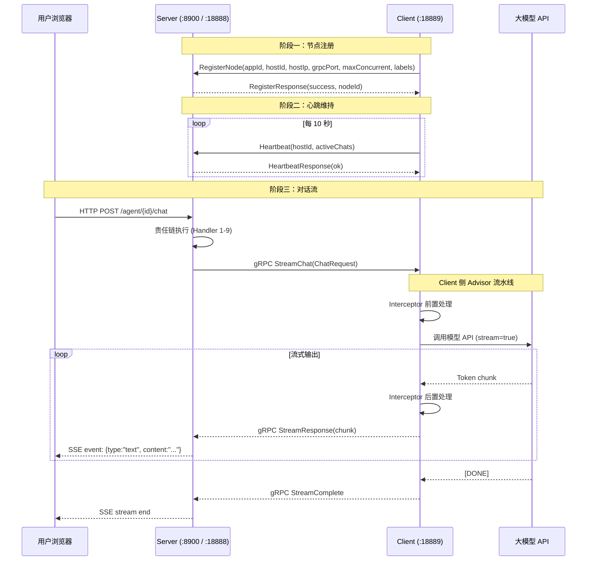

### Proto 定义概览

```protobuf
service AgentService {
  // 节点注册
  rpc RegisterNode(RegisterRequest) returns (RegisterResponse);
  
  // 心跳上报
  rpc Heartbeat(HeartbeatRequest) returns (HeartbeatResponse);
  
  // 双向流对话
  rpc StreamChat(ChatRequest) returns (stream ChatResponse);
}

message ChatRequest {
  string conversationId = 1;
  string model = 2;
  repeated Message messages = 3;
  repeated ToolDefinition tools = 4;
  ModelParameters parameters = 5;
}

message ChatResponse {
  string type = 1;      // "text" | "thinking" | "tool_call" | "error" | "done"
  string content = 2;
  ToolCallInfo toolCall = 3;
}
```

## 节点注册与心跳

### 注册流程

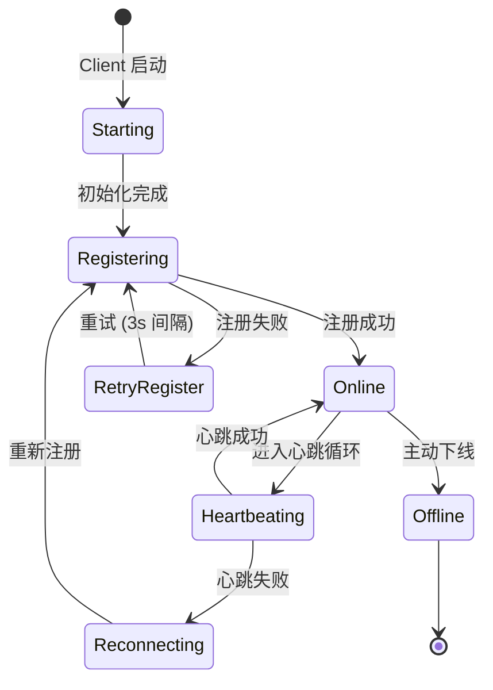

Client 节点启动后，向 Server 发送注册请求，携带以下信息：

| 注册字段 | 说明 | 示例 |
|----------|------|------|
| `appId` | 所属应用 ID | `order-ai-app` |
| `hostId` | 节点唯一标识 | `node-001` |
| `hostIp` | 节点 IP 地址 | `192.168.1.10` |
| `grpcPort` | Client gRPC 端口 | `18889` |
| `maxConcurrent` | 最大并发对话数 | `10` |
| `labels` | 节点标签（用于路由） | `{"gpu":"A100", "region":"east"}` |

### 心跳机制

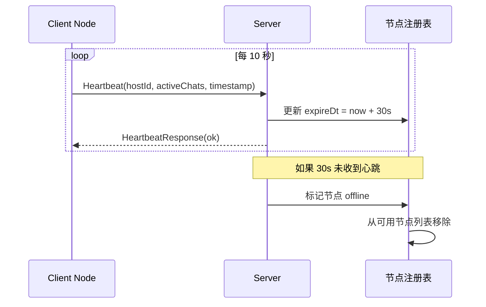

**关键参数：**

| 参数 | 值 | 说明 |
|------|-----|------|
| 心跳间隔 | 10 秒 | Client 每 10 秒发送一次心跳 |
| 过期时间 | 30 秒 | 超过 30 秒未收到心跳，Server 标记节点离线 |
| 重试策略 | 3 次/3s | 心跳失败重试 3 次，间隔 3 秒 |
| 重新注册 | 自动 | 重试耗尽后自动触发重新注册流程 |

### 节点生命周期

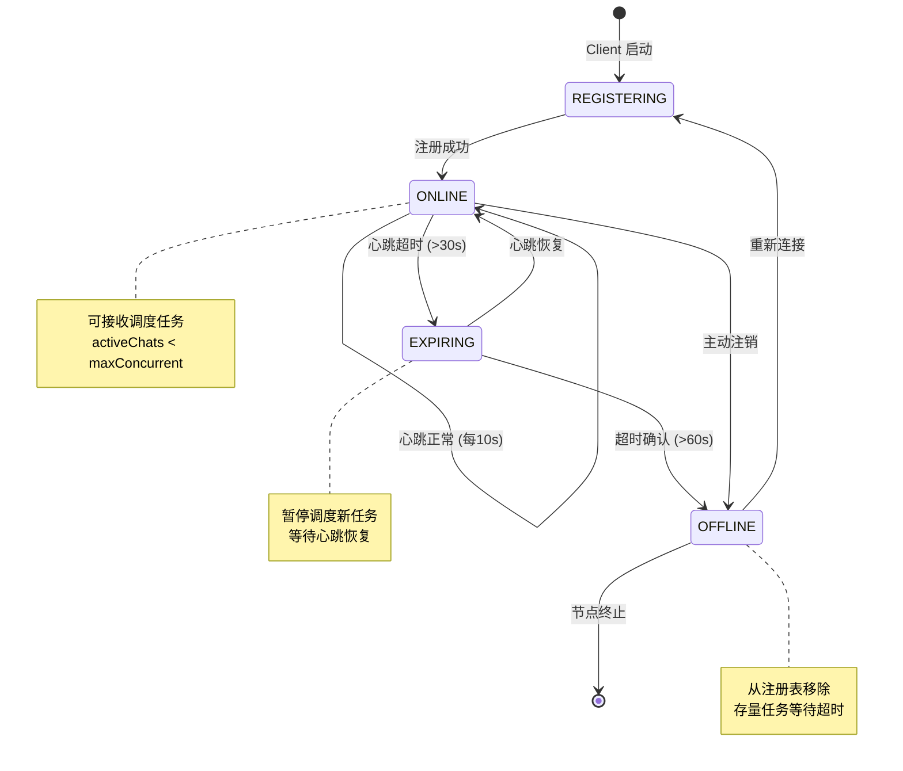

## 负载均衡策略

Snail AI 提供 **6 种负载均衡策略**，可按应用（App）级别配置：

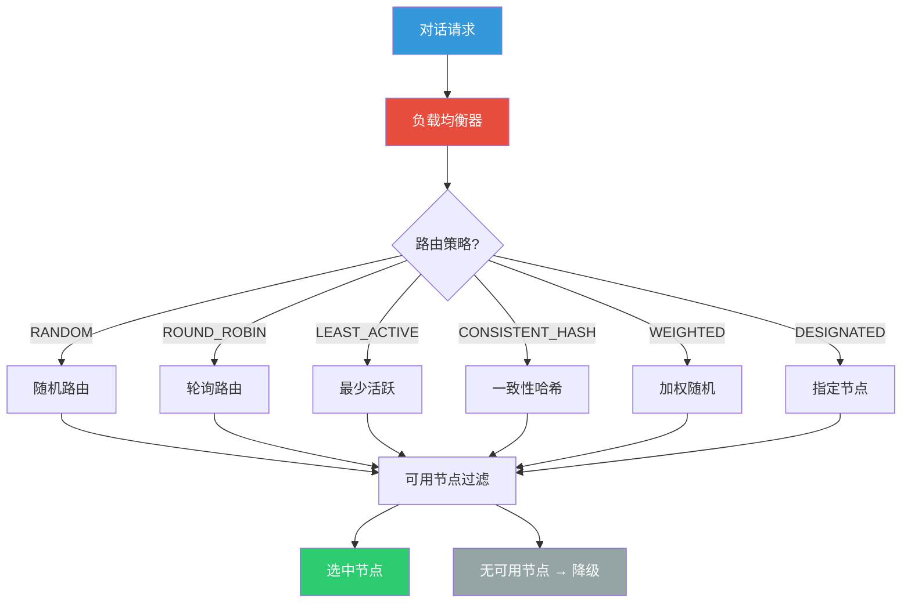

### 策略详解

| 策略 | 标识 | 算法 | 适用场景 |
|------|------|------|----------|
| **随机路由** | `RANDOM` | 从可用节点中随机选取 | 节点能力均等，通用场景 |
| **轮询路由** | `ROUND_ROBIN` | 按序依次分配 | 请求量均匀分散 |
| **最少活跃** | `LEAST_ACTIVE` | 选择当前 `activeChats` 最少的节点 | 负载敏感型，推荐默认 |
| **一致性哈希** | `CONSISTENT_HASH` | 基于 `conversationId` 哈希选择 | 同一对话固定到同一节点 |
| **加权随机** | `WEIGHTED` | 按 `maxConcurrent` 权重加权随机 | 异构节点（GPU 算力不同） |
| **指定节点** | `DESIGNATED` | 根据 Agent 配置路由到指定节点 | 特定模型仅部署在特定节点 |

### 策略选择决策图

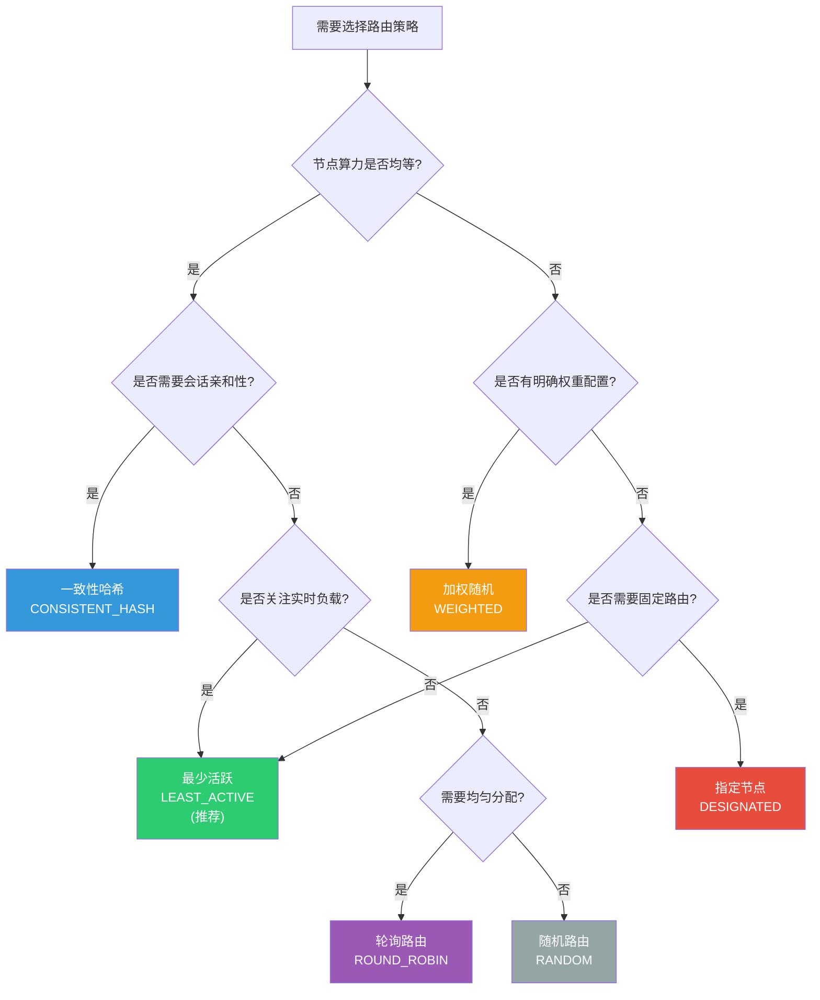

## 水平扩展模式

### 单 Server + 多 Client

最常见的部署模式，适合中小规模场景：

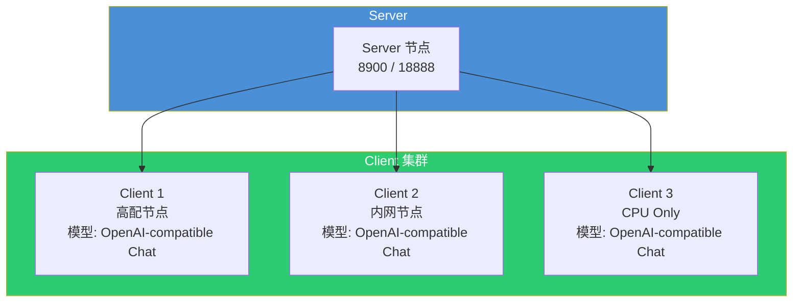

### 多应用隔离模式

不同业务线使用独立的 Client 集群，通过 App 实现资源隔离：

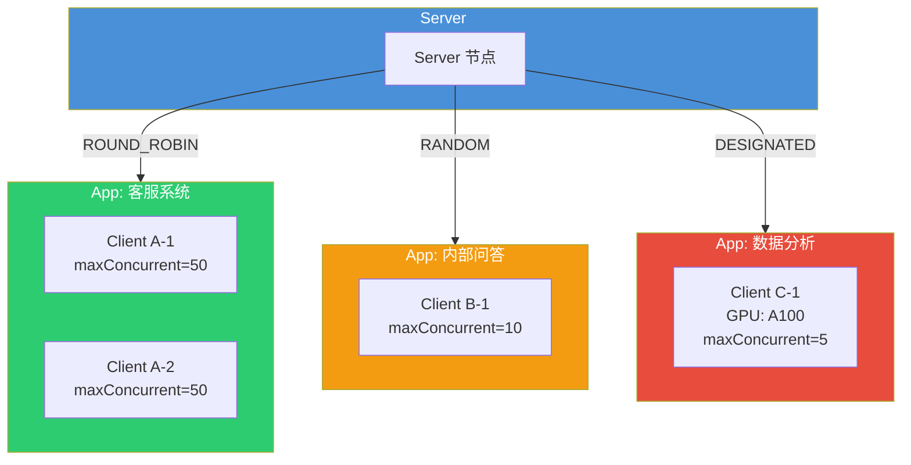

## 故障容错

### 故障场景与处理

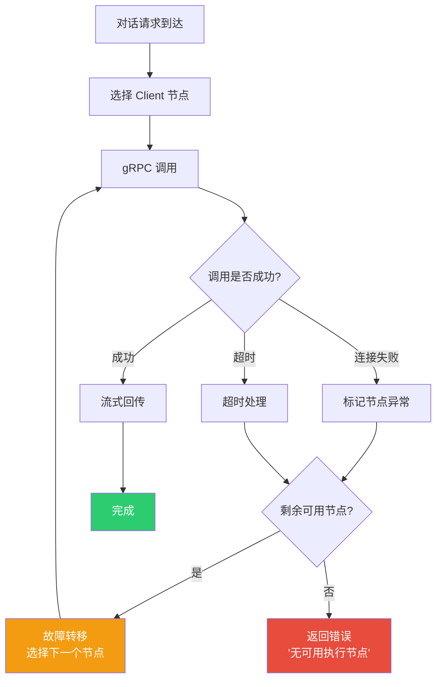

| 故障场景 | 处理策略 | 说明 |
|----------|----------|------|
| Client 节点宕机 | 心跳超时自动摘除 | 30s 无心跳标记离线，不再分配新任务 |
| gRPC 连接失败 | 故障转移到其他节点 | 自动选择下一个可用节点重试 |
| 模型调用超时 | 超时返回错误 | 可配置超时时间，默认 120s |
| Client 过载 | 负载均衡规避 | `LEAST_ACTIVE` 策略自动规避高负载节点 |
| Server 重启 | Client 自动重新注册 | Client 检测到连接断开后触发重新注册 |

### 优雅下线

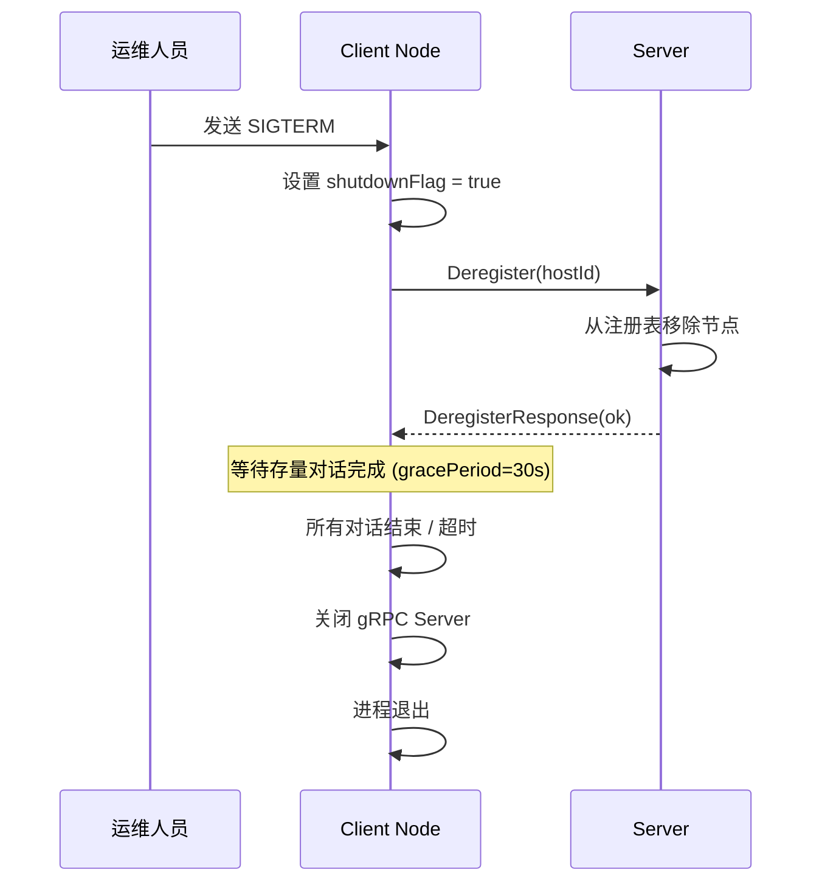

## 多节点部署配置

### Server 端配置

```yaml
# application.yml - Server 配置
snail-ai:
  grpc:
    server:
      port: 18888
      # 节点过期时间（秒），超过此时间未收到心跳标记离线
      node-expire-seconds: 30
      # 最大消息大小
      max-message-size: 16MB
```

### Client 端配置

```yaml
# application.yml - Client 配置
snail-ai:
  client:
    # 所属应用 ID（需在 Server 管理后台预先创建）
    app-id: my-ai-app
    # 节点唯一标识（同一 App 下不可重复）
    host-id: node-001
    # Server gRPC 地址
    server-address: 192.168.1.100:18888
    grpc:
      port: 18889
    # 最大并发对话数
    max-concurrent: 10
    # 心跳间隔（秒）
    heartbeat-interval: 10
    # 节点标签（可用于路由决策）
    labels:
      gpu: A100
      region: east
      env: production
```

### Docker Compose 多节点示例

```yaml
version: '3.8'
services:
  server:
    image: snail-ai/server:latest
    ports:
      - "8900:8900"
      - "18888:18888"
    environment:
      - SPRING_DATASOURCE_URL=jdbc:mysql://db:3306/snail_ai

  client-1:
    image: snail-ai/client:latest
    environment:
      - SNAIL_AI_CLIENT_APP_ID=default
      - SNAIL_AI_CLIENT_HOST_ID=client-1
      - SNAIL_AI_CLIENT_SERVER_ADDRESS=server:18888
      - SNAIL_AI_CLIENT_MAX_CONCURRENT=10

  client-2:
    image: snail-ai/client:latest
    environment:
      - SNAIL_AI_CLIENT_APP_ID=default
      - SNAIL_AI_CLIENT_HOST_ID=client-2
      - SNAIL_AI_CLIENT_SERVER_ADDRESS=server:18888
      - SNAIL_AI_CLIENT_MAX_CONCURRENT=20

  client-3:
    image: snail-ai/client:latest
    environment:
      - SNAIL_AI_CLIENT_APP_ID=high-perf
      - SNAIL_AI_CLIENT_HOST_ID=client-3
      - SNAIL_AI_CLIENT_SERVER_ADDRESS=server:18888
      - SNAIL_AI_CLIENT_MAX_CONCURRENT=5
      - SNAIL_AI_CLIENT_LABELS_GPU=A100
```
