# 记忆架构

## 概述

Snail AI 的记忆系统为智能体提供**跨对话的信息持久化能力**，使 Agent 能够"记住"用户的偏好、历史决策和关键信息。记忆系统分为 **短期记忆** 和 **长期记忆** 两个层面，通过不同的机制协同工作，在保持上下文连贯性的同时控制 Token 消耗。

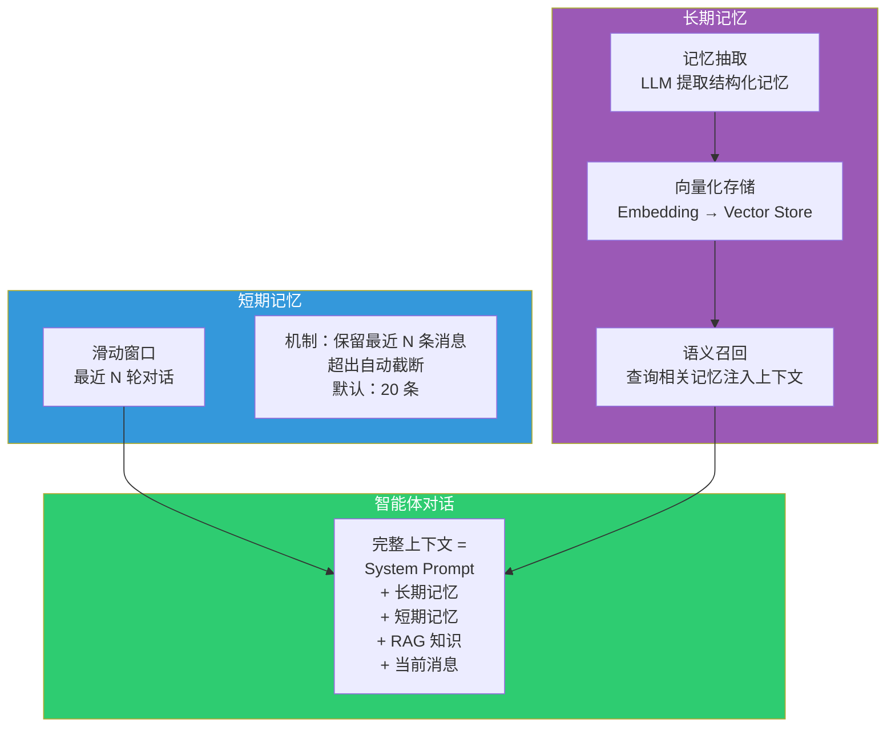

## 短期记忆：滑动窗口

短期记忆采用**滑动窗口（Sliding Window）** 机制，保留当前会话中最近的 N 条消息。当消息数量超过窗口大小时，最早的消息被自动截断。

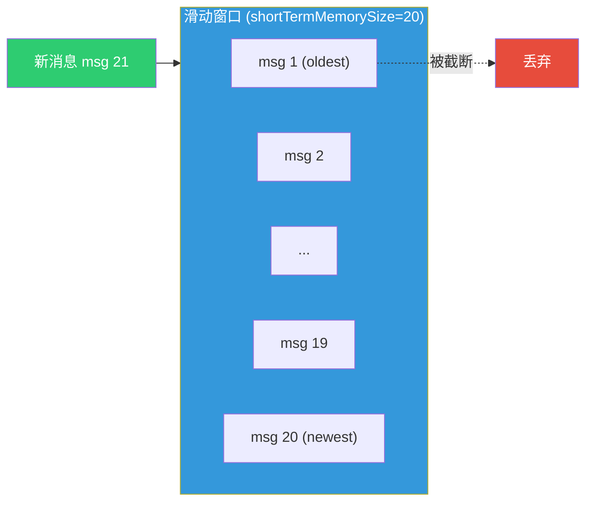

### 配置参数

| 参数 | 位置 | 说明 | 默认值 |
|------|------|------|--------|
| `shortTermMemorySize` | Agent 配置 | 滑动窗口保留的消息条数 | 20 |

### 工作原理

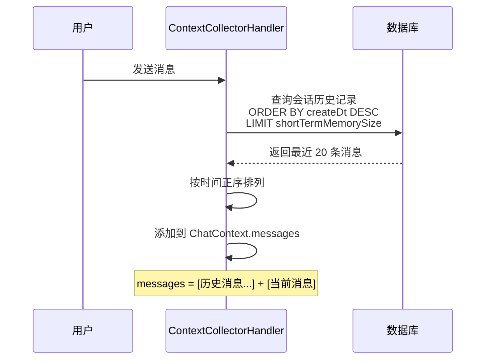

**设计考量：**

- **为什么不保留全部历史？** 大模型的上下文窗口有限（4K-128K Token），且 Token 计费与长度正相关。滑动窗口在保持上下文连贯性和控制成本之间取得平衡。
- **窗口大小建议：** 一般对话场景 20 条即可；需要长上下文的分析场景可调大至 50-100 条。

## 长期记忆：向量化召回

长期记忆通过 **LLM 抽取 → 向量化存储 → 语义召回** 三个阶段实现跨会话的信息持久化。

### 记忆抽取

在对话完成后，系统会异步调用 LLM 从对话内容中提取结构化的记忆条目：

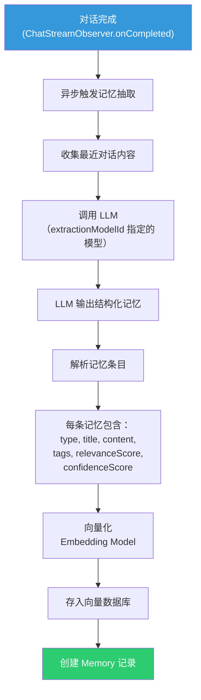

**抽取配置（MemoryConfig）：**

| 参数 | 说明 | 默认值 |
|------|------|--------|
| `extractionModelId` | 用于抽取记忆的对话模型 ID | Agent 绑定的模型 |
| `extractionInterval` | 抽取间隔（每 N 轮对话抽取一次） | 5 |
| `maxMemoriesPerExtraction` | 单次抽取的最大记忆条数 | 10 |
| `customExtractionPrompt` | 自定义抽取提示词 | 系统默认 |
| `memoryExpirationDays` | 记忆过期天数 | 无限 |

### 记忆类型

Snail AI 定义了 **5 种记忆类型**，覆盖不同维度的用户信息：

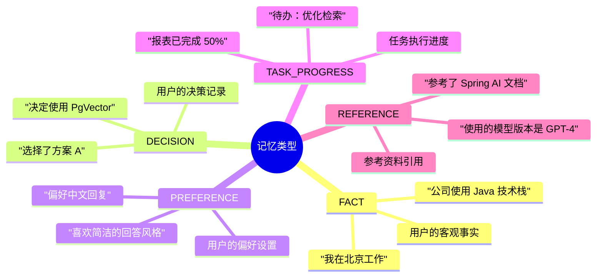

| 类型 | 标识 | 说明 | 典型示例 |
|------|------|------|----------|
| **事实** | `FACT` | 用户陈述的客观事实 | "我们部门有 30 人" |
| **决策** | `DECISION` | 用户做出的决策或结论 | "我们决定使用微服务架构" |
| **偏好** | `PREFERENCE` | 用户表达的喜好和倾向 | "请用表格形式回答" |
| **任务进度** | `TASK_PROGRESS` | 正在进行的任务状态 | "数据迁移已完成 80%" |
| **参考资料** | `REFERENCE` | 提及的文档、链接等引用 | "参考了 RFC 7231 规范" |

### 记忆生命周期状态机

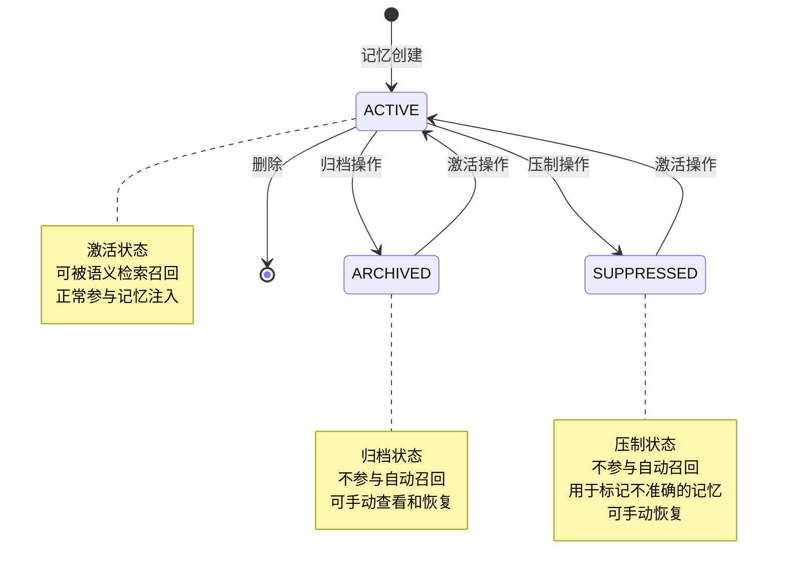

**状态转换 API：**

| 操作 | API 端点 | 说明 |
|------|----------|------|
| 归档 | `POST /memory/{id}/archive` | ACTIVE → ARCHIVED |
| 压制 | `POST /memory/{id}/suppress` | ACTIVE → SUPPRESSED |
| 激活 | `POST /memory/{id}/activate` | ARCHIVED/SUPPRESSED → ACTIVE |
| 删除 | `DELETE /memory/{id}` | 永久删除 |

### 记忆数据模型

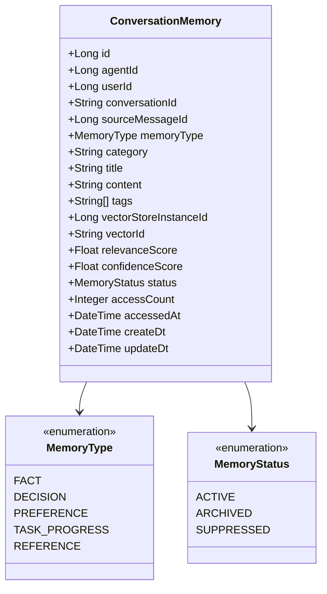

## 记忆注入：MemoryInjectionAdvisor

`MemoryInjectionAdvisor` 负责在对话请求处理过程中，将相关的长期记忆检索出来并注入到 Agent 的上下文中。

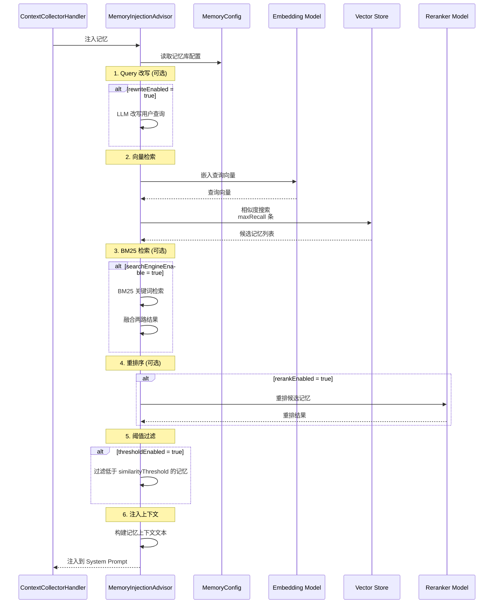

### 记忆注入格式

记忆被注入到系统提示词中，格式如下：

```
## 用户历史记忆

以下是该用户的历史记忆信息，请在回答时参考：

- [事实] 用户在北京的互联网公司工作，团队使用 Java 技术栈
- [偏好] 用户喜欢简洁清晰的回答，偏好使用代码示例说明
- [决策] 用户决定项目使用 Spring Boot 4 + Spring AI 2.0
- [任务进度] 数据库迁移项目已完成 PostgreSQL 部分，下一步是达梦适配
```

## 记忆库配置（MemoryConfig）

每个智能体可以绑定一个独立的**记忆库配置**，包含记忆检索和抽取的全部参数：

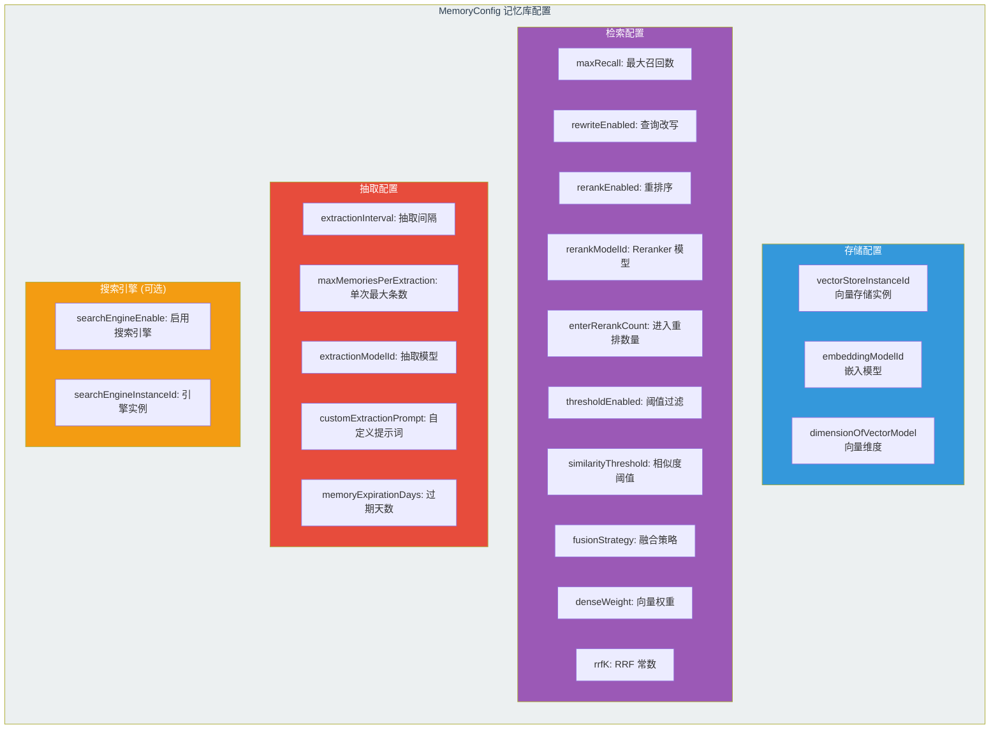

### Agent 与 MemoryConfig 的关系

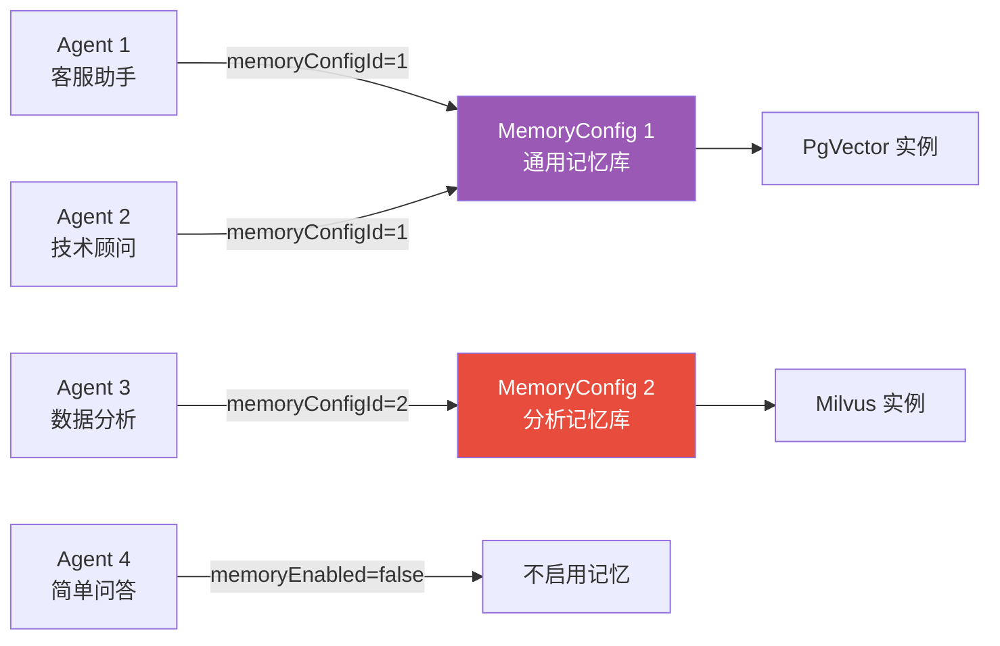

**设计说明：** 记忆库配置与智能体是**多对一**关系——多个智能体可以共享同一个记忆库配置，但每个智能体只能绑定一个记忆库。记忆数据本身按 `agentId + userId` 进行隔离，即使共享记忆库配置，不同智能体/用户的记忆也互不干扰。

## 存储后端

### 记忆存储流程

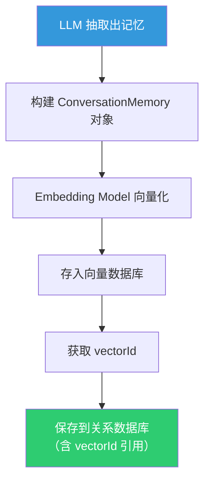

**双重存储：**

- **关系数据库** -- 存储记忆的结构化元数据（类型、标题、内容、状态、标签等）
- **向量数据库** -- 存储记忆内容的向量表示，用于语义检索

### 记忆检索流程

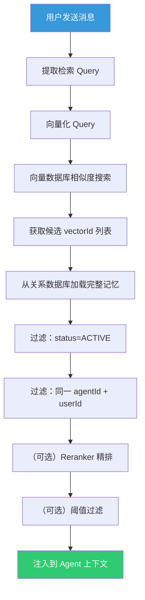

## 记忆统计与调试

### 统计指标

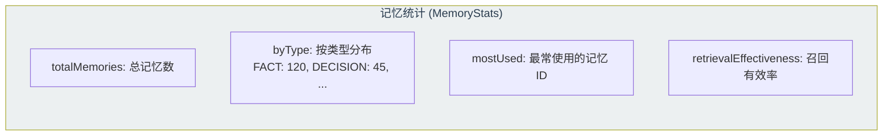

### 上下文预览

`ContextPreview` API 允许调试完整的 Agent 上下文组装结果：

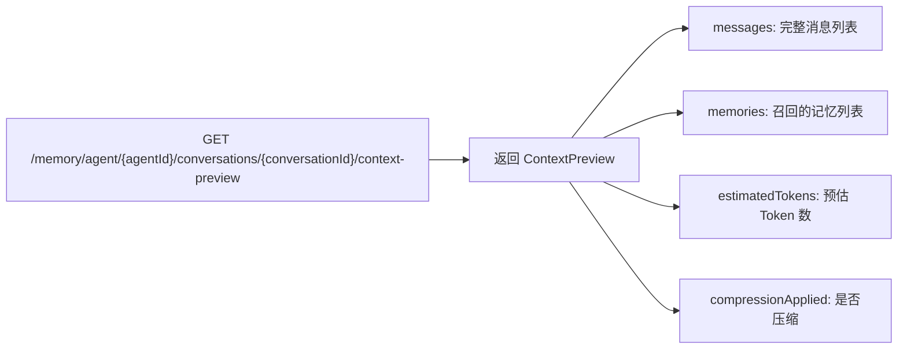

### 记忆调试

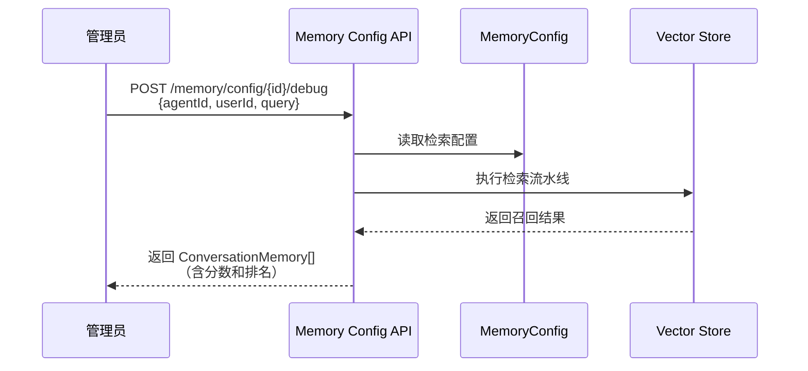

管理员可以使用 Debug API 测试记忆检索的效果，模拟特定用户的查询，查看召回的记忆列表及其相关性分数，用于调优检索参数。

## 端到端流程总结

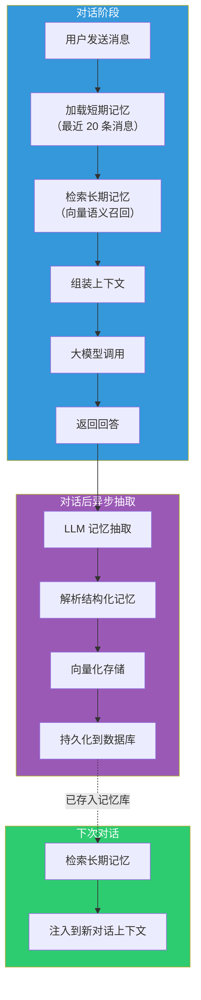
