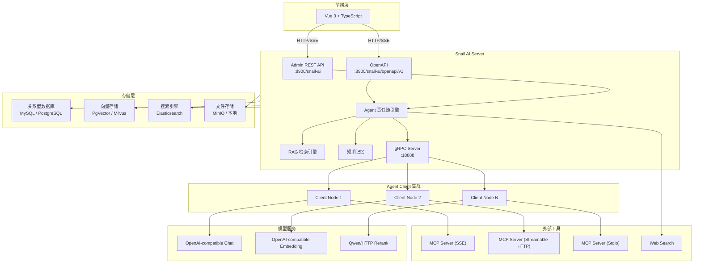
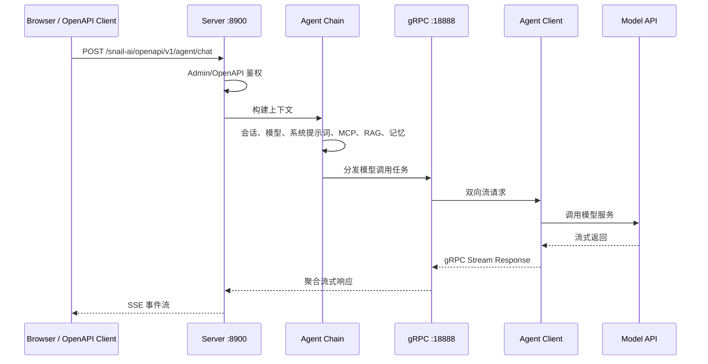
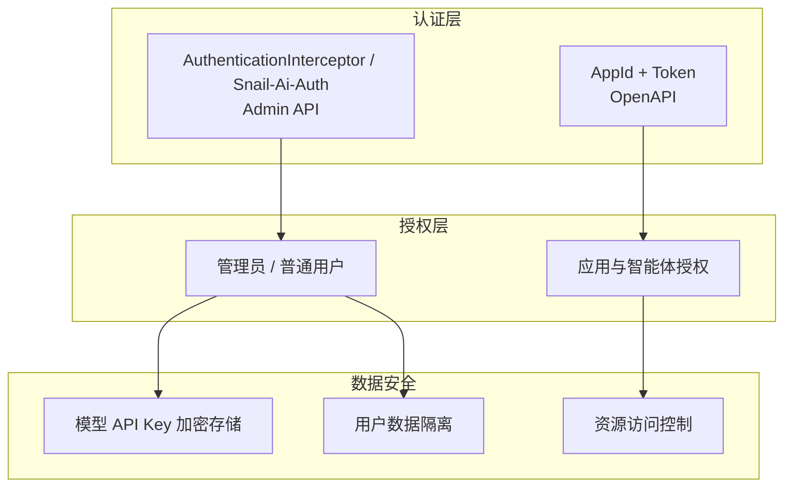

# 系统架构总览

本文以当前 Snail AI 0.0.6 源码结构为准，说明系统的运行架构、模块划分、请求链路和安全边界。

## 概览

Snail AI 采用 Server-Agent 分布式架构：前端和外部系统通过 HTTP/SSE 访问 Server，Server 通过 gRPC 将模型调用和工具执行任务分发给 Agent Client。

默认端口：

| 端口 | 协议 | 用途 |
|------|------|------|
| `8900` | HTTP/SSE | Admin API、OpenAPI、管理端页面请求 |
| `18888` | gRPC | Server 端 gRPC 监听，接收 Client 注册、心跳和任务流 |

## 当前支持状态

| 能力 | 状态 | 对应源码或脚本 |
|------|------|----------------|
| Admin API | 已支持 | `snail-ai-server/snail-ai-server-admin` |
| OpenAPI | 已支持 | `snail-ai-server/snail-ai-server-openapi` |
| Agent 责任链 | 已支持 | `snail-ai-server/snail-ai-server-features` |
| Agent Client | 已支持 | `snail-ai-agent` |
| OpenAI-compatible Chat | 已支持 | `snail-ai-models` |
| OpenAI-compatible Embedding | 已支持 | `snail-ai-models` |
| Qwen/HTTP Rerank | 已支持 | `snail-ai-models` |
| MySQL / PostgreSQL | 已支持 | `docs/sql/` |
| PgVector / Milvus / Elasticsearch | 已支持 | `docs/docker/docker-compose.yaml` |
| SQL Server / 达梦 / MariaDB | 规划或适配方向 | 不建议按当前版本直接部署 |

## 整体架构



如果 Claude、Gemini、Ollama、火山引擎等服务提供 OpenAI-compatible 接口，可以按兼容端点方式验证接入；它们不应被描述为当前源码内置的一等 Provider。

## Maven 模块结构

当前根 `pom.xml` 的顶层模块如下：

```text
snail-ai/
├── snail-ai-commons
├── snail-ai-models
├── snail-ai-server
├── snail-ai-agent
└── snail-ai-starter
```

| 模块 | 定位 | 核心内容 |
|------|------|----------|
| `snail-ai-commons` | 共享基础层 | 常量、DTO、枚举、gRPC Proto、通用工具和异常 |
| `snail-ai-models` | 模型能力层 | Chat、Embedding、Rerank 等模型调用适配 |
| `snail-ai-server` | 服务端业务层 | Admin、OpenAPI、Features、Persistence 等服务端子模块 |
| `snail-ai-agent` | Agent Client 层 | Client 启动、工具执行、拦截器、Advisor、gRPC 处理 |
| `snail-ai-starter` | 启动模块 | Spring Boot 入口、自动配置、`application.yml` |

典型依赖关系：

```text
snail-ai-starter
├── snail-ai-server
│   ├── snail-ai-server-admin
│   ├── snail-ai-server-openapi
│   ├── snail-ai-server-features
│   └── snail-ai-server-persistence
├── snail-ai-agent
├── snail-ai-models
└── snail-ai-commons
```

## 请求生命周期

一次流式对话请求的大致链路如下：



OpenAPI 外部集成使用认证头：

```http
Snail-Ai-App-Id: <your-app-id>
Snail-Ai-Token: <your-app-token>
```

Admin API 和智能体对话会话使用 `Snail-Ai-Auth`，不要混用。

## 责任链阶段

Agent 责任链会按配置和请求上下文执行多个阶段，常见阶段包括：

| 阶段 | 作用 |
|------|------|
| 初始化上下文 | 构建用户、智能体、会话和调用上下文 |
| 会话处理 | 加载或创建对话上下文 |
| 模型解析 | 解析智能体绑定模型和调用参数 |
| 系统提示词 | 组装角色设定和系统约束 |
| MCP / Skill / Tool | 加载可用工具和技能 |
| RAG 检索 | 按智能体绑定知识库进行检索 |
| 短期记忆 | 按配置加载会话记忆 |
| LLM 调用 | 通过 gRPC 分发给 Agent Client 执行模型调用 |

## 数据与存储边界

| 数据类型 | 推荐存储 | 说明 |
|----------|----------|------|
| 用户、智能体、应用、模型配置 | MySQL / PostgreSQL | 使用当前版本提供的初始化脚本 |
| 文档资源和上传文件 | MinIO / 本地目录 | 生产多节点建议 MinIO |
| 向量数据 | PgVector / Milvus | 根据规模选择 |
| 全文检索 | Elasticsearch | 适合 BM25、关键词和混合检索 |
| 短期记忆 | memory / db | 由 `snail-ai.memory.short-term.store-type` 控制 |

## 安全架构



| 安全层面 | 实现方式 |
|----------|----------|
| Admin 会话认证 | `Snail-Ai-Auth` 登录态 |
| OpenAPI 外部认证 | `Snail-Ai-App-Id` + `Snail-Ai-Token` |
| 角色管理 | 管理员 / 普通用户 |
| 密钥安全 | 模型 API Key 加密存储 |
| 数据隔离 | 用户、智能体、应用维度隔离 |

## 相关源码

- `pom.xml`
- `snail-ai-starter/src/main/resources/application.yml`
- `snail-ai-server/snail-ai-server-admin/src/main/java/com/aizuda/snail/ai/admin/controller/`
- `snail-ai-server/snail-ai-server-openapi/src/main/java/com/aizuda/snail/ai/openapi/controller/`
- `snail-ai-server/snail-ai-server-features/`
- `snail-ai-agent/`
- `snail-ai-models/`
- `docs/sql/`
- `docs/docker/docker-compose.yaml`
