# RAG 流水线

## 概述

Snail AI 的 RAG（Retrieval-Augmented Generation，检索增强生成）流水线分为两大阶段：**文档摄入流水线（Ingestion Pipeline）** 和**检索流水线（Retrieval Pipeline）**。文档摄入负责将原始文档处理成可检索的知识片段并索引；检索流水线负责在对话时从知识库中召回相关知识并注入到 Agent 上下文中。

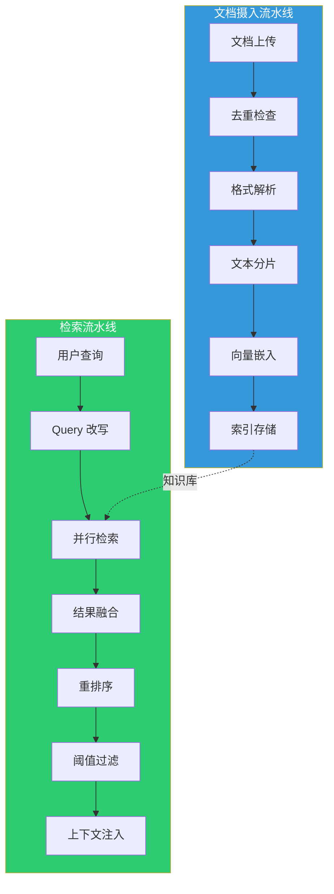

## 文档摄入流水线

### 完整流程

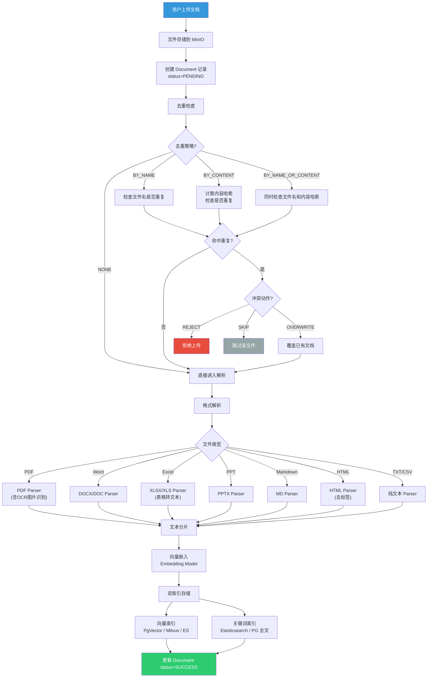

### 支持的文档格式

| 格式 | 扩展名 | 解析器 | 特性 |
|------|--------|--------|------|
| PDF | `.pdf` | PDF Parser | 支持文本提取、图片 OCR |
| Word | `.docx` `.doc` | DOCX/DOC Parser | 支持表格和图片 |
| Excel | `.xlsx` `.xls` | Excel Parser | 表格转结构化文本 |
| PowerPoint | `.pptx` | PPTX Parser | 幻灯片文本提取 |
| Markdown | `.md` | MD Parser | 保留结构标记 |
| HTML | `.html` | HTML Parser | 去除标签，保留文本 |
| 纯文本 | `.txt` | 直接读取 | 最简单的格式 |
| CSV | `.csv` | CSV Parser | 表格转文本 |

### 文档处理状态机

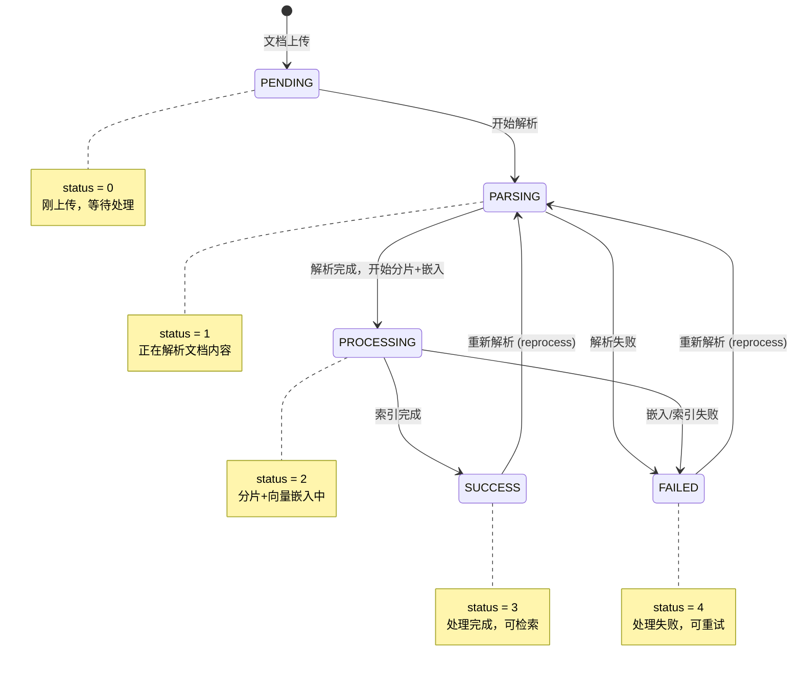

### 文本分片策略

Snail AI 提供 **4 种分片策略**，满足不同文档类型和检索需求：

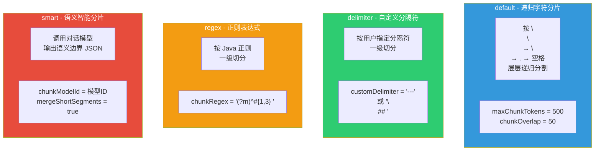

| 策略 | 标识 | 原理 | 适用场景 |
|------|------|------|----------|
| **递归字符** | `default` | 按分隔符优先级递归分割（段落→句子→词） | 通用场景，推荐默认 |
| **自定义分隔符** | `delimiter` | 按用户指定的分隔符进行一级切分 | 结构化文档（如 FAQ、条款） |
| **正则表达式** | `regex` | 按正则表达式匹配进行一级切分 | 按章节/标题分割 |
| **语义智能分片** | `smart` | 调用对话模型识别语义边界再切分 | 高质量知识库，对准确性要求高 |

**分片参数：**

| 参数 | 说明 | 默认值 |
|------|------|--------|
| `maxChunkTokens` | 单片最大 Token 数 | 500 |
| `chunkOverlap` | 相邻片段重叠 Token 数 | 50 |
| `customDelimiter` | 自定义分隔符（delimiter 模式） | - |
| `chunkRegex` | 正则表达式（regex 模式） | - |
| `chunkModelId` | 语义分片模型 ID（smart 模式） | - |
| `mergeShortSegments` | 是否合并过短的片段 | `true` |
| `imageOcr` | 是否对图片进行 OCR | `false` |

### 去重架构

文档上传采用 **Preview-Commit 两阶段模式**，在上传前检测重复并提供用户二次确认的能力：

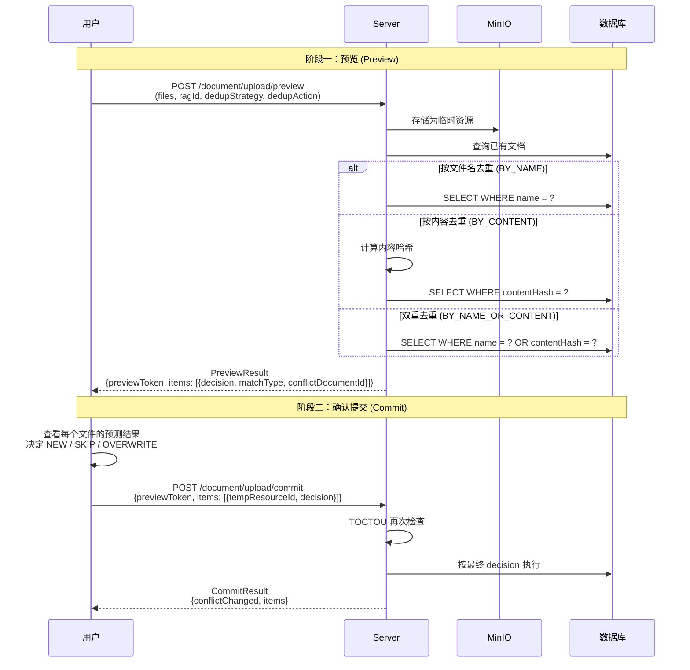

**去重决策矩阵：**

| 去重策略 | 匹配方式 | 说明 |
|----------|----------|------|
| `NONE (0)` | 不检查 | 所有文件直接入库 |
| `BY_NAME (1)` | 文件名完全匹配 | 检查同名文件是否已存在 |
| `BY_CONTENT (2)` | 内容哈希匹配 | 计算文档内容哈希值比对 |
| `BY_NAME_OR_CONTENT (3)` | 文件名或内容任意匹配 | 最严格模式 |

| 冲突动作 | 行为 |
|----------|------|
| `REJECT (0)` | 拒绝上传，返回错误 |
| `SKIP (1)` | 静默跳过重复文件 |
| `OVERWRITE (2)` | 删除旧文档，上传新文档 |

## 检索流水线

### 完整流程

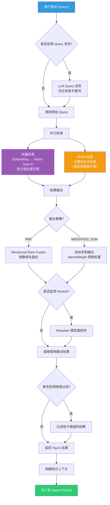

### 检索参数

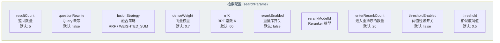

| 参数 | 类型 | 说明 | 默认值 |
|------|------|------|--------|
| `resultCount` | int | 最终返回的知识片段数量 | 5 |
| `questionRewrite` | boolean | 是否启用 LLM Query 改写 | false |
| `fusionStrategy` | enum | 融合策略：`RRF` / `WEIGHTED_SUM` | RRF |
| `denseWeight` | float | 向量检索权重（`WEIGHTED_SUM` 模式下） | 0.7 |
| `rrfK` | int | RRF 融合常数 K | 60 |
| `rerankEnabled` | boolean | 是否启用 Reranker 重排序 | false |
| `rerankModelId` | int | Reranker 模型 ID | - |
| `enterRerankCount` | int | 进入 Reranker 的候选数量 | 20 |
| `thresholdEnabled` | boolean | 是否启用相似度阈值过滤 | false |
| `threshold` | float | 相似度阈值，低于此值的结果被过滤 | 0.5 |

### 混合检索详解

#### 向量检索


向量检索基于语义相似度，能够理解查询意图，召回语义相关但用词不同的知识片段。

#### BM25 检索


BM25 检索基于关键词匹配，对精确术语、名称、编号等特别有效。

#### RRF 融合算法

**RRF（Reciprocal Rank Fusion）** 是一种不依赖分数量纲的排名融合算法：

```
RRF_score(d) = Σ 1 / (k + rank_i(d))
```

其中 `k` 是常数（默认 60），`rank_i(d)` 是文档 d 在第 i 个检索系统中的排名。

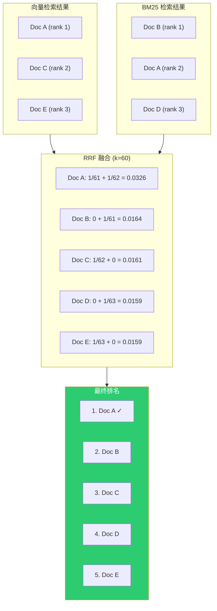

#### 加权求和融合

当选择 `WEIGHTED_SUM` 策略时，两种检索的分数按权重加权求和：

```
final_score(d) = denseWeight × vector_score(d) + (1 - denseWeight) × bm25_score(d)
```

**注意：** 使用加权融合前，需要对两种分数进行归一化处理（Min-Max Normalization），确保量纲一致。

### Reranker 重排序

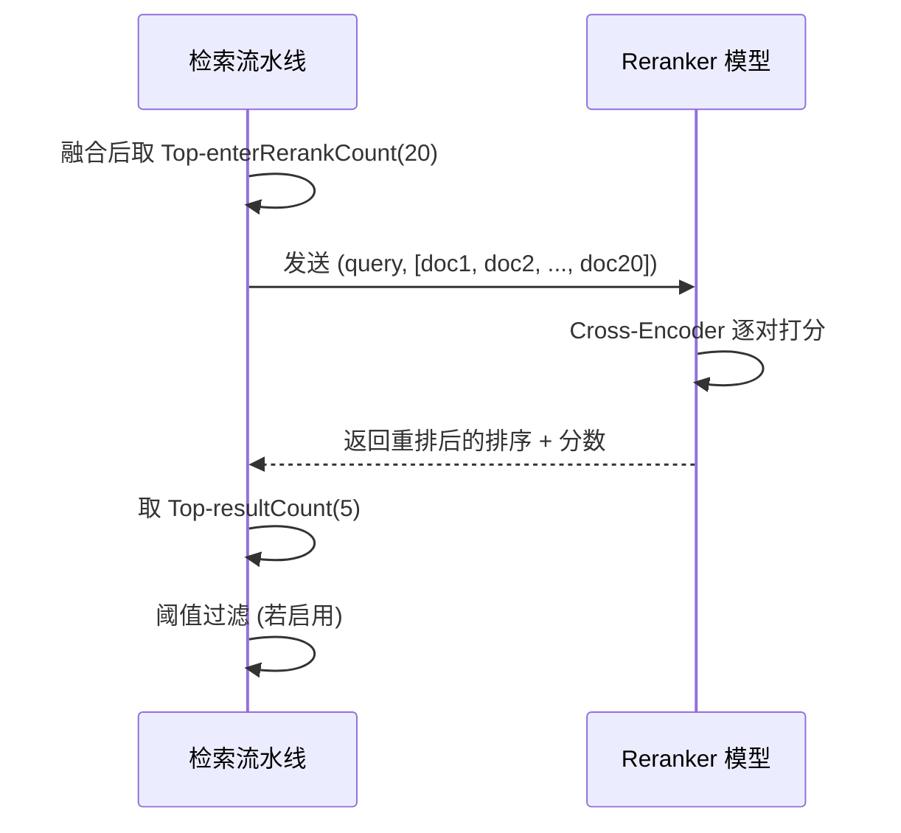

Reranker 模型使用 Cross-Encoder 架构，对 query 和每个候选文档联合编码，产生更精确的相关性分数。相比向量检索的 Bi-Encoder（独立编码后计算余弦相似度），Cross-Encoder 的准确度更高但计算成本也更高，因此采用"粗筛 + 精排"的两阶段架构。

### 检索性能指标

每次检索返回详细的性能指标（`SearchMetrics`），用于调优和监控：

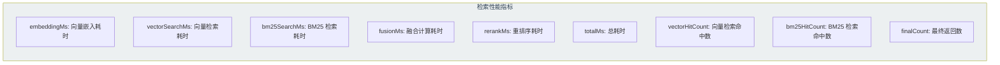

## 存储后端

### 向量存储

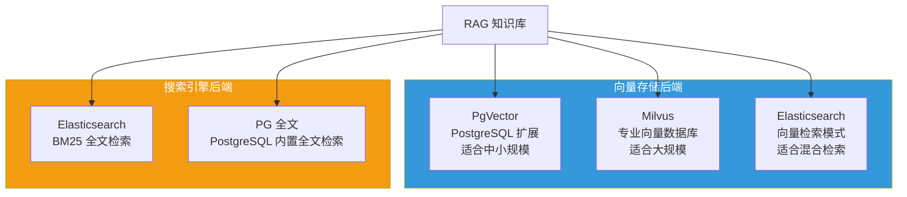

| 存储后端 | 类别 | 适用场景 | 特点 |
|----------|------|----------|------|
| **PgVector** | 向量存储 | 中小规模，与 PG 共用实例 | 部署简单，维护成本低 |
| **Milvus** | 向量存储 | 大规模向量检索（百万级以上） | 高性能，分布式扩展 |
| **Elasticsearch** | 向量+全文 | 需要混合检索的场景 | 同时支持向量和关键词检索 |
| **PG 全文** | 搜索引擎 | 轻量 BM25，不额外部署 ES | 与 PG 共用实例 |

### 存储实例配置

每个 RAG 知识库可独立绑定不同的存储实例：

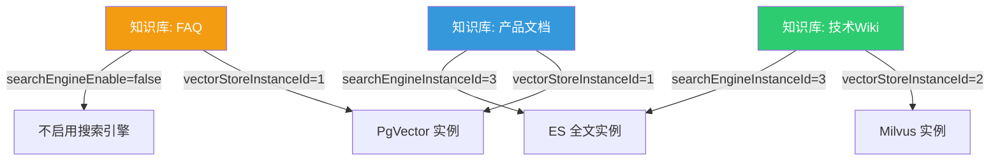

## 端到端数据流

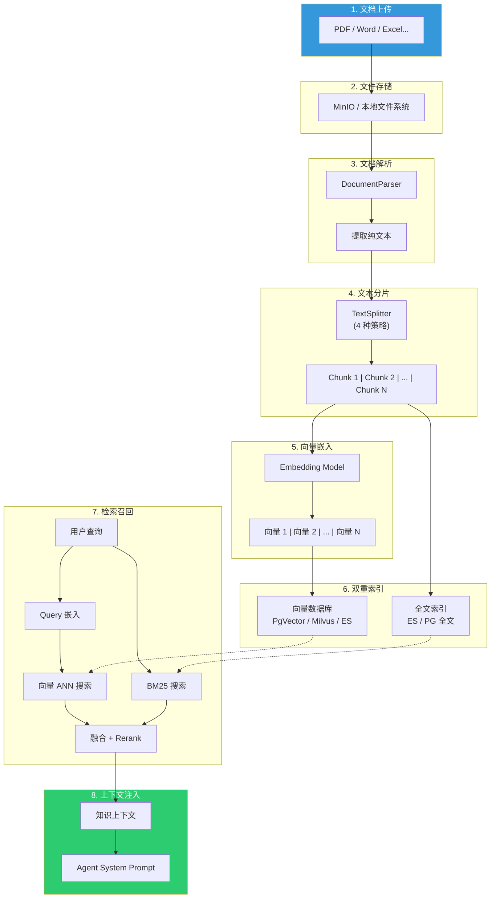
