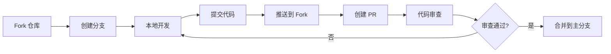

# 参与贡献

感谢你对 Snail AI 的关注！我们欢迎各种形式的贡献，无论是提交 Bug 报告、功能建议、文档改进还是代码贡献。本指南将帮助你了解如何参与到 Snail AI 的开发中来。

## 贡献方式

| 贡献形式 | 说明 | 要求 |
|---------|------|------|
| 报告 Bug | 提交 Issue 描述遇到的问题 | 提供复现步骤和环境信息 |
| 功能建议 | 提交 Feature Request | 描述使用场景和预期效果 |
| 文档改进 | 修正文档错误、补充内容 | 提交 PR 到文档仓库 |
| 代码贡献 | 修复 Bug 或开发新功能 | 遵循编码规范，通过代码审查 |
| 翻译 | 帮助翻译文档为其他语言 | 确保专业术语准确 |
| 社区支持 | 在 Issue 区帮助其他用户解答问题 | 态度友善、解答准确 |

## 贡献流程

### 标准贡献流程（Fork -> Branch -> Develop -> PR）



### 详细步骤

#### 1. Fork 仓库

前往 [Snail AI Gitee 仓库](https://gitee.com/opensnail/snail-ai)，点击右上角 **Fork** 按钮，将仓库 Fork 到你的个人空间。

#### 2. 克隆到本地

```bash
# 克隆你 Fork 的仓库
git clone https://gitee.com/your-username/snail-ai.git
cd snail-ai

# 添加上游仓库
git remote add upstream https://gitee.com/aizuda/snail-ai.git

# 验证远程仓库配置
git remote -v
```

#### 3. 创建开发分支

```bash
# 同步上游最新代码
git fetch upstream
git checkout master
git merge upstream/master

# 创建功能分支
git checkout -b feature/your-feature-name

# 或 Bug 修复分支
git checkout -b fix/your-bug-description
```

**分支命名规范：**

| 前缀 | 用途 | 示例 |
|------|------|------|
| `feature/` | 新功能开发 | `feature/workflow-engine` |
| `fix/` | Bug 修复 | `fix/agent-create-error` |
| `docs/` | 文档更新 | `docs/update-deploy-guide` |
| `refactor/` | 代码重构 | `refactor/rag-pipeline` |
| `test/` | 测试相关 | `test/add-agent-tests` |

#### 4. 本地开发

编写代码并确保通过本地测试（详见下方开发环境和编码规范）。

#### 5. 提交代码

```bash
# 添加变更文件
git add .

# 提交（遵循 Commit Message 规范）
git commit -m "feat(agent): add workflow orchestration support"

# 推送到你的 Fork
git push origin feature/your-feature-name
```

#### 6. 创建 Pull Request

1. 在 Gitee 上打开你 Fork 的仓库页面
2. 点击 **+ Pull Request** 按钮
3. 选择你的功能分支作为源，`opensnail/snail-ai:master` 作为目标
4. 填写 PR 标题和描述，说明变更内容、动机和测试情况
5. 提交 PR 并等待代码审查

## 开发环境搭建

### 后端开发环境

| 软件 | 版本要求 | 说明 |
|------|---------|------|
| JDK | 17+ | 推荐 OpenJDK 或 GraalVM |
| Maven | 3.8+ | 构建工具 |
| IDE | -- | 推荐 IntelliJ IDEA |
| MySQL | 8.0+ | 开发数据库（或 PostgreSQL） |

```bash
# 后端项目构建
cd snail-ai
mvn clean install -DskipTests

# 启动开发模式
mvn spring-boot:run -pl snail-ai-starter -Dspring-boot.run.profiles=dev
```

### 前端开发环境

| 软件 | 版本要求 | 说明 |
|------|---------|------|
| Node.js | 20+ | 运行时环境 |
| pnpm | 10+ | 包管理器 |
| IDE | -- | 推荐 VS Code |

```bash
# 前端项目启动
cd snail-ai-admin
pnpm install
pnpm dev
```

### 推荐的 IDE 插件

**IntelliJ IDEA（后端）：**
- Lombok
- MyBatisX
- Spring Boot Assistant

**VS Code（前端）：**
- Vue - Official (Volar)
- TypeScript Vue Plugin
- ESLint
- Prettier

## 编码规范

### 后端（Java / Spring Boot）

#### 代码风格

- 遵循 Spring Boot 官方编码规范
- 使用 4 个空格缩进（不使用 Tab）
- 类名使用 PascalCase，方法名和变量名使用 camelCase
- 常量使用 UPPER_SNAKE_CASE
- 包名使用小写字母

#### 项目结构约定

```
snail-ai-module/
├── controller/        # REST API 控制器
├── service/           # 业务逻辑层
│   └── impl/          # 服务实现
├── mapper/            # MyBatis Mapper 接口
├── entity/            # 数据库实体类
├── dto/               # 数据传输对象
├── vo/                # 视图对象（API 返回）
├── enums/             # 枚举类
├── config/            # 配置类
└── util/              # 工具类
```

#### 代码质量要求

- 所有公开 API 方法必须有 Javadoc 注释
- Service 层核心方法需要编写单元测试
- 避免在 Controller 层编写业务逻辑
- 使用 `@Validated` 进行参数校验
- 异常使用统一的异常处理机制

#### 示例

```java
/**
 * 智能体服务接口
 */
public interface AgentService {

    /**
     * 创建智能体
     *
     * @param request 创建请求
     * @return 智能体 ID
     */
    Long createAgent(AgentCreateRequest request);
}
```

### 前端（Vue 3 / TypeScript）

#### 代码风格

- 使用 Vue 3 Composition API（`<script setup>`）
- 使用 TypeScript 强类型
- 遵循 ESLint + Prettier 格式化规则
- 使用 2 个空格缩进

#### 组件规范

- 组件文件名使用 PascalCase（如 `AgentList.vue`）
- Composables 文件名使用 camelCase 并以 `use` 开头（如 `useAgent.ts`）
- Props 定义使用 `defineProps<T>()` 泛型方式
- Emit 定义使用 `defineEmits<T>()`

#### 示例

```vue
<script setup lang="ts">
import { ref, computed } from 'vue'

interface Props {
  agentId: string
  readonly?: boolean
}

const props = withDefaults(defineProps<Props>(), {
  readonly: false
})

const emit = defineEmits<{
  (e: 'update', value: string): void
  (e: 'delete'): void
}>()

const agentName = ref('')
const isValid = computed(() => agentName.value.length > 0)
</script>

<template>
  <div class="agent-card">
    <n-input v-model:value="agentName" :disabled="readonly" />
  </div>
</template>
```

## Commit Message 规范

采用 [Conventional Commits](https://www.conventionalcommits.org/zh-hans/) 规范，格式如下：

```
<type>(<scope>): <description>

[可选 body]

[可选 footer]
```

### Type 类型

| Type | 说明 | 示例 |
|------|------|------|
| `feat` | 新功能 | `feat(agent): add batch delete support` |
| `fix` | Bug 修复 | `fix(rag): fix document parsing failure for xlsx files` |
| `docs` | 文档更新 | `docs: update deployment guide` |
| `style` | 代码格式（不影响功能） | `style: format code with prettier` |
| `refactor` | 重构（非新功能、非 Bug 修复） | `refactor(chain): simplify handler pipeline` |
| `perf` | 性能优化 | `perf(rag): optimize vector search query` |
| `test` | 测试相关 | `test(agent): add unit tests for create flow` |
| `chore` | 构建/工具/依赖变更 | `chore: upgrade Spring Boot to 4.1` |
| `ci` | CI/CD 相关 | `ci: add GitHub Actions workflow` |

### Scope 范围

| Scope | 说明 |
|-------|------|
| `agent` | 智能体模块 |
| `rag` | RAG 知识库模块 |
| `model` | 模型管理模块 |
| `mcp` | MCP 工具集成 |
| `client` | Agent Client / SDK |
| `chain` | 责任链 |
| `memory` | 记忆系统 |
| `skill` | 技能系统 |
| `trace` | 可观测性 |
| `auth` | 认证鉴权 |
| `api` | REST API / OpenAPI |
| `ui` | 前端界面 |
| `deploy` | 部署相关 |

### Breaking Change 标记

如果提交包含不兼容的变更，在 footer 中添加 `BREAKING CHANGE:` 说明：

```
feat(api): change chat endpoint response format

BREAKING CHANGE: The chat API response structure has changed.
`data.content` is now `data.message.content`.
```

## Issue 提交指南

### Bug 报告

提交 Bug 时请包含以下信息：

```markdown
### 问题描述
[简要描述遇到的问题]

### 复现步骤
1. 进入 xxx 页面
2. 点击 xxx 按钮
3. 输入 xxx
4. 观察到 xxx 错误

### 预期行为
[描述你期望的正确行为]

### 实际行为
[描述实际发生的情况]

### 环境信息
- Snail AI 版本：
- 操作系统：
- Java 版本：
- 数据库类型及版本：
- 浏览器及版本：

### 错误日志
[粘贴相关错误日志，注意脱敏]

### 截图
[如有相关截图请附上]
```

### 功能建议

```markdown
### 功能描述
[描述你希望的功能]

### 使用场景
[描述在什么场景下需要这个功能]

### 建议实现方式
[如果有想法，描述可能的实现方案]

### 参考
[如有参考产品或文档，请附上链接]
```

## 代码审查流程

1. **自动检查** -- PR 创建后，CI 自动运行代码编译和测试
2. **Reviewer 分配** -- 维护者会根据变更内容分配审查者
3. **审查意见** -- 审查者会在 PR 中留下评论和建议
4. **修改完善** -- 根据审查意见修改代码，推送更新
5. **审查通过** -- 获得至少一位维护者的 Approve 后方可合并
6. **合并** -- 由维护者执行合并操作

### 审查关注点

- 代码是否符合编码规范
- 是否有充分的测试覆盖
- 是否引入了不必要的依赖
- 是否有安全风险
- 是否会影响现有功能
- 文档是否同步更新

## 开发者证书 (DCO)

通过向本项目提交代码，你表示同意 [Developer Certificate of Origin](https://developercertificate.org/)，即你提交的代码是你本人编写或有权提交的，并且同意以项目所用的开源许可证（Apache 2.0）发布。

## 致谢

感谢所有为 Snail AI 做出贡献的开发者！你的每一次贡献都让这个项目变得更好。

---

如有任何疑问，欢迎在 [Issue 区](https://gitee.com/opensnail/snail-ai/issues) 提问或发起讨论。
