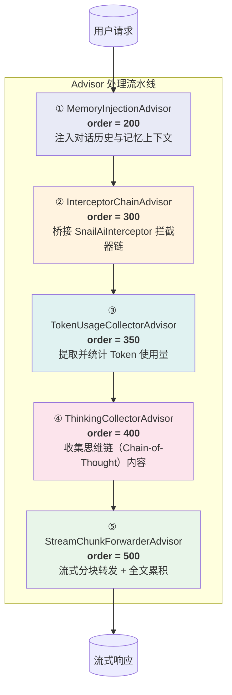
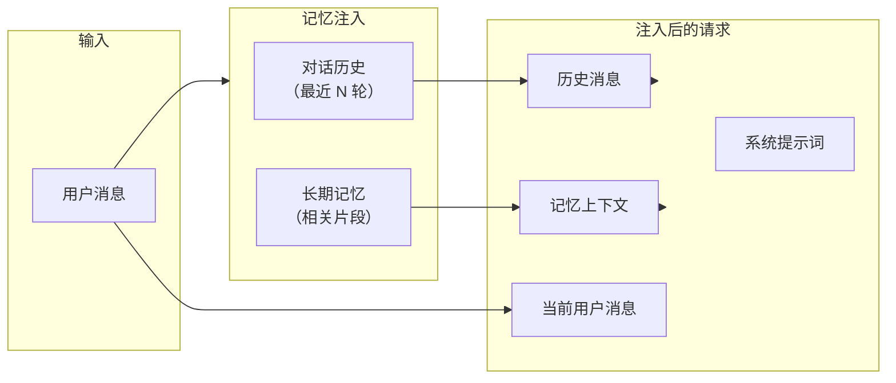
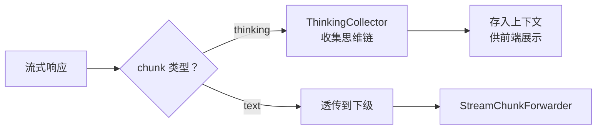
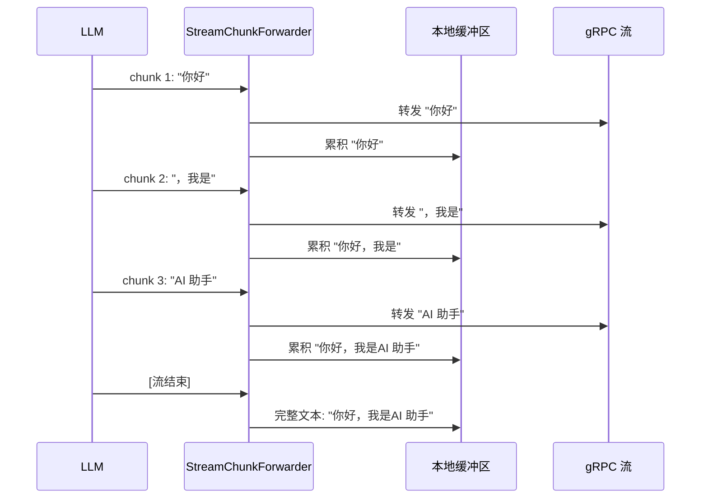
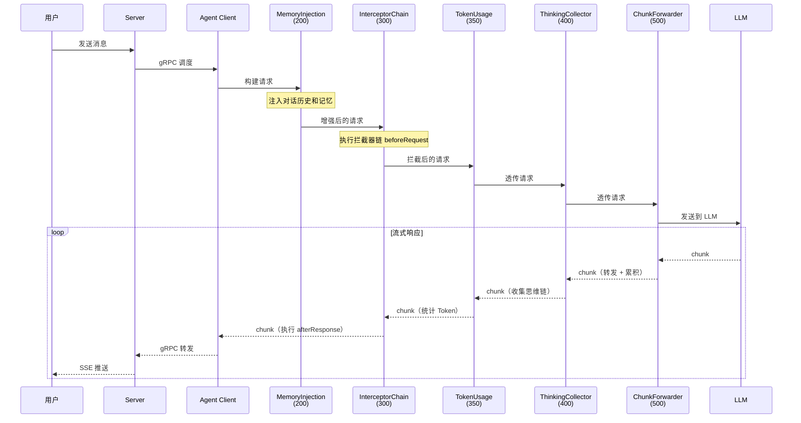

# Advisor 处理流水线

## 概述

Snail AI 客户端采用 **5 级 Advisor 处理流水线**，覆盖从记忆注入到流式转发的完整 AI 交互链路。每一级 Advisor 专注于特定的职责，共同构成了一条可扩展、可观测、自主可控的请求处理管道。

Advisor 流水线基于 Spring AI 的 `Advisor` 抽象构建，同时通过 `InterceptorChainAdvisor` 桥接了 Snail AI 自有的拦截器机制，实现了两套体系的无缝融合。

## 流水线全景



## 各级 Advisor 详解

### 第 1 级：MemoryInjectionAdvisor（order = 200）

**职责**：在 LLM 调用之前，将对话历史和记忆上下文注入到请求中。

| 属性 | 值 |
|------|-----|
| 执行顺序 | 200（最先执行） |
| 作用阶段 | 请求前置处理 |
| 核心功能 | 注入对话历史（conversation history）和长期记忆（memory context） |

**工作原理**：

1. 从对话上下文中获取当前会话的历史消息列表
2. 查询长期记忆系统，检索与当前请求相关的记忆片段
3. 将历史消息和记忆上下文作为前置消息注入到 LLM 请求中
4. 确保 LLM 具备足够的上下文信息来生成连贯的回答



**扩展点**：可以通过自定义记忆策略来控制注入的历史轮次、记忆检索条件等。

---

### 第 2 级：InterceptorChainAdvisor（order = 300）

**职责**：桥接 Snail AI 拦截器链，将所有 `SnailAiInterceptor` 实现集成到 Advisor 流水线中。

| 属性 | 值 |
|------|-----|
| 执行顺序 | 300 |
| 作用阶段 | 请求前置 + 响应后置 |
| 核心功能 | 执行 SnailAiInterceptorChain |

**工作原理**：

1. **请求阶段**：按 order 正序依次调用所有拦截器的 `beforeRequest` 方法
2. **响应阶段**：按 order 逆序依次调用所有拦截器的 `afterResponse` 方法

这一级是自主可控能力的核心入口——开发者通过实现 `SnailAiInterceptor` 接口注入的所有自定义逻辑，都在此级 Advisor 中执行。

详见：[拦截器机制](./interceptor.md)

---

### 第 3 级：TokenUsageCollectorAdvisor（order = 350）

**职责**：从流式响应的各个 chunk 中提取并累计 Token 使用量。

| 属性 | 值 |
|------|-----|
| 执行顺序 | 350 |
| 作用阶段 | 流式响应处理 |
| 核心功能 | 提取 promptTokens、completionTokens、totalTokens |

**工作原理**：

1. 监听每个 streaming chunk 的元数据
2. 从 chunk 的 `Usage` 字段中提取 Token 使用量
3. 累计计算总的 promptTokens、completionTokens 和 totalTokens
4. 将统计结果存入上下文，供后续 Advisor 或业务统计使用

```java
// TokenUsageCollectorAdvisor 收集的数据结构
public class TokenUsageResult {
    private long promptTokens;       // 提示词消耗的 Token 数
    private long completionTokens;   // 生成内容消耗的 Token 数
    private long totalTokens;        // 总 Token 消耗
}
```

**扩展点**：收集到的 Token 数据可用于计费、配额控制、成本优化分析等业务场景。

---

### 第 4 级：ThinkingCollectorAdvisor（order = 400）

**职责**：收集 LLM 的思维链（Chain-of-Thought）推理内容。

| 属性 | 值 |
|------|-----|
| 执行顺序 | 400 |
| 作用阶段 | 流式响应处理 |
| 核心功能 | 识别并收集 thinking 类型的内容块 |

**工作原理**：

1. 监听流式响应中的每个 chunk
2. 识别 `thinking` 类型的内容块（区别于普通 `text` 内容）
3. 将思维链内容单独收集并存储
4. 支持前端分别展示"思考过程"和"最终回答"

这个 Advisor 对于使用支持 thinking 模式的模型（如 Claude 的 extended thinking）尤为重要，它确保思维链内容不与最终回答混在一起。



**扩展点**：可以基于思维链内容实现推理过程分析、质量评估等高级功能。

---

### 第 5 级：StreamChunkForwarderAdvisor（order = 500）

**职责**：将流式 chunk 转发给消费者（如 gRPC 流、SSE 通道），同时累积完整文本。

| 属性 | 值 |
|------|-----|
| 执行顺序 | 500（最后执行） |
| 作用阶段 | 流式响应处理 |
| 核心功能 | chunk 转发 + 全文累积 |

**工作原理**：

1. 接收上游 Advisor 处理过的每个 chunk
2. 将 chunk 通过 gRPC 双向流实时转发给 Server
3. 同时在本地累积所有 chunk，拼接成完整的响应文本
4. 流结束时，将完整文本存入上下文，用于后续存储和统计



**扩展点**：可以在转发层实现流控、压缩、加密等传输优化。

## 流水线执行流程

以下是一次完整 AI 对话在 Advisor 流水线中的处理过程：



## 与 Spring AI ChatClient 的交互

Advisor 流水线与 Spring AI 的 `ChatClient` 紧密集成。当 Agent Client 收到 gRPC 调度指令后，构建 `ChatClient` 请求时会自动装配所有 Advisor：

```java
// 框架内部实现（简化示意）
ChatClient.builder(chatModel)
    .defaultAdvisors(
        new MemoryInjectionAdvisor(conversationMemory),    // order=200
        new InterceptorChainAdvisor(interceptorChain),      // order=300
        new TokenUsageCollectorAdvisor(),                    // order=350
        new ThinkingCollectorAdvisor(),                      // order=400
        new StreamChunkForwarderAdvisor(chunkConsumer)       // order=500
    )
    .build()
    .prompt(userMessage)
    .stream();
```

开发者无需手动装配 Advisor，`@EnableSnailAiAgent` 注解会自动完成所有配置。

## 自定义 Advisor 扩展

除了使用内置的 5 级 Advisor，开发者也可以实现自定义 Advisor 插入到流水线中。只需实现 Spring AI 的 `Advisor` 接口并指定 order：

```java
@Component
public class CustomAuditAdvisor implements CallAroundAdvisor, StreamAroundAdvisor {

    @Override
    public String getName() {
        return "CustomAuditAdvisor";
    }

    @Override
    public int getOrder() {
        return 250; // 在 MemoryInjection(200) 之后，InterceptorChain(300) 之前
    }

    @Override
    public AdvisedResponse aroundCall(AdvisedRequest request, CallAroundAdvisorChain chain) {
        // 前置处理：审计日志
        auditLog("BEFORE_CALL", request);
        AdvisedResponse response = chain.nextAroundCall(request);
        // 后置处理：审计日志
        auditLog("AFTER_CALL", response);
        return response;
    }

    @Override
    public Flux<AdvisedResponse> aroundStream(AdvisedRequest request,
                                               StreamAroundAdvisorChain chain) {
        auditLog("BEFORE_STREAM", request);
        return chain.nextAroundStream(request)
            .doOnComplete(() -> auditLog("STREAM_COMPLETE", null));
    }
}
```

### Order 区间参考

| 区间 | 位置 | 适合的扩展场景 |
|------|------|----------------|
| < 200 | MemoryInjection 之前 | 请求预处理、格式标准化 |
| 200 - 300 | 记忆注入后、拦截器前 | 审计、权限校验 |
| 300 - 350 | 拦截器后、Token 统计前 | 业务逻辑处理 |
| 350 - 400 | Token 统计后、思维链收集前 | 自定义统计 |
| 400 - 500 | 思维链收集后、流转发前 | 响应后处理 |
| > 500 | 流转发之后 | 清理、归档 |

::: tip 设计哲学
Advisor 流水线的 5 级设计体现了 Snail AI 的**自主可控**理念：每一级都有明确的职责和扩展点，开发者可以在任意位置插入自定义逻辑，完全掌控 AI 交互的每个环节。这与 SaaS 平台"全托管、不可干预"的模式形成鲜明对比。
:::
