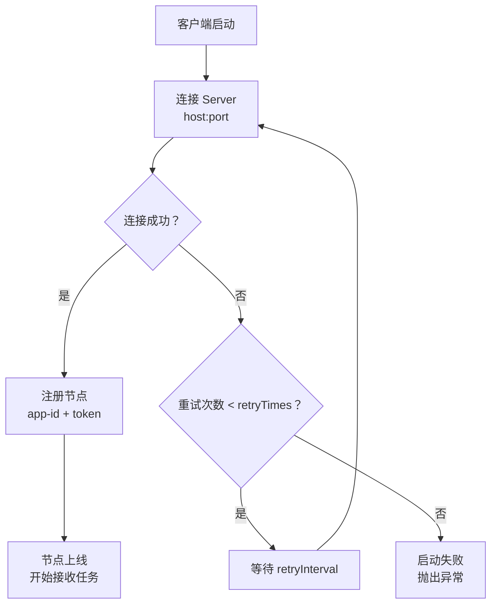
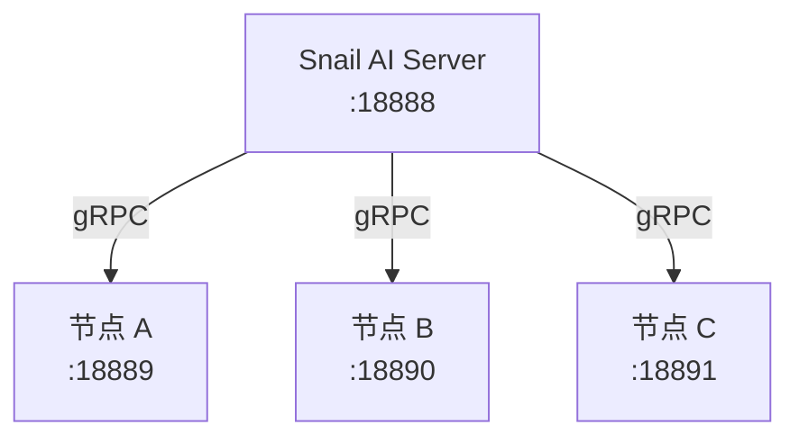

# 客户端配置参考

## 概述

Snail AI 客户端的所有配置项均通过 `SnailAiAgentProperties` 统一管理，遵循 Spring Boot 的标准配置体系。开发者可以在 `application.yml`（或 `application.properties`）中进行配置。

本文档提供完整的配置项参考，帮助开发者根据实际部署场景进行合理配置。

## 配置项一览

### 基础配置

| 配置项 | 类型 | 默认值 | 说明 |
|--------|------|--------|------|
| `snail-ai.enabled` | `boolean` | `true` | 是否启用 Agent 客户端。设为 `false` 可完全禁用客户端功能 |
| `snail-ai.app-id` | `String` | -- | 应用 ID，用于向 Server 注册和认证身份。在管理后台创建应用后获取 |
| `snail-ai.token` | `String` | -- | 认证令牌，与 `app-id` 配合使用进行身份验证 |
| `snail-ai.port` | `int` | `18889` | 客户端 gRPC 服务监听端口，Server 通过此端口向客户端下发指令 |
| `snail-ai.max-concurrent-chats` | `int` | -- | 最大并发对话会话数。限制同时处理的对话数量，防止资源耗尽 |
| `snail-ai.skill-temp-dir` | `String` | -- | 技能文件的本地存储目录。ShellTool 的工作目录基于此路径 |

### Agent 功能配置

| 配置项 | 类型 | 默认值 | 说明 |
|--------|------|--------|------|
| `snail-ai.agent.logging-interceptor` | `boolean` | `false` | 是否启用内置的 `LoggingInterceptor`。开启后自动记录每次 LLM 调用的消息数量和 finishReason |

### Server 连接配置

| 配置项 | 类型 | 默认值 | 说明 |
|--------|------|--------|------|
| `snail-ai.server.host` | `String` | -- | Snail AI Server 的主机地址（IP 或域名） |
| `snail-ai.server.port` | `int` | `18888` | Snail AI Server 的 gRPC 端口 |
| `snail-ai.server.timeout` | `Duration` | -- | 与 Server 建立连接的超时时间 |
| `snail-ai.server.retryTimes` | `int` | -- | 连接失败时的重试次数 |
| `snail-ai.server.retryInterval` | `Duration` | -- | 重试间隔时间 |

## 配置项详解

### snail-ai.enabled

控制是否启用 Agent 客户端功能。当设置为 `false` 时，`@EnableSnailAiAgent` 注解不会触发任何自动配置，应用将作为普通 Spring Boot 应用运行。

```yaml
snail-ai:
  enabled: false  # 临时禁用 Agent 功能
```

**典型场景**：在不需要 AI 能力的环境（如单元测试、特定的预发布环境）中临时关闭 Agent 客户端。

### snail-ai.app-id 和 snail-ai.token

`app-id` 和 `token` 是客户端向 Server 注册的身份凭证。在管理后台创建应用时，系统会自动生成这对凭证。

```yaml
snail-ai:
  app-id: myapp-001
  token: sk-xxxxxxxxxxxxxxxxxxxxx
```

::: warning 安全建议
`token` 是敏感信息，生产环境中建议通过环境变量或配置中心注入，避免明文存储在配置文件中：
```yaml
snail-ai:
  token: ${SNAIL_AI_TOKEN}
```
:::

### snail-ai.port

客户端 gRPC 服务的监听端口。Server 通过此端口向客户端下发聊天请求和其他调度指令。

```yaml
snail-ai:
  port: 18889  # 默认端口
```

**注意事项**：
- 确保此端口未被其他服务占用
- 如果在同一台机器部署多个客户端节点，需要为每个节点分配不同的端口
- 防火墙/安全组需要放行此端口，允许 Server 访问

### snail-ai.max-concurrent-chats

限制客户端节点同时处理的对话会话数。当并发数达到上限时，新的对话请求将排队等待。

```yaml
snail-ai:
  max-concurrent-chats: 10  # 最多同时处理 10 个对话
```

合理设置此值可以：
- 防止单个节点过载，保护系统稳定性
- 配合多节点水平扩展，实现负载均衡
- 根据机器配置和 LLM API 限流策略调整

### snail-ai.skill-temp-dir

技能文件的本地存储目录。客户端从 Server 同步的技能文件会存储在此目录下，`ShellTool` 也在此目录范围内执行命令。

```yaml
snail-ai:
  skill-temp-dir: /opt/snail-ai/skills
```

**安全建议**：
- 确保目录具有适当的文件系统权限
- 避免使用系统关键目录（如 `/`, `/etc`）
- 建议使用专用目录，与业务数据隔离

### snail-ai.server.* 连接配置

配置与 Snail AI Server 的 gRPC 连接参数：

```yaml
snail-ai:
  server:
    host: 192.168.1.100    # Server 地址
    port: 18888            # Server gRPC 端口
    timeout: 10s           # 连接超时
    retryTimes: 3          # 重试次数
    retryInterval: 5s      # 重试间隔
```

**连接流程**：



## 完整配置示例

### 基础配置（开发环境）

```yaml
snail-ai:
  enabled: true
  app-id: dev-app-001
  token: sk-dev-token-xxxxx
  port: 18889
  skill-temp-dir: /tmp/snail-ai/skills
  agent:
    logging-interceptor: true  # 开发环境开启日志
  server:
    host: localhost
    port: 18888
    timeout: 10s
    retryTimes: 3
    retryInterval: 5s
```

### 生产配置

```yaml
snail-ai:
  enabled: true
  app-id: ${SNAIL_AI_APP_ID}
  token: ${SNAIL_AI_TOKEN}
  port: 18889
  max-concurrent-chats: 20
  skill-temp-dir: /opt/snail-ai/skills
  agent:
    logging-interceptor: false  # 生产环境按需开启请求/响应日志
  server:
    host: ${SNAIL_AI_SERVER_HOST}
    port: 18888
    timeout: 30s
    retryTimes: 5
    retryInterval: 10s
```

### 多节点部署配置

在同一台机器部署多个客户端节点时，为每个节点分配不同的端口：

```yaml
# 节点 A（application-node-a.yml）
snail-ai:
  app-id: node-a
  port: 18889

# 节点 B（application-node-b.yml）
snail-ai:
  app-id: node-b
  port: 18890

# 节点 C（application-node-c.yml）
snail-ai:
  app-id: node-c
  port: 18891
```



## 配置优先级

Snail AI 的配置遵循 Spring Boot 标准优先级（从高到低）：

1. 命令行参数：`--snail-ai.port=19000`
2. 环境变量：`SNAIL_AI_PORT=19000`
3. `application-{profile}.yml`
4. `application.yml`
5. 默认值

::: tip 最佳实践
- **开发环境**：在 `application-dev.yml` 中开启 `logging-interceptor`，使用本地 Server 地址
- **生产环境**：通过环境变量注入敏感配置（`app-id`、`token`），合理设置 `max-concurrent-chats` 和重试策略
- **容器化部署**：通过 Docker/K8s 环境变量覆盖端口和 Server 地址，实现灵活的多节点部署
:::
