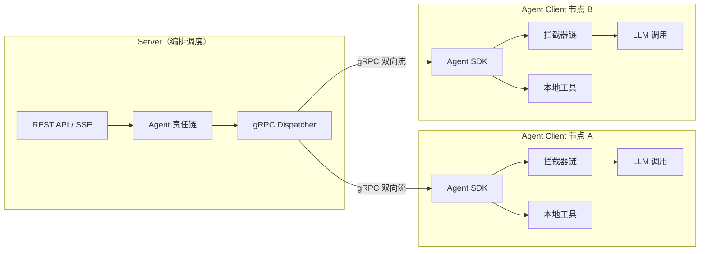

# 客户端模式

## 设计理念：自主可控

Snail AI 的核心设计理念是**自主可控**（Self-Controllable）。与 Dify、FastGPT 等纯 SaaS 平台不同，Snail AI 让用户能够**深度参与并控制 AI 交互的全流程**，而非仅仅作为终端使用者被动接收结果。

在传统 SaaS 平台中，所有 AI 调用都在服务端完成，用户无法插手中间过程。而 Snail AI 的客户端模式将 LLM 调用的执行权完全交给客户端节点——企业可以在自己的 Spring Boot 应用中直接控制请求的构建、响应的处理、工具的执行，实现真正的**数据不出域、逻辑可定制、过程可审计**。

<!-- screenshot: client-architecture.png — Snail AI 客户端模式架构总览，展示 Server 与多个 Agent Client 的 gRPC 连接拓扑 -->

## Server-Agent 分离架构

Snail AI 采用分布式 **Server-Agent** 架构，Server 与 Agent Client 通过 gRPC 双向流通信，各司其职：



| 组件 | 职责 | 部署位置 |
|------|------|----------|
| **Server** | 接收用户请求、执行责任链编排、管理对话上下文、调度分发任务 | 中心服务器 |
| **Agent Client** | 接收 gRPC 指令、构建 LLM 请求、执行拦截器链、调用本地工具、流式返回结果 | 客户端节点（任意 Spring Boot 应用） |

Server 不直接调用大模型，它只负责**编排和调度**。真正的 LLM 调用在客户端节点上独立完成，这意味着：

- **数据安全**：敏感数据在客户端处理，不经过中心服务器
- **弹性扩展**：多个客户端节点可水平扩展，分担负载
- **自主可控**：每个客户端节点可自定义拦截器、工具、处理逻辑

## 核心能力概览

客户端 SDK 提供多项核心能力，让开发者拥有对 AI 交互的控制权：

### 1. 拦截器机制（Interceptor）

通过 `SnailAiInterceptor` SPI 接口，开发者可以在 LLM 调用前后插入自定义逻辑。支持有序执行、链式传递，轻松实现日志记录、内容过滤、元数据注入等业务需求。

详见：[拦截器机制](./interceptor.md)

### 2. Advisor 处理流水线

5 级 Advisor 流水线覆盖从记忆注入到流式转发的全链路处理，每一级都提供扩展点。框架内置了记忆注入、Token 统计、思维链收集等关键 Advisor，开发者也可以按需扩展。

详见：[Advisor 处理流水线](./advisor-pipeline.md)

### 3. 本地工具执行

Shell 命令、HTTP 调用、MCP 工具等均在客户端节点本地执行，数据不出域。支持内置工具和动态工具注册。

详见：[本地工具执行](./tools.md)

### 4. 客户端日志

内置 `LoggingInterceptor`、`TokenUsageCollectorAdvisor` 和 `ThinkingCollectorAdvisor`，用于请求响应日志、Token 用量采集和思维内容采集。

详见：[客户端日志](./logging.md)

### 5. 客户端 Chat 模式

独立前端 `snail-ai-chat` 可通过 Agent Chat Starter 提供 `/snail-chat` 页面和 `/api/snail/chat` 网关，用于独立聊天页或业务系统嵌入。

详见：[客户端 Chat 模式](./chat.md)

## 一键启用：@EnableSnailAiAgent

将任意 Spring Boot 应用接入 Snail AI 客户端模式，只需要一个注解：

```java
@SpringBootApplication
@EnableSnailAiAgent
public class MyBusinessApplication {
    public static void main(String[] args) {
        SpringApplication.run(MyBusinessApplication.class, args);
    }
}
```

`@EnableSnailAiAgent` 会自动完成以下工作：

1. **注册 gRPC 客户端**：与 Server 建立双向流连接，接收调度指令
2. **初始化拦截器链**：扫描所有 `SnailAiInterceptor` 实现，按 order 排序组装
3. **装配 Advisor 流水线**：注入 5 级 Advisor，构建完整的请求处理流水线
4. **注册本地工具**：发现并注册 Shell、HTTP、MCP 等工具
5. **启用采集能力**：按配置启用日志、Token 用量和思维内容采集

配合 `application.yml` 中的少量配置即可运行：

```yaml
snail-ai:
  app-id: your-app-id
  token: your-token
  server:
    host: 192.168.1.100
    port: 18888
```

详见：[客户端配置参考](./config.md)

<!-- screenshot: client-node-online.png — 管理后台中查看客户端节点上线状态，显示节点列表及其连接信息 -->

## 与 SaaS 平台的对比

| 能力 | Snail AI 客户端模式 | Dify | FastGPT |
|------|---------------------|------|---------|
| **LLM 调用位置** | 客户端节点本地执行 | 服务端执行 | 服务端执行 |
| **请求拦截** | SnailAiInterceptor 链 + Advisor 流水线 | 不支持 | 不支持 |
| **响应拦截** | beforeRequest / afterResponse 全链路可控 | 不支持 | 不支持 |
| **工具执行位置** | 客户端本地，数据不出域 | 服务端 | 服务端 |
| **自定义处理逻辑** | Java 代码级深度定制 | 可视化编排，定制有限 | 可视化编排，定制有限 |
| **数据安全** | 敏感数据不经过中心服务器 | 所有数据经过平台服务端 | 所有数据经过平台服务端 |
| **日志与用量采集** | 客户端日志、Token 用量和思维内容采集 | 基础日志 | 基础日志 |
| **部署灵活性** | 任意 Spring Boot 应用一键接入 | 绑定平台部署 | 绑定平台部署 |
| **技术栈** | Java 生态原生，Spring AI 集成 | Python 生态 | Node.js 生态 |

::: tip 核心差异
Dify 和 FastGPT 是 SaaS 平台，用户只能通过可视化界面编排流程，无法在代码层面介入 LLM 调用过程。Snail AI 的客户端模式让开发者像使用 Spring MVC 的 Filter/Interceptor 一样自然地控制 AI 交互——这是**自主可控**理念的具体体现。
:::

## 客户端模式文档导航

| 文档 | 说明 |
|------|------|
| [拦截器机制](./interceptor.md) | SnailAiInterceptor SPI 接口、拦截器链、执行顺序 |
| [Advisor 处理流水线](./advisor-pipeline.md) | 5 级 Advisor 流水线的设计与扩展 |
| [客户端日志](./logging.md) | 日志拦截器、Token 用量和思维内容采集 |
| [本地工具执行](./tools.md) | 内置工具、MCP 集成、动态注册、安全模型 |
| [客户端 Chat 模式](./chat.md) | 独立 Chat 前端、后端网关、会话 Token 和嵌入配置 |
| [客户端配置参考](./config.md) | SnailAiAgentProperties 完整配置项 |
| [OpenAPI 客户端 SDK](./openapi-sdk.md) | 流式调用、事件监听、类型安全接口 |
