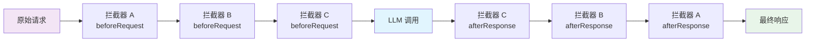
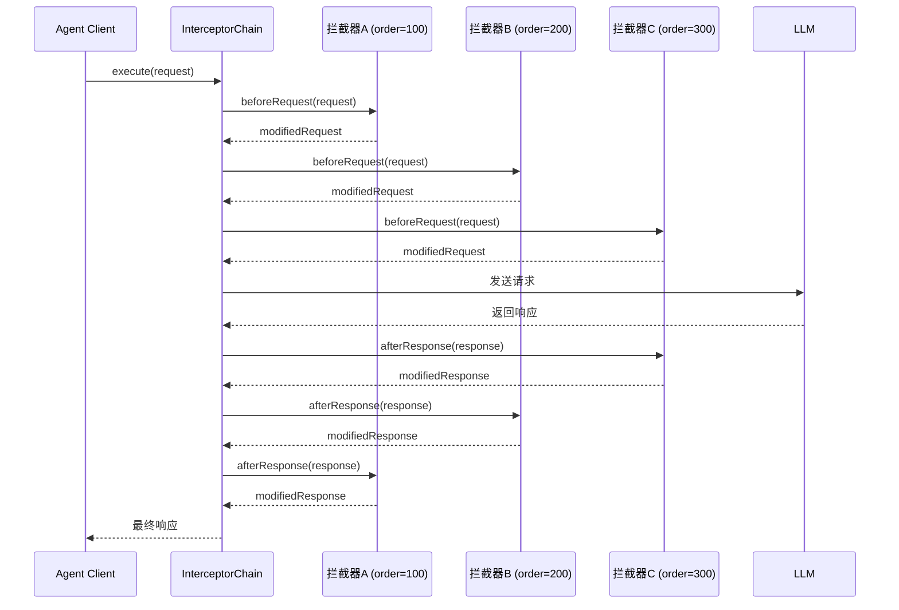
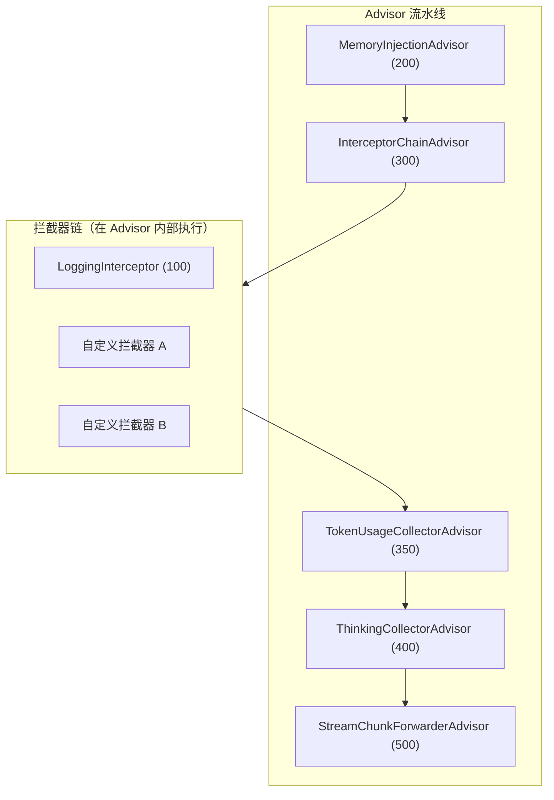

# 拦截器机制

## 概述

拦截器是 Snail AI 客户端模式中实现**自主可控**的核心机制。通过 `SnailAiInterceptor` SPI 接口，开发者可以在 LLM 调用前后插入自定义逻辑，对请求和响应进行任意修改——这是 Snail AI 区别于 Dify、FastGPT 等 SaaS 平台的关键能力。

在传统 SaaS 平台中，AI 请求从发出到返回是一个"黑盒"。而 Snail AI 的拦截器机制让这个过程完全透明、可干预：



## SnailAiInterceptor SPI 接口

`SnailAiInterceptor` 是拦截器的核心接口，继承自 `Ordered`，提供请求前置处理和响应后置处理两个扩展点：

```java
public interface SnailAiInterceptor extends Ordered {

    /**
     * 在 LLM 调用之前执行。
     * 可以修改请求内容（如注入元数据、过滤敏感词、添加系统提示词等）。
     *
     * @param request 当前的 ChatClient 请求对象
     * @return 修改后的请求对象（或原始对象）
     */
    default ChatClientRequest beforeRequest(ChatClientRequest request) {
        return request;
    }

    /**
     * 在 LLM 调用之后执行。
     * 可以修改响应内容（如添加审计日志、二次加工输出、统计 Token 等）。
     *
     * @param response 当前的 ChatClient 响应对象
     * @return 修改后的响应对象（或原始对象）
     */
    default ChatClientResponse afterResponse(ChatClientResponse response) {
        return response;
    }

    /**
     * 拦截器执行顺序，数值越小越先执行。
     * beforeRequest 按 order 正序执行（小 -> 大）。
     * afterResponse 按 order 逆序执行（大 -> 小）。
     */
    @Override
    int getOrder();
}
```

### 接口设计要点

| 方法 | 执行时机 | 典型用途 |
|------|----------|----------|
| `beforeRequest` | LLM 调用之前 | 注入元数据、添加系统提示词、过滤敏感内容、请求参数修改 |
| `afterResponse` | LLM 调用之后 | 审计日志、内容后处理、Token 统计、响应格式转换 |
| `getOrder` | 链构建时 | 决定拦截器在链中的位置 |

::: tip 默认行为
`beforeRequest` 和 `afterResponse` 均提供了默认实现（直接透传），开发者可以选择性地只覆盖需要的方法。
:::

## SnailAiInterceptorChain 执行链

`SnailAiInterceptorChain` 负责管理所有拦截器的有序执行。它遵循**经典责任链模式**，与 Servlet Filter Chain 类似：



### 执行顺序规则

| 阶段 | 执行顺序 | 说明 |
|------|----------|------|
| **beforeRequest** | 正序（order 小 → 大） | 先执行 order 小的拦截器 |
| **afterResponse** | 逆序（order 大 → 小） | 先执行 order 大的拦截器 |

这种"洋葱模型"确保每个拦截器的 `beforeRequest` 和 `afterResponse` 形成对称的处理对，与 Spring MVC 的 `HandlerInterceptor` 行为一致。

## InterceptorChainAdvisor 桥接

`InterceptorChainAdvisor`（order=300）是连接拦截器链与 Spring AI Advisor 流水线的桥梁。它将所有用户自定义的 `SnailAiInterceptor` 集成到 Advisor 流水线中：



这种设计让拦截器机制既能独立使用，又能无缝融入 Spring AI 的 Advisor 架构，充分利用两个体系的优势。

详见：[Advisor 处理流水线](./advisor-pipeline.md)

## 内置拦截器：LoggingInterceptor

Snail AI 内置了 `LoggingInterceptor`（order=100），提供开箱即用的日志记录能力：

```java
public class LoggingInterceptor implements SnailAiInterceptor {

    @Override
    public ChatClientRequest beforeRequest(ChatClientRequest request) {
        // 记录请求中的消息数量
        log.info("[SnailAI] Request messages count: {}",
            request.prompt().getInstructions().size());
        return request;
    }

    @Override
    public ChatClientResponse afterResponse(ChatClientResponse response) {
        // 记录响应的 finishReason
        log.info("[SnailAI] Response finishReason: {}",
            response.chatResponse().getResult().getMetadata().getFinishReason());
        return response;
    }

    @Override
    public int getOrder() {
        return 100;
    }
}
```

通过配置开启：

```yaml
snail-ai:
  agent:
    logging-interceptor: true
```

## Spring Bean 自动发现

实现 `SnailAiInterceptor` 接口并注册为 Spring Bean，即可自动加入拦截器链——无需额外的注册代码：

```java
@Component
public class MyCustomInterceptor implements SnailAiInterceptor {

    @Override
    public ChatClientRequest beforeRequest(ChatClientRequest request) {
        // 自定义逻辑
        return request;
    }

    @Override
    public int getOrder() {
        return 150; // 在 LoggingInterceptor(100) 之后执行
    }
}
```

框架在启动时会自动：

1. 扫描 Spring 容器中所有 `SnailAiInterceptor` 实现
2. 按 `getOrder()` 返回值排序
3. 组装为 `SnailAiInterceptorChain`
4. 注入到 `InterceptorChainAdvisor` 中

## 代码示例

### 示例一：元数据注入拦截器

为每次 LLM 请求注入业务上下文信息（如用户 ID、请求来源等）：

```java
@Component
public class MetadataInterceptor implements SnailAiInterceptor {

    @Override
    public ChatClientRequest beforeRequest(ChatClientRequest request) {
        // 获取当前业务上下文
        String userId = SecurityContextHolder.getContext().getUserId();
        String requestSource = RequestContextHolder.getRequestSource();

        // 在系统提示词中注入元数据
        String metadataPrompt = String.format(
            "当前用户ID: %s, 请求来源: %s。请根据用户身份调整回答策略。",
            userId, requestSource
        );

        // 通过 mutate 模式修改请求
        return ChatClientRequest.builder()
            .from(request)
            .systemText(request.systemText() + "\n" + metadataPrompt)
            .build();
    }

    @Override
    public ChatClientResponse afterResponse(ChatClientResponse response) {
        // 记录审计日志
        AuditLogger.log("LLM_CALL",
            "userId", SecurityContextHolder.getContext().getUserId(),
            "finishReason", response.chatResponse().getResult()
                .getMetadata().getFinishReason()
        );
        return response;
    }

    @Override
    public int getOrder() {
        return 120; // 在 LoggingInterceptor(100) 之后
    }
}
```

### 示例二：敏感内容过滤拦截器

在请求发送前和响应返回后进行敏感内容检测与过滤：

```java
@Component
public class SensitiveContentFilterInterceptor implements SnailAiInterceptor {

    @Autowired
    private SensitiveWordService sensitiveWordService;

    @Override
    public ChatClientRequest beforeRequest(ChatClientRequest request) {
        // 检查用户输入是否包含敏感词
        List<Message> messages = request.prompt().getInstructions();
        for (Message message : messages) {
            if (message instanceof UserMessage userMsg) {
                String content = userMsg.getText();
                List<String> sensitiveWords = sensitiveWordService.detect(content);
                if (!sensitiveWords.isEmpty()) {
                    log.warn("[SnailAI] 检测到敏感词: {}", sensitiveWords);
                    // 替换敏感词后继续
                    String filtered = sensitiveWordService.replace(content);
                    // 构建替换后的请求
                    return rebuildRequestWithFilteredContent(request, filtered);
                }
            }
        }
        return request;
    }

    @Override
    public ChatClientResponse afterResponse(ChatClientResponse response) {
        // 检查 LLM 响应是否包含不当内容
        String output = response.chatResponse().getResult().getOutput().getText();
        if (sensitiveWordService.containsSensitive(output)) {
            log.warn("[SnailAI] LLM 响应包含敏感内容，已过滤");
            return rebuildResponseWithFilteredContent(response);
        }
        return response;
    }

    @Override
    public int getOrder() {
        return 110; // 在 LoggingInterceptor 之后，元数据注入之前
    }
}
```

<!-- screenshot: client-interceptor-code.png — IDE 中拦截器代码示例与断点调试界面 -->

## 最佳实践

### Order 值规划

建议为不同用途的拦截器分配不同的 order 区间：

| Order 区间 | 用途 | 示例 |
|------------|------|------|
| 0 - 99 | 安全相关（认证、鉴权） | AuthInterceptor |
| 100 - 199 | 基础设施（日志、监控） | LoggingInterceptor (100) |
| 200 - 299 | 业务前置处理（元数据注入、内容过滤） | MetadataInterceptor, SensitiveFilterInterceptor |
| 300 - 399 | 核心业务逻辑 | BusinessRuleInterceptor |
| 400 - 499 | 业务后置处理（格式转换、统计） | FormatInterceptor |
| 500+ | 收尾工作（清理、归档） | CleanupInterceptor |

### 注意事项

1. **保持幂等性**：拦截器可能在重试场景下被多次调用，确保 `beforeRequest` 和 `afterResponse` 逻辑是幂等的
2. **避免阻塞操作**：拦截器在请求链路上同步执行，耗时操作（如远程调用）应异步化
3. **异常处理**：拦截器中的异常会中断整个链路，建议在关键逻辑外包裹 try-catch
4. **最小化修改**：只修改需要的部分，避免意外覆盖其他拦截器的修改

::: warning 与 Spring AI Advisor 的关系
`SnailAiInterceptor` 是 Snail AI 提供的轻量级拦截接口，适合快速实现 request/response 级别的处理。如果需要更复杂的流式处理或与 Spring AI 深度集成，可以直接实现 Spring AI 的 `Advisor` 接口。两者通过 `InterceptorChainAdvisor` 桥接，可以混合使用。
:::
