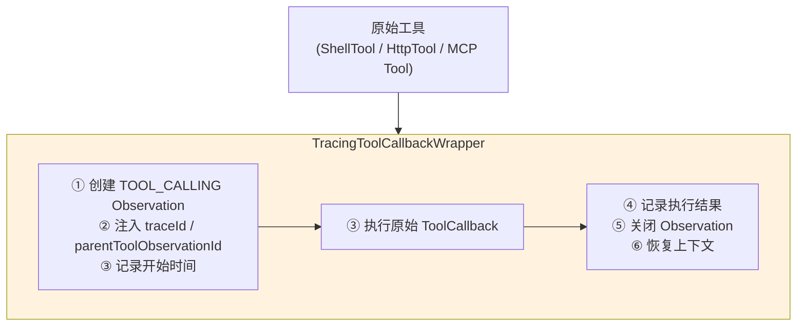
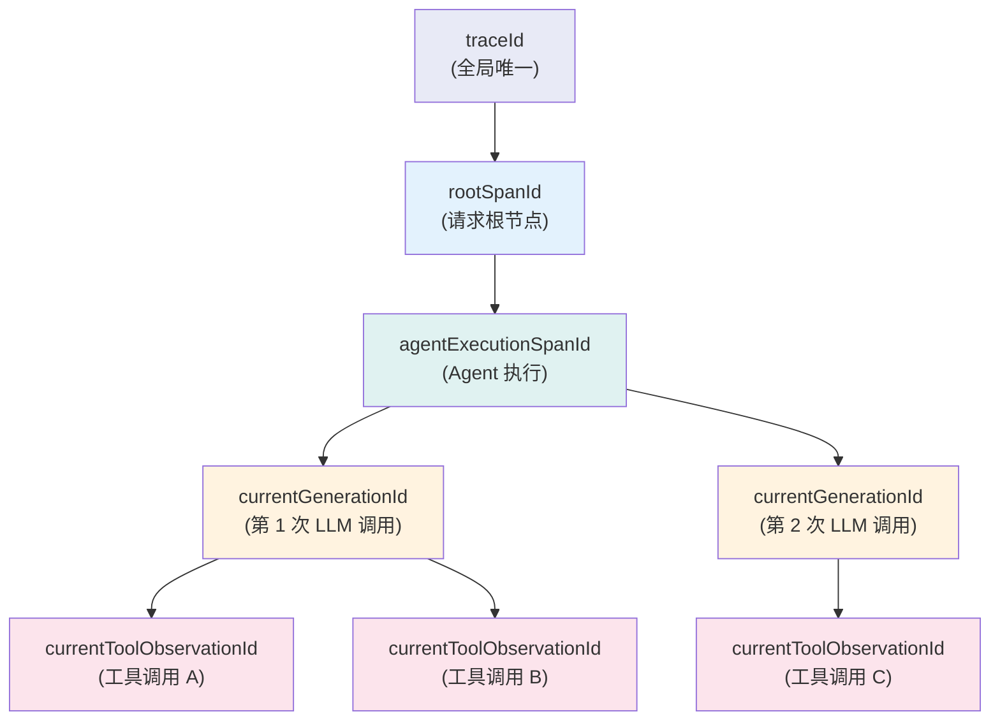
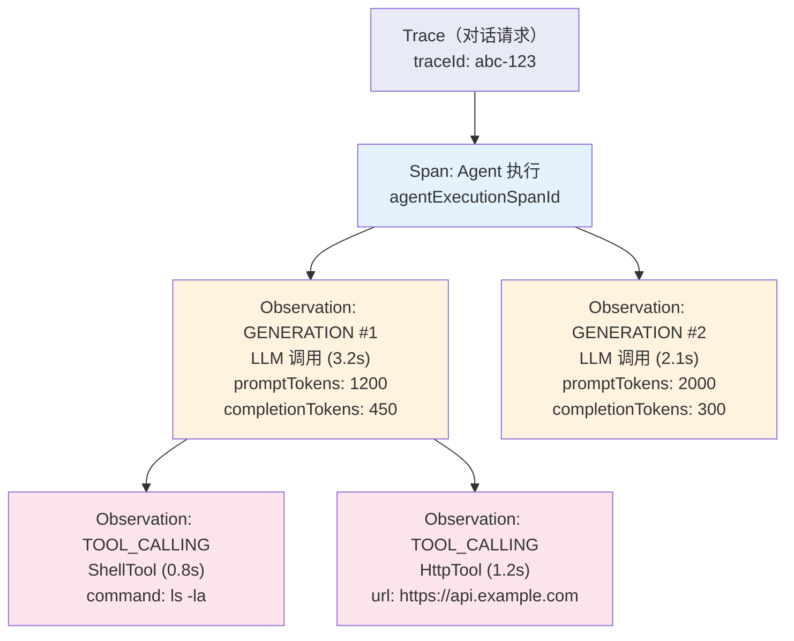

# 在线日志与追踪

## 概述

Snail AI 客户端模式提供了完整的**生产级可观测性**体系，涵盖日志记录、分布式追踪和上下文传播三大维度。这套体系的核心优势在于：追踪数据在客户端本地生成和收集，开发者对 AI 交互的每个环节都拥有完全的可见性——这是**自主可控**理念在可观测性领域的具体体现。

与 SaaS 平台提供的基础日志不同，Snail AI 的追踪系统基于 Micrometer ObservationRegistry 构建，原生支持 GENERATION（LLM 调用）和 TOOL_CALLING（工具调用）两种 Observation 类型，并通过 `TracingToolCallbackWrapper` 和 `AgentChatContextHolder` 实现了跨线程、跨组件的 Trace Context 传播。

## LoggingInterceptor 内置日志

`LoggingInterceptor` 是 Snail AI 提供的开箱即用的日志拦截器，可通过一行配置开启：

```yaml
snail-ai:
  agent:
    logging-interceptor: true
```

开启后，每次 LLM 调用都会自动记录以下信息：

| 日志阶段 | 记录内容 | 说明 |
|----------|----------|------|
| **请求前** | 消息数量（messages count） | 包含系统提示词、历史消息和当前用户消息的总数 |
| **响应后** | 完成原因（finishReason） | 如 `STOP`、`LENGTH`、`TOOL_CALLS` 等 |

日志输出示例：

```
[SnailAI] Request messages count: 5
[SnailAI] Response finishReason: STOP
```

::: tip 何时使用
`LoggingInterceptor` 适合开发调试阶段的快速诊断。对于生产环境的全链路追踪需求，建议结合 Micrometer Observation 体系使用。
:::

## Micrometer ObservationRegistry 集成

Snail AI 客户端深度集成了 Micrometer 的 `ObservationRegistry`，为 AI 交互的关键环节创建标准化的 Observation：

### Observation 类型

| 类型 | 名称 | 说明 |
|------|------|------|
| **GENERATION** | `gen_ai.chat.completions` | LLM 调用的完整生命周期追踪 |
| **TOOL_CALLING** | `gen_ai.tool.call` | 工具调用的执行追踪 |

### GENERATION Observation

每次 LLM 调用会创建一个 GENERATION 类型的 Observation，记录：

- **请求维度**：模型名称、provider、prompt tokens 数量、消息列表
- **响应维度**：completion tokens、total tokens、finish reason、响应时长
- **上下文维度**：traceId、spanId、关联的 agentId、conversationId

```mermaid
gantt
    title GENERATION Observation 生命周期
    dateFormat X
    axisFormat %s

    section 请求
    构建 Prompt           :a1, 0, 100
    发送到 LLM            :a2, 100, 150

    section 响应
    接收流式 chunk         :a3, 150, 800
    累积完整响应           :a4, 800, 850

    section 后处理
    Token 统计            :a5, 850, 900
    Observation 关闭      :a6, 900, 950
```



### TOOL_CALLING Observation

每次工具调用会创建一个 TOOL_CALLING 类型的 Observation，记录：

- **调用维度**：工具名称、输入参数、调用来源
- **执行维度**：执行时长、输出结果、是否成功
- **关联维度**：parentToolObservationId、所属的 GENERATION Observation

## TracingToolCallbackWrapper

`TracingToolCallbackWrapper` 是 Snail AI 实现工具调用追踪的核心组件。它以**装饰器模式**包裹每一个工具的 `ToolCallback`，在工具执行前后自动注入追踪上下文：



### 工作原理

```java
// TracingToolCallbackWrapper 包裹逻辑（简化示意）
public class TracingToolCallbackWrapper implements ToolCallback {

    private final ToolCallback delegate;        // 原始工具
    private final ObservationRegistry registry; // Observation 注册表

    @Override
    public String call(String toolInput) {
        // 1. 创建 TOOL_CALLING Observation
        Observation observation = Observation.createNotStarted(
            "gen_ai.tool.call", registry);

        // 2. 注入追踪上下文
        ChatContext ctx = AgentChatContextHolder.get();
        observation.lowCardinalityKeyValue("traceId", ctx.getTraceId());
        observation.lowCardinalityKeyValue("toolName", delegate.getName());
        observation.highCardinalityKeyValue("parentObservationId",
            ctx.getCurrentToolObservationId());

        // 3. 开始观测
        observation.start();

        try {
            // 4. 执行原始工具
            String result = delegate.call(toolInput);

            // 5. 记录结果
            observation.highCardinalityKeyValue("result", result);
            return result;
        } catch (Exception e) {
            observation.error(e);
            throw e;
        } finally {
            // 6. 关闭观测
            observation.stop();
        }
    }
}
```

所有工具（内置的 ShellTool、HttpTool、ReadSkillTool，以及通过 MCP 和 Skill 动态注册的工具）都会自动被 `TracingToolCallbackWrapper` 包裹，无需额外配置。

## AgentChatContextHolder 追踪上下文

`AgentChatContextHolder` 是 Snail AI 追踪体系的上下文载体，通过 ThreadLocal 在整个请求链路中传播追踪信息。

### ChatContext 数据结构

```java
public class ChatContext {
    /** 全局追踪 ID，贯穿整个对话请求的生命周期 */
    private String traceId;

    /** 根 Span ID，标识本次请求的根节点 */
    private String rootSpanId;

    /** Agent 执行的 Span ID */
    private String agentExecutionSpanId;

    /** 当前 GENERATION Observation 的 ID */
    private String currentGenerationId;

    /** 当前工具调用 Observation 的 ID（嵌套工具调用时会更新） */
    private String currentToolObservationId;
}
```

### 上下文关系图



### Reactor 线程间传播

在流式处理场景中，请求可能跨越多个 Reactor 线程。`AgentChatContextThreadLocalAccessor` 确保追踪上下文在线程切换时不会丢失：

```java
public class AgentChatContextThreadLocalAccessor implements ThreadLocalAccessor<ChatContext> {

    public static final String KEY = "snailai.chatcontext";

    @Override
    public Object key() {
        return KEY;
    }

    @Override
    public ChatContext getValue() {
        return AgentChatContextHolder.get();
    }

    @Override
    public void setValue(ChatContext value) {
        AgentChatContextHolder.set(value);
    }

    @Override
    public void reset() {
        AgentChatContextHolder.clear();
    }
}
```

这个 Accessor 通过 Reactor 的 `Context` 机制注册，确保在以下场景中追踪上下文都能正确传播：

- `Flux` / `Mono` 的操作符切换线程（如 `publishOn`、`subscribeOn`）
- gRPC 流回调切换到不同线程
- 工具调用的异步执行

## 追踪数据结构

一次完整的 Agent 对话追踪形成如下树形结构：



## 管理后台实时日志查看

追踪数据会通过 gRPC 实时上报到 Server，管理后台提供可视化的日志和追踪查看界面：

<!-- screenshot: client-log-view.png — 管理后台的客户端日志查看界面，展示实时滚动的日志流 -->

### 日志视图功能

| 功能 | 说明 |
|------|------|
| **实时日志流** | 实时展示客户端节点的日志输出，支持按级别过滤 |
| **结构化查询** | 按 traceId、agentId、时间范围筛选 |
| **日志级别过滤** | INFO / WARN / ERROR 分级展示 |
| **关键词搜索** | 全文检索日志内容 |

### 追踪瀑布图

<!-- screenshot: client-trace-waterfall.png — 追踪瀑布图界面，以时间线展示 GENERATION 和 TOOL_CALLING 的耗时分布 -->

瀑布图以时间线方式可视化每个 Observation 的耗时分布，帮助开发者快速定位性能瓶颈：

| 图表元素 | 含义 |
|----------|------|
| **横轴** | 时间轴（毫秒） |
| **每行** | 一个 Observation（GENERATION 或 TOOL_CALLING） |
| **条形长度** | 该 Observation 的执行耗时 |
| **嵌套关系** | 缩进表示父子关系（如 TOOL_CALLING 嵌套在 GENERATION 下） |
| **颜色编码** | 不同颜色区分 Observation 类型和状态 |

## 最佳实践

### 1. 开发环境：开启 LoggingInterceptor

```yaml
snail-ai:
  agent:
    logging-interceptor: true
```

快速查看每次 LLM 调用的基本信息，适合开发调试。

### 2. 生产环境：利用 Observation 体系

生产环境中建议结合 Micrometer 的导出器（如 Prometheus、Zipkin）将追踪数据输出到外部监控系统：

```yaml
management:
  tracing:
    enabled: true
    sampling:
      probability: 1.0  # 生产环境可调低采样率
```

### 3. 自定义追踪扩展

通过实现自定义 `ObservationHandler` 可以扩展追踪行为：

```java
@Component
public class CustomObservationHandler implements ObservationHandler<Observation.Context> {

    @Override
    public boolean supportsContext(Observation.Context context) {
        // 只处理 AI 相关的 Observation
        return context.getName().startsWith("gen_ai.");
    }

    @Override
    public void onStop(Observation.Context context) {
        // 将追踪数据发送到自定义监控系统
        customMonitor.report(context);
    }
}
```

::: warning 性能考量
在高并发场景下，追踪数据的采集和上报可能产生额外开销。建议在生产环境中合理设置采样率（`management.tracing.sampling.probability`），在可观测性和性能之间取得平衡。
:::
