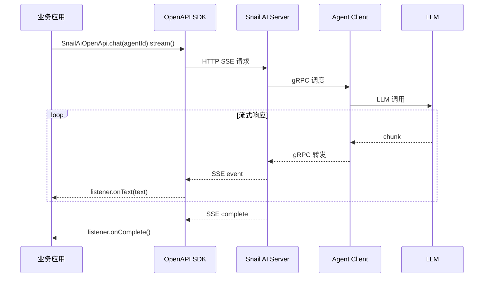
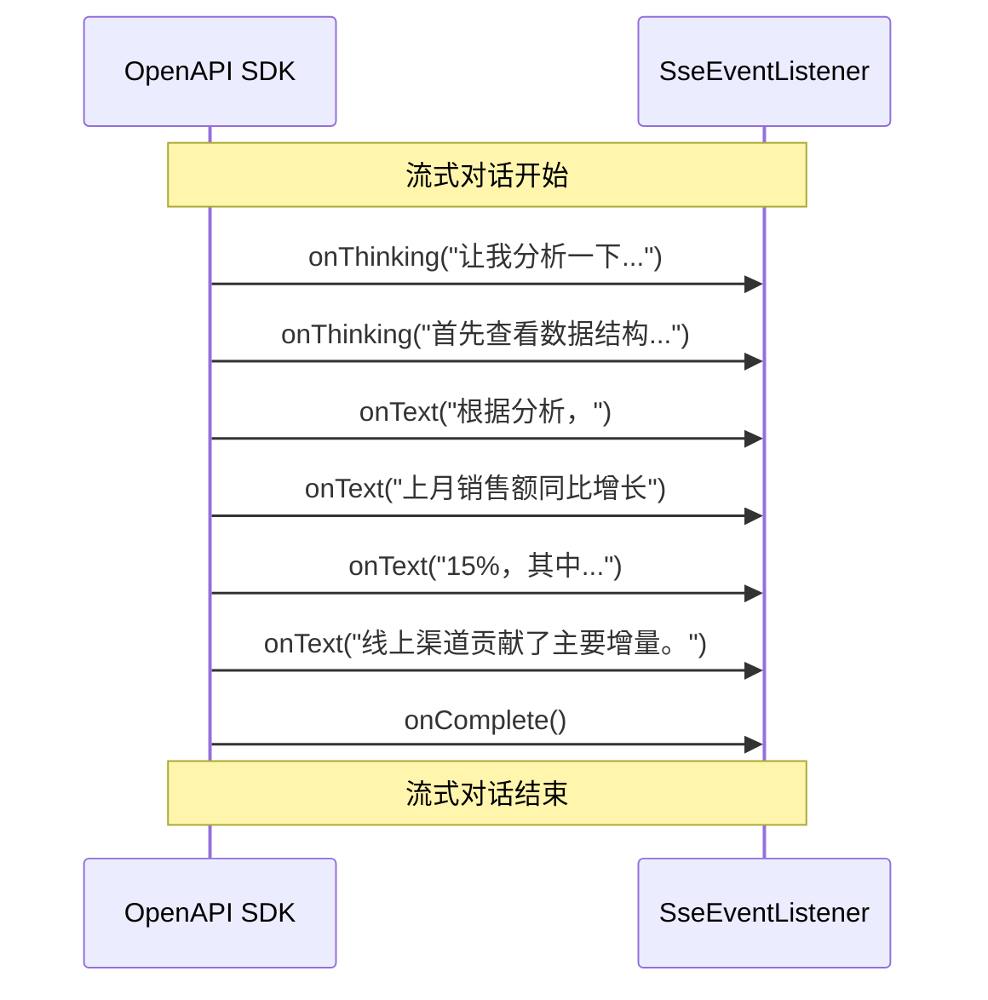
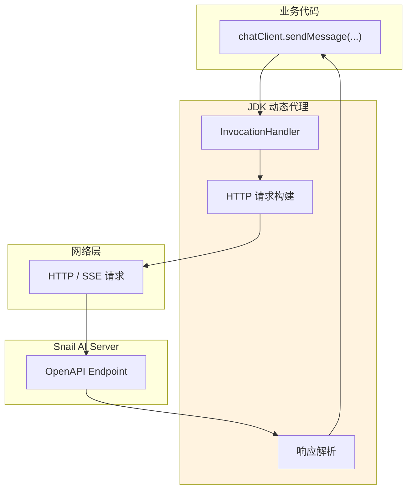
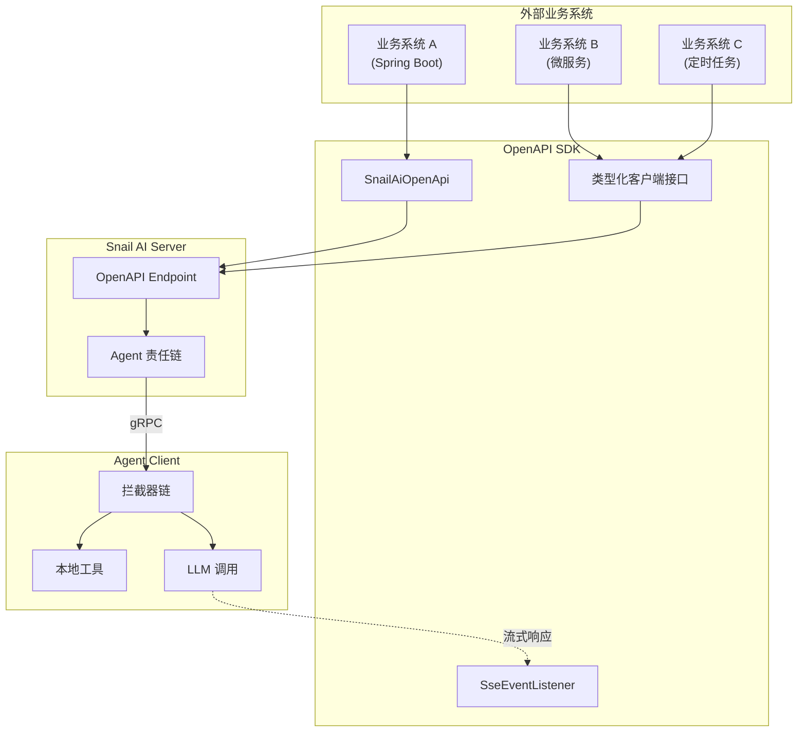

# OpenAPI 客户端 SDK

## 概述

Snail AI 提供了 OpenAPI 客户端 SDK，让外部应用能够以**流式、类型安全**的方式调用 Snail AI 的 AI 能力。通过 `@EnableSnailAiOpenApi` 注解一键启用，SDK 提供了流畅的 Builder API、SSE 事件监听和基于 JDK 动态代理的类型化客户端接口。

OpenAPI SDK 是 Snail AI **自主可控**理念的外延——它不仅让客户端节点能自主执行 AI 任务，还让企业的其他业务系统能够以编程方式灵活接入 AI 能力，实现深度集成而非简单的 API 转发。

## 快速开始

### 1. 启用 OpenAPI SDK

在 Spring Boot 应用中添加 `@EnableSnailAiOpenApi` 注解：

```java
@SpringBootApplication
@EnableSnailAiOpenApi
public class MyApplication {
    public static void main(String[] args) {
        SpringApplication.run(MyApplication.class, args);
    }
}
```

### 2. 配置连接参数

```yaml
snail-ai:
  openapi:
    web-port: 8900          # Snail AI Server HTTP 端口
    https: false             # 是否使用 HTTPS
    prefix: snail-ai         # context path，不带开头斜杠
    connect-timeout-ms: 5000
    read-timeout-ms: 60000
    chat-timeout-ms: 300000
```

### 3. 发起流式对话

```java
SnailAiOpenApi.chat(agentId)
    .openId("user-001")
    .content("帮我分析一下最新的销售数据")
    .listener(new SseEventListener() {
        @Override
        public void onText(String text) {
            System.out.print(text);  // 实时打印文本
        }

        @Override
        public void onThinking(String thinking) {
            System.out.println("[思考] " + thinking);
        }

        @Override
        public void onComplete() {
            System.out.println("\n[对话完成]");
        }

        @Override
        public void onError(Throwable error) {
            System.err.println("错误: " + error.getMessage());
        }
    })
    .stream();
```

<!-- screenshot: client-openapi-demo.png — OpenAPI SDK 调用示例的运行效果，展示流式输出和事件回调 -->

## SnailAiOpenApi 流式 Builder API

`SnailAiOpenApi` 提供了流畅的 Builder 模式 API，支持链式调用：

```java
SnailAiOpenApi.chat(agentId)           // 指定智能体 ID
    .openId("user-001")                // 用户标识
    .conversationId("conv-abc-123")    // 会话 ID（可选，不传则新建会话）
    .content("你好，请帮我分析数据")      // 用户消息内容
    .disabledMcpServerIds(ids)         // 禁用指定 MCP Server（可选）
    .disabledSkillIds(ids)             // 禁用指定技能（可选）
    .listener(myListener)              // SSE 事件监听器
    .stream();                         // 发起流式请求
```

### Builder 方法说明

| 方法 | 参数类型 | 必填 | 说明 |
|------|----------|------|------|
| `chat(agentId)` | `Long` | 是 | 静态工厂方法，指定要对话的智能体 ID |
| `openId(openId)` | `String` | 是 | 用户标识，用于关联用户身份和对话上下文 |
| `conversationId(id)` | `String` | 否 | 会话 ID。传入已有 ID 继续对话，不传则自动创建新会话 |
| `content(content)` | `String` | 是 | 用户消息的文本内容 |
| `disabledMcpServerIds(ids)` | `List<Long>` | 否 | 本次请求中禁用的 MCP Server ID 列表 |
| `disabledSkillIds(ids)` | `List<Long>` | 否 | 本次请求中禁用的技能 ID 列表 |
| `listener(listener)` | `SseEventListener` | 是 | SSE 事件监听器，接收流式响应回调 |
| `stream()` | -- | -- | 发起流式请求 |

### 请求流程



## SseEventListener 接口

`SseEventListener` 是流式响应的事件回调接口，定义了 4 个事件方法：

```java
public interface SseEventListener {

    /**
     * 收到文本内容 chunk 时回调。
     * 在一次对话中可能被多次调用，每次传入一小段文本。
     *
     * @param text 文本片段
     */
    void onText(String text);

    /**
     * 收到思维链（thinking）内容时回调。
     * 当 LLM 返回推理过程或 thinking 内容时触发。
     *
     * @param thinking 思维链文本片段
     */
    void onThinking(String thinking);

    /**
     * 流式响应完成时回调。
     * 表示本次对话的 LLM 调用已全部完成。
     */
    void onComplete();

    /**
     * 发生错误时回调。
     * 包含网络错误、服务端错误、LLM 调用失败等各种异常。
     *
     * @param error 错误对象
     */
    void onError(Throwable error);
}
```

### 事件时序



### 实现示例

```java
// 示例：将流式内容写入 WebSocket 推送给前端
public class WebSocketEventListener implements SseEventListener {

    private final WebSocketSession session;
    private final StringBuilder fullText = new StringBuilder();

    public WebSocketEventListener(WebSocketSession session) {
        this.session = session;
    }

    @Override
    public void onText(String text) {
        fullText.append(text);
        // 实时推送给前端
        session.sendMessage(new TextMessage(
            JsonUtil.toJson(Map.of("type", "text", "content", text))
        ));
    }

    @Override
    public void onThinking(String thinking) {
        session.sendMessage(new TextMessage(
            JsonUtil.toJson(Map.of("type", "thinking", "content", thinking))
        ));
    }

    @Override
    public void onComplete() {
        // 保存完整对话记录
        conversationService.saveMessage(fullText.toString());
        session.sendMessage(new TextMessage(
            JsonUtil.toJson(Map.of("type", "complete"))
        ));
    }

    @Override
    public void onError(Throwable error) {
        log.error("对话出错", error);
        session.sendMessage(new TextMessage(
            JsonUtil.toJson(Map.of("type", "error", "message", error.getMessage()))
        ));
    }
}
```

## 类型化客户端接口

OpenAPI SDK 通过 JDK 动态代理提供了类型安全的客户端接口，无需手动构建 HTTP 请求：

### 接口列表

| 接口 | 说明 | 典型操作 |
|------|------|----------|
| `OpenApiChatClient` | 对话相关 | 发送消息、获取对话历史 |
| `OpenApiConversationClient` | 会话管理 | 创建/删除会话、列出会话 |
| `OpenApiAgentClient` | 智能体查询 | 查询可用智能体、获取详情 |
| `OpenApiUserClient` | 用户管理 | 用户认证、信息查询 |

### 使用示例

```java
@Autowired
private OpenApiChatClient chatClient;

@Autowired
private OpenApiConversationClient conversationClient;

@Autowired
private OpenApiAgentClient agentClient;

// 查询可用的智能体列表
List<AgentInfo> agents = agentClient.listAgents();

// 创建新会话
String conversationId = conversationClient.create(agentId, "user-001");

// 获取历史对话记录
List<MessageRecord> history = conversationClient.getMessages(agentId, conversationId);
```

### 动态代理原理



类型化接口的优势：

- **编译时类型检查**：参数和返回值类型在编译时验证，减少运行时错误
- **IDE 友好**：支持自动补全、跳转定义、参数提示
- **统一错误处理**：代理层统一处理网络异常、认证过期等问题
- **零样板代码**：无需手动构建 HTTP 请求、解析 JSON 响应

## 高级功能

### 按请求禁用工具

在某些场景下，可能需要临时禁用特定的 MCP Server 或技能。`disabledMcpServerIds` 和 `disabledSkillIds` 提供了按请求粒度的工具控制能力：

```java
// 场景：在内网安全环境中，禁用所有外部访问相关的工具
SnailAiOpenApi.chat(agentId)
    .openId("user-001")
    .content("分析内部数据库中的客户信息")
    .disabledMcpServerIds(List.of(
        101L,  // 外部搜索 MCP Server
        102L   // 网页爬取 MCP Server
    ))
    .disabledSkillIds(List.of(
        201L,  // 互联网搜索技能
        202L   // 外部 API 调用技能
    ))
    .listener(myListener)
    .stream();
```

这个功能体现了 Snail AI 的**自主可控**设计：调用方不仅可以控制对话内容，还可以精确控制 AI 在处理请求时可以使用哪些工具，确保数据流向的可控性。

### 多轮对话

通过传入 `conversationId` 实现多轮对话的上下文延续：

```java
// 第一轮对话（不传 conversationId，自动创建新会话）
String conversationId = null;

SnailAiOpenApi.chat(agentId)
    .openId("user-001")
    .content("帮我查看最近一周的订单数据")
    .listener(new SseEventListener() {
        @Override
        public void onComplete() {
            // 从响应中获取 conversationId，用于后续对话
        }
        // ... 其他回调
    })
    .stream();

// 第二轮对话（传入 conversationId，继续上一轮的上下文）
SnailAiOpenApi.chat(agentId)
    .openId("user-001")
    .conversationId(conversationId)  // 继续对话
    .content("其中退款订单有多少？")
    .listener(myListener)
    .stream();
```

## SnailAiOpenApiProperties 配置参考

| 配置项 | 类型 | 默认值 | 说明 |
|--------|------|--------|------|
| `snail-ai.openapi.web-port` | `int` | `8080` | Snail AI Server HTTP 端口；当前项目默认应配置为 `8900` |
| `snail-ai.openapi.https` | `boolean` | `false` | 是否使用 HTTPS 连接 |
| `snail-ai.openapi.prefix` | `String` | `snail-ai` | HTTP 上下文路径前缀，不带开头斜杠 |
| `snail-ai.openapi.connect-timeout-ms` | `long` | `5000` | HTTP 连接超时时间，单位毫秒 |
| `snail-ai.openapi.read-timeout-ms` | `long` | `60000` | HTTP 读取超时时间，单位毫秒 |
| `snail-ai.openapi.chat-timeout-ms` | `long` | `300000` | 流式对话超时时间，单位毫秒 |

### 完整配置示例

```yaml
snail-ai:
  openapi:
    web-port: 8900
    https: false
    prefix: snail-ai
    connect-timeout-ms: 5000
    read-timeout-ms: 120000
    chat-timeout-ms: 300000
```

### HTTPS 配置

生产环境建议启用 HTTPS：

```yaml
snail-ai:
  openapi:
    web-port: 443
    https: true
    prefix: snail-ai
    connect-timeout-ms: 5000
    read-timeout-ms: 120000
    chat-timeout-ms: 300000
```

## 集成架构

OpenAPI SDK 在 Snail AI 整体架构中的位置：



::: tip 与直接 HTTP 调用的区别
虽然可以直接调用 Snail AI Server 的 HTTP API，但 OpenAPI SDK 提供了以下优势：
- **流式支持**：内置 SSE 解析和事件分发，无需手动处理流
- **类型安全**：编译时验证参数和返回值类型
- **自动重试**：内置连接失败重试机制
- **工具控制**：`disabledMcpServerIds` / `disabledSkillIds` 实现细粒度的工具管控
- **Spring 集成**：自动装配，声明式配置
:::
