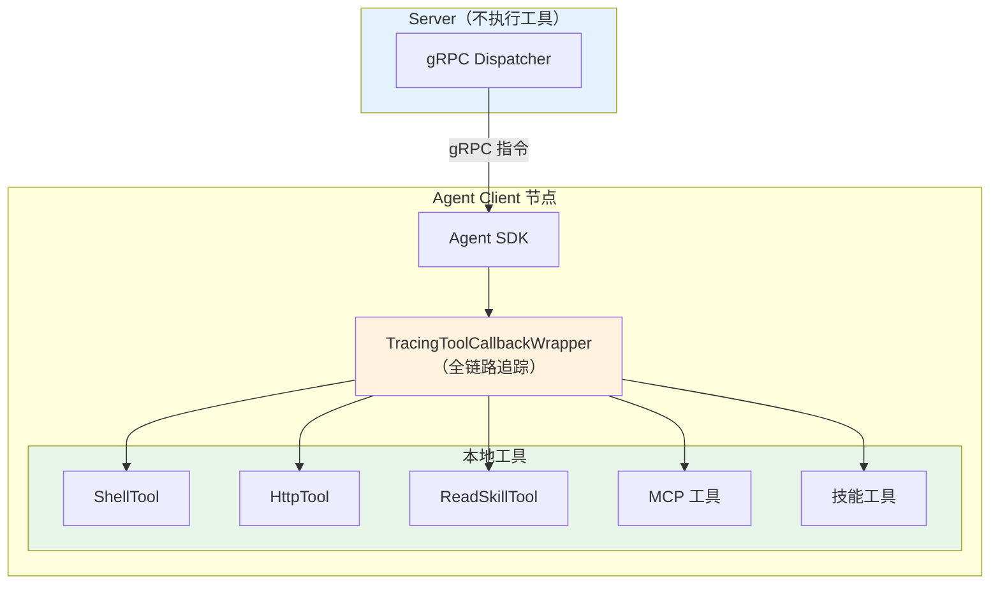
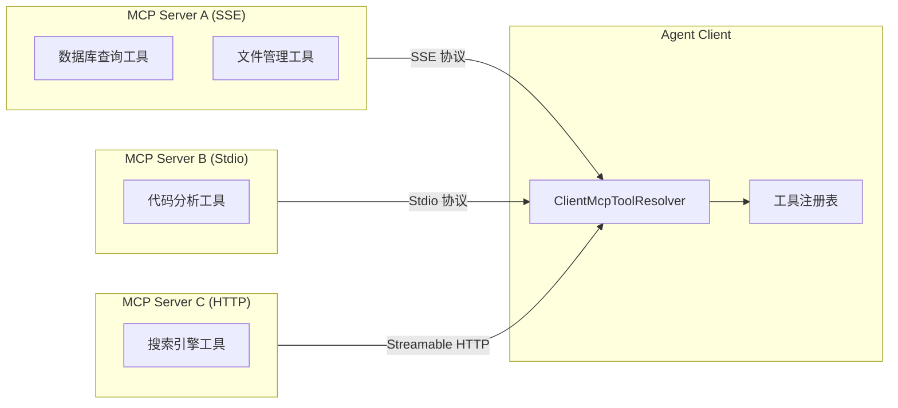
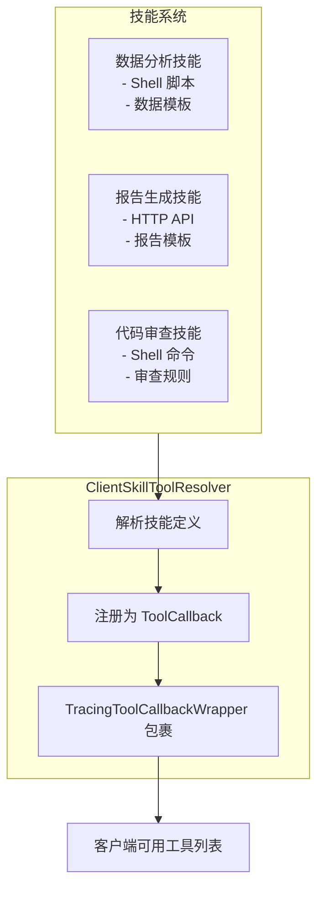
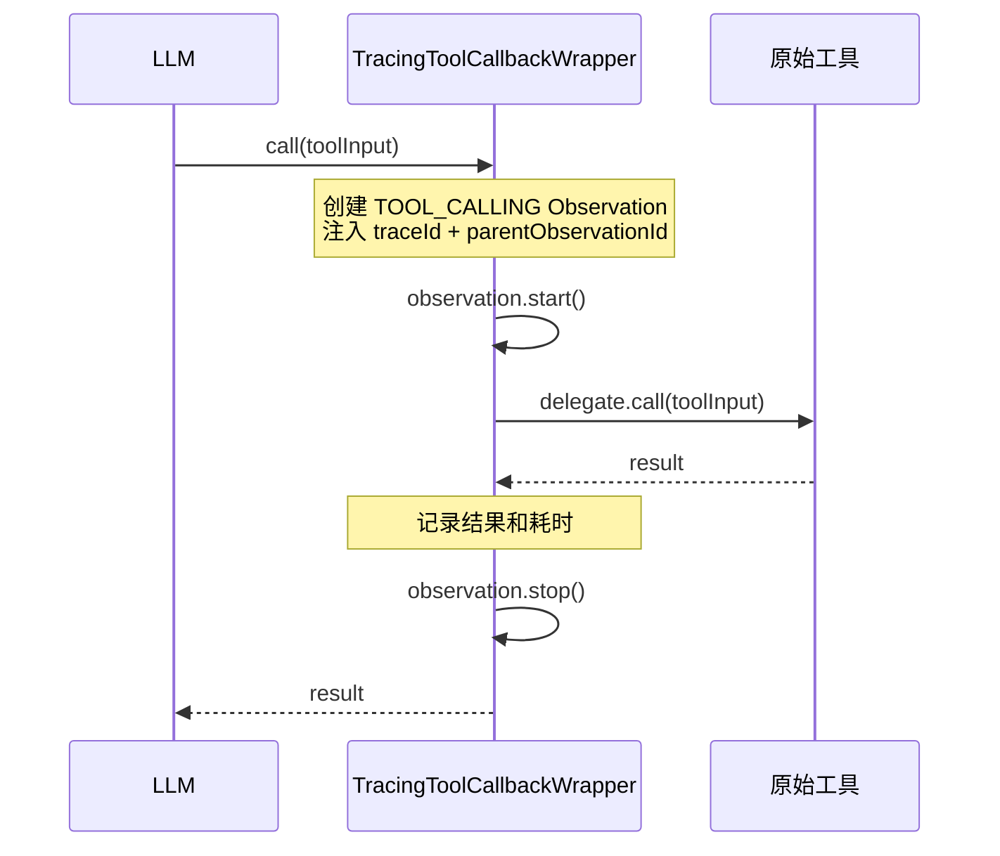
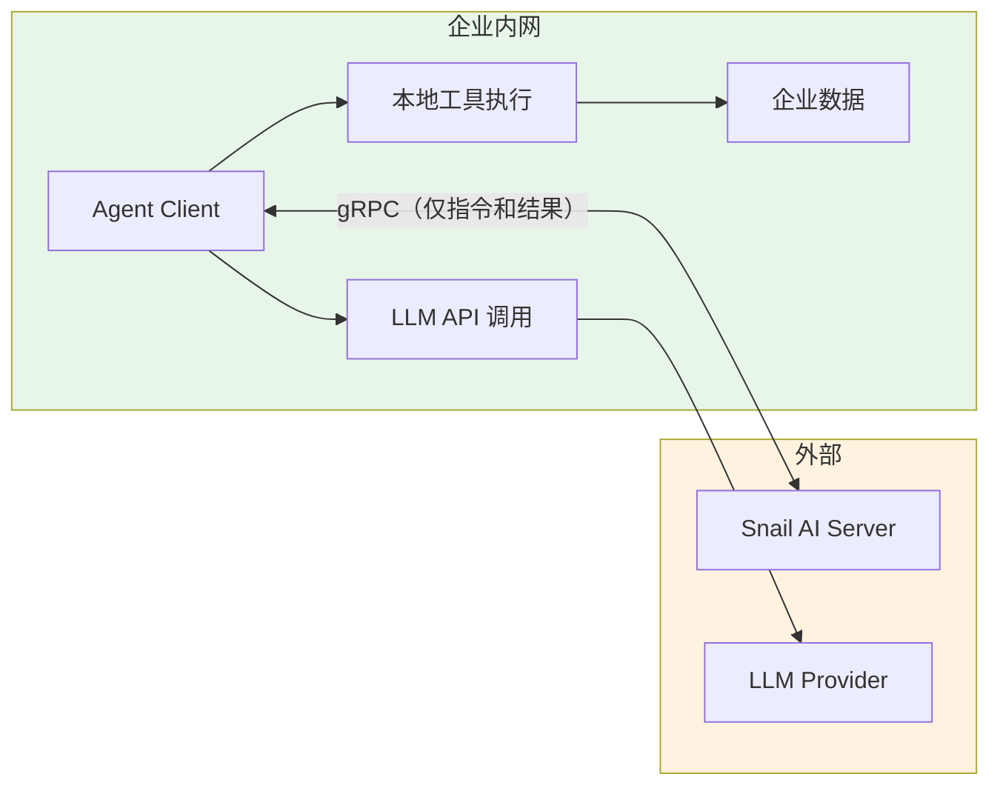
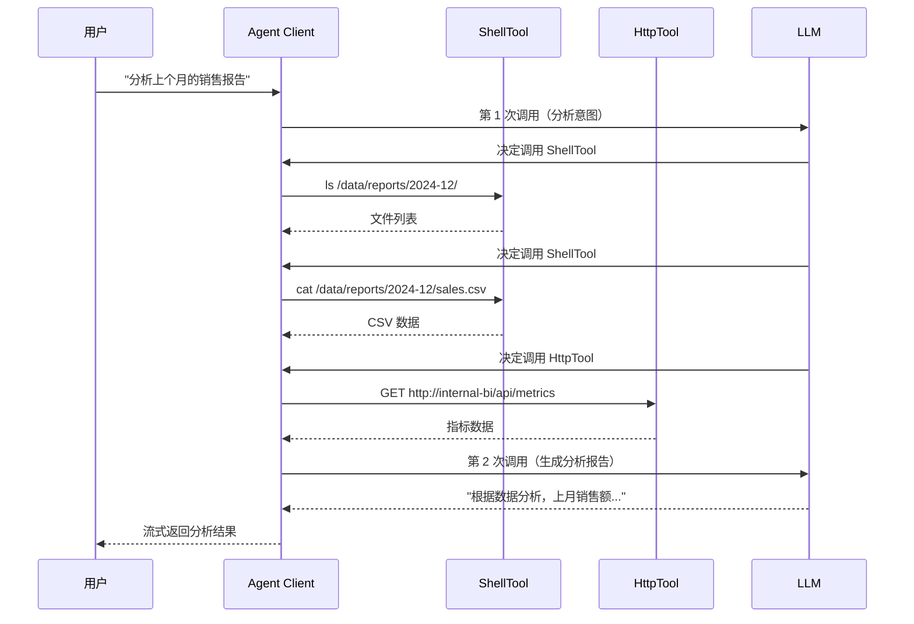

# 本地工具执行

## 概述

Snail AI 客户端模式中的工具（Tool）执行在客户端节点本地完成，这是**自主可控**理念的重要体现：敏感数据不需要离开客户端环境，工具的执行逻辑完全由客户端节点掌控。

与 SaaS 平台将所有工具调用集中在服务端不同，Snail AI 的架构设计使得：

- **数据不出域**：Shell 命令、HTTP 请求等工具在客户端本地执行，数据不经过中心 Server
- **执行可控**：企业可以精确控制哪些工具可用、工具的执行权限和资源限制
- **动态扩展**：通过 MCP 协议和技能系统动态注册新工具，无需修改代码



## 内置工具

### ShellTool -- Shell 命令执行

在客户端节点的指定技能目录下执行 Shell 命令，适用于本地文件操作、脚本执行等场景。

| 属性 | 说明 |
|------|------|
| **工具名称** | `ShellTool` |
| **执行环境** | 客户端节点本地操作系统 |
| **工作目录** | 技能（Skill）配置的目录 |
| **典型用途** | 执行构建脚本、读写本地文件、运行数据处理命令 |

```java
// ShellTool 调用示例（由 LLM 自动触发）
// LLM 决定调用 ShellTool 时，传入参数：
{
    "command": "ls -la /data/reports/",
    "workingDirectory": "/opt/skills/data-analysis"
}
```

::: warning 安全提示
ShellTool 在客户端本地执行命令，请确保技能目录（`snail-ai.skill-temp-dir`）的权限配置合理，避免执行不受信任的命令。
:::

### HttpTool -- HTTP 请求工具

执行 HTTP GET/POST 请求，支持调用任意 HTTP API，数据在客户端本地发送和接收。

| 属性 | 说明 |
|------|------|
| **工具名称** | `HttpTool` |
| **支持方法** | GET、POST |
| **请求格式** | JSON |
| **典型用途** | 调用内部 API、获取外部数据、Webhook 通知 |

```java
// HttpTool 调用参数示例
{
    "method": "GET",
    "url": "https://api.internal.company.com/reports/latest",
    "headers": {
        "Authorization": "Bearer internal-token"
    }
}

// POST 请求示例
{
    "method": "POST",
    "url": "https://api.internal.company.com/analysis",
    "body": {
        "dataSource": "sales_2024",
        "metrics": ["revenue", "growth_rate"]
    }
}
```

### ReadSkillTool -- 技能文件读取

读取技能（Skill）目录下的文件内容，使 LLM 能够获取本地的提示词模板、参考资料等。

| 属性 | 说明 |
|------|------|
| **工具名称** | `ReadSkillTool` |
| **读取范围** | 技能目录下的文件 |
| **典型用途** | 读取提示词模板、参考文档、配置文件 |

## 动态工具注册

Snail AI 支持通过两种机制动态注册工具，无需重启客户端节点。

### ClientMcpToolResolver -- MCP 工具注册

`ClientMcpToolResolver` 连接到 MCP（Model Context Protocol）Server，将 MCP Server 提供的工具动态注册为客户端可用的工具。



支持三种 MCP 传输协议：

| 协议 | 说明 | 适用场景 |
|------|------|----------|
| **SSE** | Server-Sent Events | 远程 MCP Server，支持持久连接 |
| **Streamable HTTP** | HTTP 流式传输 | 远程 MCP Server，兼容性好 |
| **Stdio** | 标准输入/输出 | 本地 MCP Server，如命令行工具 |

MCP 工具注册后，LLM 可以像使用内置工具一样调用它们，无需感知底层传输协议的差异。

### ClientSkillToolResolver -- 技能工具注册

`ClientSkillToolResolver` 将技能（Skill）系统中定义的工具注册为可调用的工具。技能是 Snail AI 中更高层次的工具抽象，包含：

- **工具定义**：名称、描述、输入参数 schema
- **执行逻辑**：可以是 Shell 脚本、HTTP 调用或复合操作
- **文件资源**：关联的提示词模板、参考文件等



## TracingToolCallbackWrapper 全链路追踪

所有工具（包括内置工具和动态注册的工具）都会被 `TracingToolCallbackWrapper` 自动包裹。这意味着每次工具调用都会生成一个 TOOL_CALLING 类型的 Observation，包含：

| 追踪信息 | 说明 |
|----------|------|
| **traceId** | 所属对话请求的全局追踪 ID |
| **parentToolObservationId** | 父级 Observation ID（来自 GENERATION） |
| **工具名称** | 被调用的工具名 |
| **输入参数** | 工具的输入参数（高基数标签） |
| **执行耗时** | 工具执行的总耗时 |
| **执行结果** | 工具返回的结果 |



详见：[在线日志与追踪](./logging.md)

## 安全模型

Snail AI 的本地工具执行遵循**最小权限原则**，通过多层安全机制保护客户端环境：

### 1. 数据不出域



关键安全点：

| 安全措施 | 说明 |
|----------|------|
| **工具本地执行** | 所有工具在客户端节点本地执行，敏感数据不发送到 Server |
| **gRPC 最小传输** | 与 Server 之间只传输调度指令和处理结果，不传输原始数据 |
| **目录隔离** | ShellTool 限定在技能目录下执行，防止越权访问 |
| **工具白名单** | 可通过配置控制哪些工具可用 |

### 2. 按请求禁用工具

通过 OpenAPI SDK 可以在每次请求时动态禁用特定的工具：

```java
SnailAiOpenApi.chat(agentId)
    .content("分析最新的销售数据")
    .disabledMcpServerIds(List.of("external-search"))  // 禁用外部搜索 MCP
    .disabledSkillIds(List.of("web-crawl"))             // 禁用网页爬取技能
    .stream();
```

详见：[OpenAPI 客户端 SDK](./openapi-sdk.md)

### 3. 与 SaaS 平台的安全对比

| 安全维度 | Snail AI 客户端模式 | Dify / FastGPT |
|----------|---------------------|----------------|
| **工具执行位置** | 客户端本地 | 平台服务端 |
| **数据流向** | 数据不出域 | 数据上传到平台 |
| **工具权限控制** | 客户端自主管理 | 平台统一管理 |
| **网络隔离** | 支持内网部署，工具仅访问内网资源 | 需要平台能访问目标资源 |
| **审计追踪** | 本地 Observation 全链路追踪 | 平台基础日志 |

<!-- screenshot: client-tool-execution.png — 管理后台展示工具执行记录，包括工具名称、输入参数、执行结果和耗时 -->

## 使用示例

### 场景：企业内部数据分析



在整个过程中，销售数据始终在客户端节点本地处理，不会传输到 Server 或其他外部系统。这就是**自主可控**的工具执行模型。
