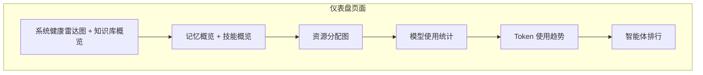
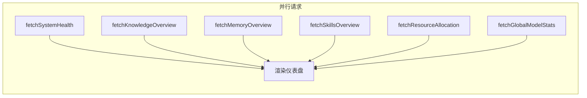

# 仪表盘

仪表盘（Dashboard）是 Snail AI 平台的全局概览页面，登录后的首页即为仪表盘。它通过多维度的数据可视化组件，帮助管理员和运营人员快速掌握系统整体运行状况、资源分配情况和使用趋势。

<!-- screenshot: dashboard-full.png — 仪表盘首页完整截图，展示系统健康雷达图、知识库概览、记忆概览、技能概览、资源分配图、Token 趋势图等组件 -->

## 页面布局

仪表盘采用响应式卡片布局，各功能模块以独立卡片形式排列：



## 系统健康雷达图

<!-- screenshot: dashboard-radar.png — 系统健康雷达图，六边形雷达图展示六个维度的得分 -->

系统健康雷达图以六维雷达图的形式，综合评估系统的整体健康状态。每个维度独立计算得分（0-100），最终汇总为一个整体健康分。

### 评估维度

| 维度 | 说明 | 计算方式 |
|------|------|----------|
| **智能体活跃度** | 衡量智能体的使用频率 | 基于选定时间范围内的对话总数计算 |
| **模型可用性** | 衡量已配置模型的可用比例 | 有调用记录的模型数 / 总模型数 |
| **知识覆盖度** | 衡量智能体绑定 RAG 知识库的比例 | 已绑定 RAG 的智能体占比 |
| **记忆深度** | 衡量智能体启用记忆功能的比例 | 已启用记忆的智能体占比 |
| **技能多样性** | 衡量智能体平均绑定的 Skill 数量 | 所有智能体的平均技能数 |
| **响应质量** | 衡量系统的平均响应速度 | 基于平均响应时间反向计算（越快得分越高） |

### 数据结构

```typescript
type SystemHealth = {
  dimensions: Array<{
    name: string;       // 维度名称
    value: number;      // 原始值
    max: number;        // 最大值
    normalized: number; // 归一化得分（0-100）
  }>;
  overallScore: number; // 整体健康分（各维度平均值）
};
```

### 整体健康分

整体健康分为六个维度归一化得分的算术平均值，直观反映系统的综合状态：

| 分数范围 | 健康等级 | 说明 |
|----------|----------|------|
| 80-100 | 优秀 | 系统配置完善，使用率高 |
| 60-79 | 良好 | 系统基本正常，部分维度有优化空间 |
| 40-59 | 一般 | 多个维度需要关注和优化 |
| 0-39 | 需改进 | 系统配置不足或使用率偏低 |

::: tip 提升健康分的建议
- **智能体活跃度低**：检查智能体配置是否合理，推广使用
- **模型可用性低**：检查模型配置和 API Key 是否有效
- **知识覆盖度低**：为更多智能体绑定 RAG 知识库
- **记忆深度低**：为需要上下文延续的智能体启用记忆功能
- **技能多样性低**：创建更多 Skill 并绑定到智能体
- **响应质量低**：优化模型配置或排查网络延迟问题
:::

## 知识库概览

知识库概览卡片汇总展示所有 RAG 知识库的关键统计数据：

### 统计指标

| 指标 | 说明 |
|------|------|
| **知识库总数** | 系统中创建的 RAG 知识库总数 |
| **文档总数** | 所有知识库中的文档总数 |
| **分片总数** | 所有文档切分后的 Chunk 总数 |
| **状态分布** | 按状态（active/processing/error）统计知识库数量 |
| **Top 知识库** | 按文档数量排名前 3 的知识库 |

### 数据结构

```typescript
type KnowledgeOverview = {
  totalKnowledgeBases: number;       // 知识库总数
  totalDocuments: number;            // 文档总数
  totalChunks: number;               // 分片总数
  statusBreakdown: Record<string, number>; // 状态分布
  topKnowledgeBases: Array<{         // Top 知识库
    id: number;
    name: string;
    documentCount: number;
    icon?: string;
  }>;
};
```

## 记忆概览

记忆概览卡片汇总展示系统中所有智能体的记忆数据统计：

### 统计指标

| 指标 | 说明 |
|------|------|
| **记忆总数** | 系统中存储的记忆条目总数 |
| **按类型分布** | FACT / DECISION / PREFERENCE / TASK_PROGRESS / REFERENCE 各类型的数量 |
| **检索有效性** | 记忆检索的平均有效性评分 |
| **变化趋势** | 记忆数据量的变化趋势（上升/下降/持平） |
| **变化幅度** | 相比上一周期的变化百分比 |

### 数据结构

```typescript
type MemoryOverview = {
  totalMemories: number;                  // 记忆总数
  byType: Record<string, number>;         // 按类型分布
  retrievalEffectiveness: number;         // 检索有效性
  trend: 'up' | 'down' | 'flat';         // 变化趋势
  changePercent?: number;                 // 变化幅度
};
```

### 记忆类型说明

| 类型 | 说明 |
|------|------|
| **FACT** | 事实类记忆：用户提供的客观事实信息 |
| **DECISION** | 决策类记忆：对话中产生的决策和结论 |
| **PREFERENCE** | 偏好类记忆：用户的个人偏好和习惯 |
| **TASK_PROGRESS** | 任务进度：正在进行的任务状态 |
| **REFERENCE** | 参考资料：对话中引用的文档和链接 |

## 技能概览

技能概览卡片展示系统中已配置的 Skill 技能统计：

### 统计指标

| 指标 | 说明 |
|------|------|
| **技能总数** | 系统中创建的 Skill 总数 |
| **Top 技能** | 按绑定智能体数量排名前 5 的技能 |
| **绑定智能体数** | 每个技能被多少个智能体引用 |

### 数据结构

```typescript
type SkillsOverview = {
  totalSkills: number;
  skills: Array<{
    id: number;
    name: string;
    description?: string;
    agentCount: number;     // 绑定的智能体数量
    fileSize?: number;      // 技能文件大小
  }>;
};
```

## 资源分配图

资源分配图以可视化方式展示各智能体所占有的资源情况，帮助了解资源的分布是否均衡。

### 展示维度

对于每个智能体，统计以下资源维度：

| 维度 | 说明 |
|------|------|
| **知识库** | 绑定的 RAG 知识库数量 |
| **技能** | 绑定的 Skill 数量 |
| **记忆** | 是否启用记忆功能（0 或 1） |
| **对话数** | 近期的对话数量 |

### 数据结构

```typescript
type ResourceAllocation = {
  agents: Array<{
    id: number;
    name: string;
    avatar?: string;
    resources: {
      knowledgeBases: number;   // 知识库数量
      skills: number;           // 技能数量
      memories: number;         // 记忆状态
      conversations: number;    // 对话数量
    };
  }>;
};
```

### 排序逻辑

智能体按资源综合得分排序，得分计算公式：

```
综合得分 = 对话数 x 2 + 技能数 x 3 + 知识库数 x 5 + 记忆启用 x 3
```

资源较丰富、使用较活跃的智能体排在前面，便于快速识别核心智能体。

## 模型使用统计

模型使用统计卡片展示系统中各模型的调用情况，帮助了解模型资源的使用分布：

### 统计指标

| 指标 | 说明 |
|------|------|
| **模型名称** | 模型标识和所属厂商 |
| **调用总次数** | 累计调用次数 |
| **成功次数** | 调用成功的次数 |
| **失败次数** | 调用失败的次数 |
| **成功率** | 成功调用占比 |
| **Token 消耗** | 累计消耗的 Token 总量 |
| **总费用** | 累计产生的费用 |
| **平均响应时间** | 平均每次调用的响应耗时 |

## Token 使用趋势

<!-- screenshot: dashboard-token-trend.png — Token 使用趋势折线图，展示近 30 天的每日 Token 消耗量 -->

Token 使用趋势图以折线图形式展示系统 Token 消耗的时间变化趋势，是容量规划和成本管控的重要参考。

### 趋势维度

- **输入 Token 趋势**：每日输入 Token 消耗量
- **输出 Token 趋势**：每日输出 Token 消耗量
- **总 Token 趋势**：每日总 Token 消耗量
- **费用趋势**：每日产生的费用

### 分析场景

| 场景 | 关注指标 | 分析方法 |
|------|----------|----------|
| 成本控制 | 费用趋势 | 观察日费用是否在预算范围内 |
| 容量规划 | Token 总量趋势 | 预测未来的 Token 需求增长 |
| 异常检测 | 日消耗量突变 | Token 消耗突然激增可能表示异常使用 |
| 优化评估 | 输入/输出比例 | 输入 Token 占比过高可能说明 prompt 需要优化 |

## 智能体排行

智能体排行榜按使用热度排列系统中的所有智能体，帮助了解哪些智能体最受欢迎。

### 排行指标

| 指标 | 说明 |
|------|------|
| **排名** | 按使用热度从高到低排列 |
| **智能体名称** | 智能体的名称和头像 |
| **访问量** | viewCount 累计访问次数 |
| **活跃用户** | 近期的活跃用户数 |
| **对话数** | 近期的对话数量 |
| **消息数** | 近期的消息总数 |

### 数据来源

排行榜数据来自智能体列表接口和各智能体的统计分析接口聚合。前端获取所有智能体后，按 `viewCount` 或对话数进行排序。

## 数据刷新

仪表盘的数据在页面加载时自动获取。由于部分数据需要聚合多个接口的结果，加载过程采用并行请求策略以优化性能：



每个数据模块独立加载、独立渲染，某个模块的加载失败不会影响其他模块的展示。

## API 接口

仪表盘使用的数据来自多个业务模块的聚合，涉及以下 API：

| 方法 | 路径 | 用途 |
|------|------|------|
| GET | `/agent/page` | 获取智能体列表（计算健康度、资源分配） |
| GET | `/agent/{id}/analytics` | 获取单个智能体的统计数据 |
| GET | `/rag/page` | 获取知识库列表（知识库概览） |
| GET | `/skill/page` | 获取技能列表（技能概览） |
| GET | `/memory/agent/{id}/stats` | 获取智能体记忆统计（记忆概览） |
| GET | `/model/usage-stat/page` | 获取模型使用统计 |

## 使用建议

### 日常巡检

建议每日查看仪表盘进行系统巡检：

1. **查看健康雷达图**：整体健康分是否在正常范围
2. **检查模型使用统计**：是否有模型调用失败率异常升高
3. **关注 Token 趋势**：日消耗是否在合理范围，是否有异常波动
4. **查看智能体排行**：热门智能体的使用情况是否正常

### 定期分析

建议每周进行一次深度分析：

1. **资源分配均衡性**：是否存在"空壳"智能体（无知识库、无技能、无使用量）
2. **知识库状态**：是否有知识库处于 error 状态需要修复
3. **记忆检索有效性**：记忆检索的有效性评分是否达标
4. **技能利用率**：是否有技能从未被任何智能体使用

### 容量规划

根据仪表盘数据进行中长期规划：

- **Token 预算**：根据 Token 趋势预测月度 Token 消耗，制定预算
- **存储规划**：根据知识库和文档增长趋势，预估存储需求
- **并发扩容**：根据活跃用户增长趋势，评估是否需要扩容 Agent Client 节点

## 下一步

- [智能体管理](/guide/agent/) -- 创建和管理智能体
- [可观测性](/guide/observability/) -- 深入查看单个智能体的追踪数据
- [模型管理](/guide/model/) -- 配置和管理大模型
