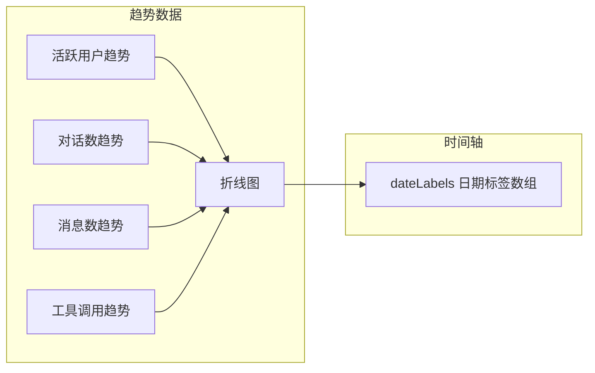

# 统计分析

统计分析功能为每个智能体提供全面的使用数据洞察，帮助运营人员了解智能体的活跃度、使用趋势和用户行为。通过多维度的数据指标和可视化图表，可以量化评估智能体的运行效果，为优化决策提供数据支撑。

## 访问入口

在智能体详情页中，切换到**数据分析**标签页即可进入统计分析功能。

<!-- screenshot: obs-analytics.png — 统计分析页面，展示核心指标卡片（活跃用户、对话数、消息数、平均响应时间）和趋势折线图 -->

## 核心指标

统计分析页面顶部以卡片形式展示四个核心指标，提供当前时间范围内智能体使用情况的快速概览：

### 活跃用户 (activeUsers)

| 属性 | 说明 |
|------|------|
| **定义** | 在选定时间范围内，与该智能体进行过至少一次对话的去重用户数量 |
| **趋势** | 展示按日的活跃用户数变化趋势折线图（`activeUsersTrend`） |
| **用途** | 衡量智能体的用户覆盖面和受欢迎程度 |

### 对话数 (conversationCount)

| 属性 | 说明 |
|------|------|
| **定义** | 在选定时间范围内，与该智能体建立的对话会话总数 |
| **趋势** | 展示按日的对话数变化趋势折线图（`conversationCountTrend`） |
| **用途** | 反映智能体的使用频率和业务量 |

### 消息总数 (totalMessages)

| 属性 | 说明 |
|------|------|
| **定义** | 在选定时间范围内，所有对话中的消息总数（包含用户消息和 AI 回复） |
| **趋势** | 展示按日的消息数变化趋势折线图（`messageTrend`） |
| **用途** | 衡量用户交互深度，消息数/对话数的比值反映了单次对话的平均交互轮次 |

### 平均响应时间 (avgResponseTime)

| 属性 | 说明 |
|------|------|
| **定义** | 在选定时间范围内，AI 从收到用户消息到返回完整响应的平均耗时（毫秒） |
| **用途** | 衡量智能体的响应速度和用户体验质量 |

## 趋势图表

在核心指标卡片下方，展示时间序列趋势图，支持以下数据维度：



### 数据结构

趋势数据通过以下字段返回：

```typescript
type AnalyticsOverview = {
  activeUsers: number;                    // 活跃用户数
  activeUsersTrend?: number[];            // 按日活跃用户趋势
  conversationCount: number;              // 对话总数
  conversationCountTrend?: number[];      // 按日对话数趋势
  totalMessages?: number;                 // 消息总数
  messageTrend?: number[];                // 按日消息数趋势
  totalToolCalls?: number;                // 工具调用总次数
  toolCallTrend?: number[];               // 按日工具调用趋势
  avgResponseTime?: number;               // 平均响应时间（ms）
  dateLabels?: string[];                  // 日期标签数组
  dateRange: { start: string; end: string }; // 实际查询的日期范围
};
```

### 图表交互

- **悬停查看**：鼠标悬停在折线图上的数据点，显示该日期的具体数值
- **多指标叠加**：可以在同一图表中叠加多条趋势线进行对比
- **时间范围缩放**：通过调整日期范围，可以查看更细粒度或更长周期的趋势

## 日期范围筛选

统计分析支持灵活的时间范围选择，所有数据指标和趋势图表会随时间范围的变化实时更新。

### 预设范围

| 范围 | 标识 | 说明 |
|------|------|------|
| **近 1 天** | `1d` | 展示最近 24 小时的数据 |
| **近 7 天** | `7d` | 展示最近一周的数据（默认） |
| **近 30 天** | `30d` | 展示最近一个月的数据 |
| **自定义** | `custom` | 手动选择起止日期 |

### 自定义日期范围

选择"自定义"后，可以通过日期选择器指定精确的起止日期：

```typescript
type AnalyticsDateRange = '1d' | '7d' | '30d' | 'custom';

// 请求参数
{
  range?: AnalyticsDateRange;    // 预设范围
  start?: string;                // 自定义起始日期（ISO 格式）
  end?: string;                  // 自定义结束日期（ISO 格式）
}
```

::: tip 日期范围建议
- 日常监控推荐使用 **7d**，可以快速发现近期异常
- 周期性报告推荐使用 **30d**，便于观察长期趋势
- 问题排查时使用 **1d** 或 **自定义** 精确定位时间窗口
:::

## 用户使用详情

在核心指标和趋势图表之外，统计分析页还提供了按用户维度的使用明细，帮助了解每个用户对智能体的使用情况。

### 用户明细列表

用户使用详情以分页表格形式展示，每行代表一个用户：

| 字段 | 说明 |
|------|------|
| **用户 ID** | 用户的系统唯一标识 |
| **用户名** | 用户的显示名称 |
| **部门** | 用户所属部门 |
| **消息数** | 该用户在选定时间范围内的消息总数 |

### 数据结构

```typescript
type UsageDetailItem = {
  userId: number;       // 用户 ID
  userName: string;     // 用户名
  department: string;   // 部门
  messageCount: number; // 消息数
};
```

### 用户明细用途

- **识别核心用户**：找出使用频率最高的用户，了解哪些人是智能体的重度用户
- **部门分析**：统计各部门的使用量，评估智能体在不同业务线的渗透率
- **异常检测**：发现使用量突然激增或骤降的用户，可能需要关注

## API 接口

统计分析相关的 API 接口：

| 方法 | 路径 | 说明 |
|------|------|------|
| GET | `/agent/{agentId}/analytics` | 获取智能体的统计概览数据 |
| GET | `/agent/{agentId}/usage-detail` | 获取按用户维度的使用明细 |
| GET | `/agent/{agentId}/conversations` | 获取智能体的对话列表 |

### 统计概览请求示例

```
GET /agent/1/analytics?range=7d
```

### 用户明细请求示例

```
GET /agent/1/usage-detail?page=1&size=20&start=2025-01-01&end=2025-01-31
```

## 数据分析场景

### 场景一：评估智能体上线效果

新智能体上线后，选择 **30d** 时间范围，观察以下关键指标：

1. **活跃用户趋势**是否持续增长 -- 反映用户接受度
2. **消息数/对话数比值**是否稳定 -- 反映用户交互深度
3. **平均响应时间**是否在可接受范围内 -- 反映系统性能

### 场景二：优化智能体配置

通过数据对比发现优化方向：

1. 对比不同时间段的**平均响应时间**，判断模型或 Prompt 调整是否有效
2. 观察**工具调用趋势**，判断 MCP 工具配置是否合理
3. 分析**用户使用详情**，了解哪些用户/部门的需求未被满足

### 场景三：容量规划

根据历史趋势数据预测未来需求：

1. **消息数增长率** -- 预估 Token 消耗增长趋势
2. **活跃用户增速** -- 预估并发请求量
3. **工具调用频率** -- 预估外部工具服务的负载

## 下一步

- [追踪详情](./trace.md) -- 深入查看单条对话的完整追踪
- [评分系统](./score.md) -- 对智能体的表现进行定量评估
- [可观测性概览](./index.md) -- 返回可观测性总览
