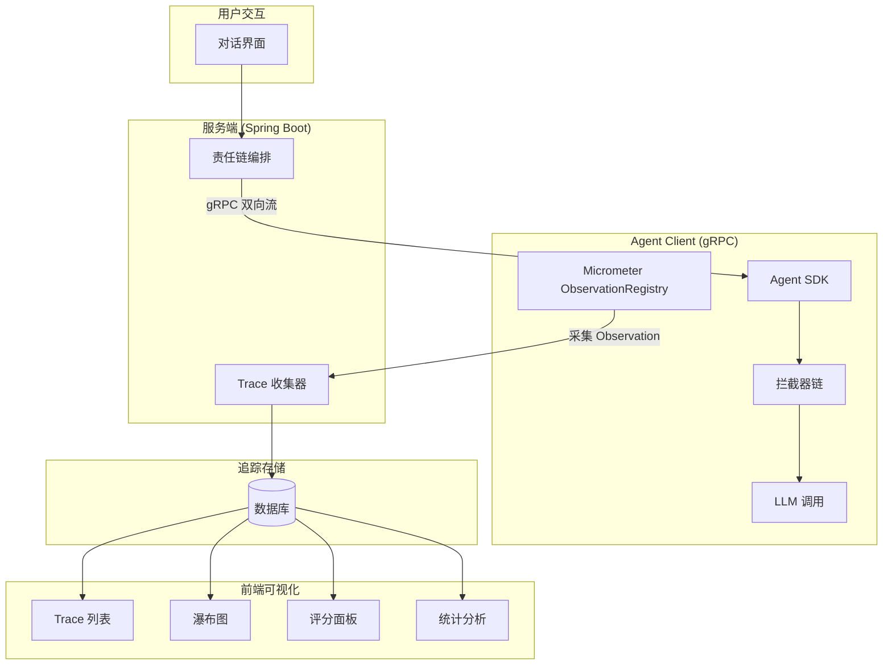
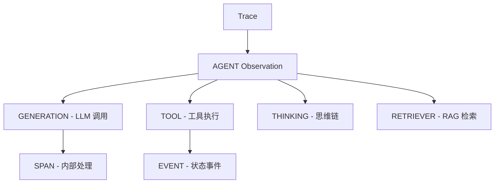
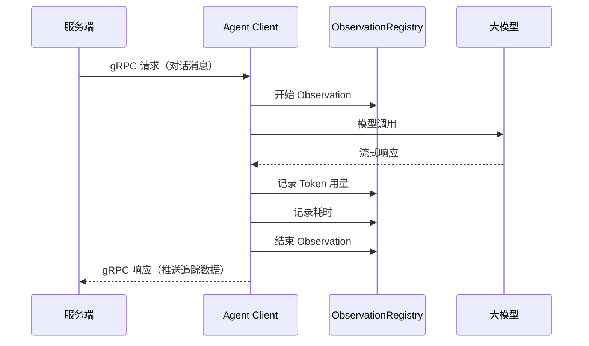
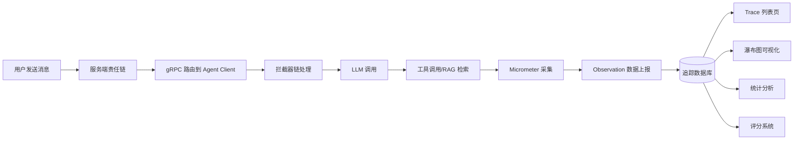

# 可观测性

可观测性（Observability）是 Snail AI 平台的核心运维能力之一。它为每一次 AI 对话生成结构化的追踪数据，帮助开发者和运营人员深入理解智能体的推理过程、工具调用行为和性能瓶颈。

Snail AI 的可观测性设计参考了 [Langfuse](https://langfuse.com/) 的 Observation 追踪模型，并深度集成了客户端 Micrometer ObservationRegistry，实现了从服务端编排到客户端执行的全链路追踪。

## 核心架构



## 追踪模型

Snail AI 采用 **Trace -> Observation** 的两层追踪模型：

- **Trace（追踪）**：代表一次完整的用户交互轮次（一问一答），是追踪数据的最顶层容器。每个 Trace 包含输入、输出、耗时、状态、标签等元信息，以及一棵由多个 Observation 组成的树形结构。
- **Observation（观测）**：代表 Trace 内部的一个具体执行步骤，如模型调用、工具执行、思维链推理等。Observation 之间通过 `parentObservationId` 形成父子关系，构成完整的执行树。



## 观测类型 (Observation Type)

每个 Observation 都有一个明确的类型标识，用于区分不同的执行步骤：

| 类型 | 说明 | 典型场景 |
|------|------|----------|
| **GENERATION** | 大模型生成调用 | 调用 GPT、Claude、Ollama 等模型进行推理，记录输入 prompt、输出内容、Token 用量、耗时、模型参数等 |
| **TOOL** | 工具调用执行 | MCP 工具调用的实际执行过程，包含工具名称、输入参数、返回结果和执行耗时 |
| **THINKING** | 思维链/推理过程 | 记录推理模型（如 OpenAI o1/o3、Claude 等）的思维链内容，展示模型的内部推理过程 |
| **SPAN** | 通用执行跨度 | 记录任意内部处理阶段的耗时和上下文，如责任链节点执行、拦截器处理等 |
| **EVENT** | 离散事件标记 | 标记某个关键节点的状态变化或事件触发，如对话开始、模型切换、错误发生等 |
| **AGENT** | 智能体编排步骤 | 记录智能体责任链中的编排和路由决策过程 |
| **RETRIEVER** | 检索操作 | RAG 知识库的向量检索、BM25 检索、融合排序等过程 |
| **EMBEDDING** | 向量化操作 | 文本向量化（Embedding）调用，记录输入文本和生成的向量维度 |

### 类型图标与颜色

在前端可视化中，每种观测类型使用不同的图标和颜色进行区分，便于在追踪树和瀑布图中快速识别：

- **GENERATION** -- 紫色，表示 AI 生成
- **TOOL** -- 蓝色，表示工具调用
- **THINKING** -- 橙色，表示思维过程
- **SPAN** -- 灰色，表示通用跨度
- **EVENT** -- 绿色，表示事件
- **AGENT** -- 青色，表示智能体编排
- **RETRIEVER** -- 黄色，表示检索
- **EMBEDDING** -- 粉色，表示向量化

## 观测级别 (Observation Level)

每个 Observation 都可以标记一个级别，用于表示该步骤的严重程度或重要性：

| 级别 | 说明 | 使用场景 |
|------|------|----------|
| **DEBUG** | 调试信息 | 仅在调试模式下关注的详细信息，如内部参数传递、缓存命中等 |
| **DEFAULT** | 默认级别 | 正常执行的 Observation，大多数步骤使用此级别 |
| **WARNING** | 警告 | 执行中出现非致命性问题，如模型降级、重试成功、Token 接近上限等 |
| **ERROR** | 错误 | 执行失败或异常，如模型调用超时、工具执行报错、RAG 检索失败等 |

在追踪列表和详情页中，WARNING 和 ERROR 级别的 Observation 会以醒目的颜色标注，便于快速定位问题。

## 客户端 Micrometer 集成

::: warning 实现中
Micrometer 集成功能正在开发中，当前版本尚未完整实现。文档描述的是目标设计，实际功能将在后续版本中发布。
:::

Snail AI 的 Agent Client SDK 深度集成了 Spring Micrometer 的 `ObservationRegistry`，将 AI 交互全链路的关键指标自动采集为 Observation 数据：



### 采集指标

通过 Micrometer 集成，以下指标会自动采集并上报：

- **模型调用耗时**：包括首 Token 时间（Time to First Token）和总耗时
- **Token 用量**：输入 Token 数、输出 Token 数、总 Token 数
- **工具调用**：工具名称、参数、返回值、执行耗时
- **思维链内容**：推理模型的内部思维过程
- **错误信息**：异常类型、错误消息、堆栈摘要

### 自定义扩展

开发者可以通过 Agent Client SDK 的拦截器机制，在 Micrometer ObservationRegistry 中注册自定义的 `ObservationHandler`，扩展采集维度：

```java
@Bean
public ObservationHandler<Observation.Context> customObservationHandler() {
    return new ObservationHandler<>() {
        @Override
        public void onStart(Observation.Context context) {
            // 自定义采集逻辑
        }

        @Override
        public boolean supportsContext(Observation.Context context) {
            return true;
        }
    };
}
```

## 功能模块

可观测性包含以下子模块：

| 模块 | 说明 | 文档链接 |
|------|------|----------|
| **追踪详情** | Trace 列表、观测树、瀑布图、工具调用检查 | [追踪详情](./trace.md) |
| **统计分析** | Agent 维度的活跃用户、对话量、消息趋势等统计 | [统计分析](./analytics.md) |
| **评分系统** | 对 Trace 和 Observation 进行多维度评分 | [评分系统](./score.md) |

## 数据流向

以下展示了一次完整对话中，可观测性数据的产生和消费路径：



## 下一步

- [追踪详情](./trace.md) -- 查看 Trace 列表和观测树的使用方法
- [统计分析](./analytics.md) -- 了解 Agent 维度的数据分析功能
- [评分系统](./score.md) -- 学习如何对追踪数据进行评分
