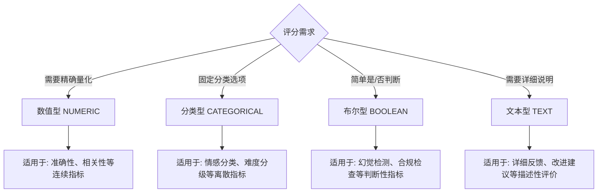
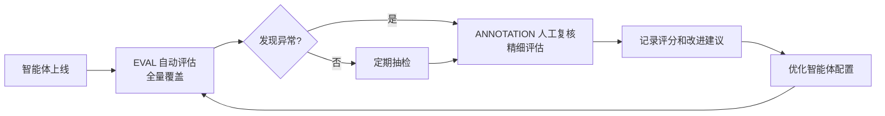

# 评分系统

::: warning 实现中
该功能正在开发中，当前版本尚未完整实现。文档描述的是目标设计，实际功能将在后续版本中发布。
:::

评分系统是 Snail AI 可观测性模块的质量评估组件，允许用户对 Trace（对话轮次）和 Observation（单个观测步骤）进行多维度打分。通过评分数据的积累，团队可以量化评估智能体的输出质量，发现问题模式，并持续优化智能体配置。

<!-- screenshot: obs-score.png — 评分面板，展示评分创建表单（名称、数据类型、来源选择）以及已有评分列表 -->

## 核心概念

### 评分目标

评分可以关联到两种追踪实体：

| 评分目标 | 说明 | 使用场景 |
|----------|------|----------|
| **Trace 评分** | 对整条 Trace（完整的一问一答轮次）进行打分 | 评估一次完整对话交互的整体质量 |
| **Observation 评分** | 对 Trace 内的某个具体 Observation 进行打分 | 精细评估特定步骤的质量，如某次 LLM 调用的准确性、某次工具调用的结果合理性 |

### 评分维度

评分系统不限制评分维度，用户可以自定义任意名称的评分项。常见的评分维度包括：

- **准确性（Accuracy）**：AI 回答是否准确、无事实性错误
- **相关性（Relevance）**：回答是否切题、与用户问题相关
- **完整性（Completeness）**：回答是否全面、覆盖了问题的各个方面
- **有用性（Helpfulness）**：回答是否对用户有实际帮助
- **安全性（Safety）**：回答是否存在不当内容
- **幻觉检测（Hallucination）**：回答是否包含虚构的信息

## 评分数据类型 (ScoreDataType)

每个评分都有一个数据类型，决定了评分值的形式：

| 数据类型 | 标识 | 说明 | 示例 |
|----------|------|------|------|
| **数值型** | `NUMERIC` | 使用数值进行打分，通常为 0-1 或 0-10 的分值 | 准确性: 0.85、质量: 8.5 |
| **分类型** | `CATEGORICAL` | 使用预定义的分类标签进行打分 | 情感: "正面" / "中性" / "负面" |
| **布尔型** | `BOOLEAN` | 是/否的二元判断 | 是否包含幻觉: true / false |
| **文本型** | `TEXT` | 使用自由文本进行评价 | "回答整体准确，但缺少具体数据引用" |

### 数据类型选择建议



## 评分来源 (ScoreSource)

评分系统支持三种来源，覆盖从人工到自动化的全方位质量评估：

### ANNOTATION（人工标注）

| 属性 | 说明 |
|------|------|
| **来源标识** | `ANNOTATION` |
| **评分方式** | 由人工在前端界面手动创建评分 |
| **典型使用者** | 质量评审人员、业务专家、管理员 |
| **优势** | 评分质量高，可以结合业务语境做出准确判断 |
| **劣势** | 人力成本高，覆盖率有限 |

人工标注评分适用于以下场景：
- 新智能体上线初期的质量抽检
- 关键业务场景的逐条评审
- 评分标准校准（为自动评分建立基准）
- 问题 Trace 的详细评估

### API（程序化评分）

| 属性 | 说明 |
|------|------|
| **来源标识** | `API` |
| **评分方式** | 通过 REST API 程序化批量创建评分 |
| **典型使用者** | 外部质量评估系统、数据管道 |
| **优势** | 可批量处理，适合集成到现有工作流 |
| **劣势** | 需要开发集成代码 |

API 评分适用于以下场景：
- 将第三方评估工具的结果导入 Snail AI
- 在 CI/CD 流程中自动对智能体输出进行评估
- 批量历史数据回标

### EVAL（自动化评估）

| 属性 | 说明 |
|------|------|
| **来源标识** | `EVAL` |
| **评分方式** | 由系统内置的自动评估机制生成 |
| **典型使用者** | 系统自动执行 |
| **优势** | 全覆盖、实时、无人力成本 |
| **劣势** | 评估精度依赖于评估模型和规则的质量 |

自动化评估适用于以下场景：
- 所有对话的基础质量监控
- 实时异常检测和告警
- 大规模回归测试

## 创建评分

### 通过界面创建

在 Trace 详情页中，可以通过评分面板手动创建评分：

1. 在 Trace 详情页或 Observation 详情面板中找到**评分**区域
2. 点击**添加评分**按钮
3. 填写评分表单：

| 表单字段 | 是否必填 | 说明 |
|----------|----------|------|
| **评分名称** | 是 | 评分维度的名称，如 "准确性"、"相关性" |
| **数据类型** | 是 | NUMERIC / CATEGORICAL / BOOLEAN / TEXT |
| **评分值** | 是 | 根据数据类型填写数值、选择分类、选择是/否或输入文本 |
| **来源** | 否 | 默认为 ANNOTATION（手动标注） |
| **备注** | 否 | 对评分的补充说明 |

### 通过 API 创建

使用 REST API 程序化创建评分：

```
POST /agent/score
```

请求体：

```json
{
  "traceId": "trace-abc-123",
  "observationId": null,
  "name": "准确性",
  "value": 0.85,
  "stringValue": null,
  "dataType": "NUMERIC",
  "source": "API",
  "comment": "回答基本准确，但日期信息有误"
}
```

#### 字段说明

| 字段 | 类型 | 必填 | 说明 |
|------|------|------|------|
| `traceId` | string | 否* | 关联的 Trace ID |
| `observationId` | string | 否* | 关联的 Observation ID |
| `name` | string | 是 | 评分名称 |
| `value` | number | 否 | 数值型评分值（NUMERIC / BOOLEAN 使用） |
| `stringValue` | string | 否 | 文本型评分值（CATEGORICAL / TEXT 使用） |
| `dataType` | string | 是 | 数据类型：NUMERIC / CATEGORICAL / BOOLEAN / TEXT |
| `source` | string | 否 | 来源：ANNOTATION / API / EVAL，默认 ANNOTATION |
| `comment` | string | 否 | 备注说明 |

> *`traceId` 和 `observationId` 至少填写一个，用于指定评分的关联目标。

### 不同数据类型的评分示例

**数值型（NUMERIC）：**

```json
{
  "traceId": "trace-001",
  "name": "准确性",
  "value": 0.92,
  "dataType": "NUMERIC",
  "source": "EVAL",
  "comment": "自动评估结果"
}
```

**分类型（CATEGORICAL）：**

```json
{
  "traceId": "trace-001",
  "name": "情感倾向",
  "stringValue": "正面",
  "dataType": "CATEGORICAL",
  "source": "ANNOTATION"
}
```

**布尔型（BOOLEAN）：**

```json
{
  "traceId": "trace-001",
  "observationId": "obs-gen-001",
  "name": "是否幻觉",
  "value": 0,
  "dataType": "BOOLEAN",
  "source": "ANNOTATION",
  "comment": "回答内容经核实无幻觉"
}
```

> 布尔型评分中，`value` 为 `1` 表示 true，`0` 表示 false。

**文本型（TEXT）：**

```json
{
  "traceId": "trace-001",
  "name": "改进建议",
  "stringValue": "建议在回答中增加具体的数据引用来源，提升可信度",
  "dataType": "TEXT",
  "source": "ANNOTATION"
}
```

## 删除评分

可以通过 API 删除不再需要的评分记录：

```
DELETE /agent/score/{scoreId}
```

## 评分数据结构

### Score 完整类型

```typescript
type Score = {
  id: string;                   // 评分唯一 ID
  name: string;                 // 评分名称
  value?: number;               // 数值型评分值
  stringValue?: string;         // 文本型评分值
  dataType: ScoreDataType;      // 数据类型
  source: ScoreSource;          // 来源
  comment?: string;             // 备注
  authorUserName?: string;      // 评分创建者用户名
};
```

### 在 Trace 中查看评分

评分数据作为 Trace 的组成部分返回，在 Trace 详情中可以直接查看所有关联的评分：

```typescript
type Trace = {
  // ... 其他字段
  scores: Score[];    // 关联的评分列表
};
```

### 汇总统计

在追踪统计中，各评分维度的平均值会自动计算并展示：

```typescript
type TraceSummary = {
  // ... 其他字段
  avgScores?: Record<string, number>;  // 各评分维度的平均值
};
```

## API 接口总览

| 方法 | 路径 | 说明 |
|------|------|------|
| POST | `/agent/score` | 创建评分 |
| DELETE | `/agent/score/{scoreId}` | 删除评分 |

## 最佳实践

### 建立评分体系

1. **确定核心评分维度**：根据业务需求，选择 3-5 个最关键的评分维度（如准确性、相关性、有用性）
2. **制定评分标准**：为每个维度制定明确的评分标准和示例，确保不同评审人员的评分一致性
3. **选择合适的数据类型**：简单判断用布尔型，量化评估用数值型，分类标签用分类型
4. **组合多种来源**：使用人工标注建立基准，API 集成外部评估，EVAL 实现全覆盖

### 评分流程建议



### 评分数据活用

- **评分趋势监控**：通过 `avgScores` 追踪各评分维度随时间的变化趋势
- **问题模式发现**：筛选低分 Trace，分析共性问题（如特定类型的问题总是回答不佳）
- **A/B 测试**：修改智能体配置后，对比前后的评分变化来验证优化效果
- **基准建立**：积累足够的人工评分后，可以用于训练和校准自动评估模型

## 下一步

- [追踪详情](./trace.md) -- 在 Trace 详情中查看和添加评分
- [统计分析](./analytics.md) -- 结合统计数据和评分数据综合评估智能体
- [可观测性概览](./index.md) -- 返回可观测性总览
