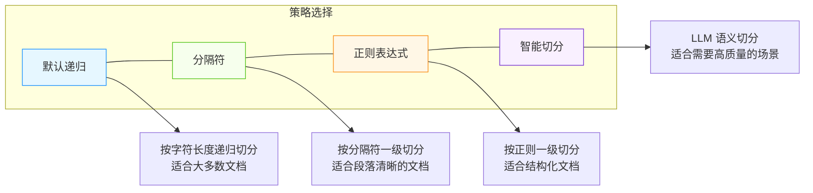

# 分片管理

分片（Chunk）是 RAG 检索的最小单元。文档被解析后，需要切分为大小适中的文本片段，再将每个片段通过 Embedding 模型转换为向量，存储到向量数据库中。分片的质量直接决定检索的准确性和最终回答的效果。

切片详情页以卡片方式展示切片内容、来源文档、字符数和更新时间，支持按文档、ID 或内容筛选。


## 分片策略

Snail AI 提供 4 种分片策略，适用于不同类型的文档和场景：



### 1. 默认递归切分（default）

最通用的分片策略，使用 Recursive Text Splitter 算法，按字符长度递归切分文本。

**工作原理：**
1. 按分隔符层级（段落分隔 -> 换行 -> 空格 -> 字符）递归尝试切分
2. 每个片段不超过 `maxChunkTokens` 指定的最大长度
3. 相邻片段之间保留 `chunkOverlap` 个字符的重叠，确保语义连续性
4. 可选开启「合并短片段」，将过短的片段与相邻片段合并

**参数配置：**

| 参数 | 类型 | 默认值 | 范围 | 说明 |
|------|------|--------|------|------|
| `maxChunkTokens` | number | 600 | 50 ~ 32000 | 每个分片的最大字符数。常用预设值：200（精细）、600（标准）、1000（中等）、2000（粗粒度） |
| `chunkOverlap` | number | 16 | 0 ~ 4096 | 相邻分片之间的重叠字符数。重叠可以保持上下文连续性，推荐设置为最大长度的 5%~15% |
| `mergeShortSegments` | boolean | true | - | 是否合并过短的片段。开启后，长度不足最大长度一半的片段会被尝试与前后片段合并 |
| `imageOcr` | boolean | false | - | 是否对文档中的图片进行 OCR 文字识别 |

**适用场景：** 通用文档、混合格式文档、无明确结构的长文本。

**分片效果示意：**

```
原文: [========================================]

maxChunkTokens=600, chunkOverlap=16:

分片1: [==========]
分片2:        [==========]    ← 与分片1重叠16字符
分片3:               [==========]
分片4:                      [====]  ← 最后一个分片可能较短
```

### 2. 分隔符切分（delimiter）

按用户选择的分隔符进行一级切分，适合段落结构清晰的文档。

**工作原理：**
1. 按选定的分隔符将全文切分为段落
2. 多个分隔符按选择顺序依次尝试
3. 切分后不做二级递归（不受 maxChunkTokens 限制）

**可选分隔符：**

| 分隔符 | 符号表示 | 说明 |
|--------|----------|------|
| 换行符 | `\n` | 单换行 |
| 双换行 | `\n\n` | 段落分隔（**默认选择**） |
| 中文句号 | `。` | 中文句末 |
| 中文感叹号 | `！` | 中文感叹句末 |
| 中文问号 | `？` | 中文疑问句末 |
| 英文句号 | `.` | 英文句末 |
| 英文感叹号 | `!` | 英文感叹句末 |
| 英文问号 | `?` | 英文疑问句末 |
| 英文分号 | `;` | 英文分号 |

支持多选，提交时以 JSON 数组格式传递给后端：

```json
{
  "chunkMode": "delimiter",
  "customDelimiter": "[\"\\n\\n\", \"。\", \".\"]"
}
```

**适用场景：** 段落清晰的文章、FAQ 文档、按条目组织的内容。

### 3. 正则表达式切分（regex）

使用自定义正则表达式进行一级切分，超长片段会进一步递归切分。

**工作原理：**
1. 使用用户输入的正则表达式（Java Pattern 语法）匹配切分点
2. 匹配到的位置作为切分边界
3. 切分后超过 `maxChunkTokens` 的片段会继续用递归策略二次切分

**参数配置：**

| 参数 | 类型 | 默认值 | 说明 |
|------|------|--------|------|
| `chunkRegex` | string | - | 正则表达式（必填），使用 Java Pattern 语法 |
| `maxChunkTokens` | number | 600 | 二次递归切分的最大长度 |
| `chunkOverlap` | number | 16 | 二次递归切分的重叠字符数 |

**正则示例：**

```
# 按 Markdown 标题切分
^#{1,3}\s+

# 按编号列表切分
^\d+[\.\)]\s+

# 按中文章节号切分
^第[一二三四五六七八九十百千]+[章节条]
```

> **注意：** 输入正则后系统会进行语法校验，不合法的正则会提示错误。

**适用场景：** 结构化文档、法律条文、技术手册中按章节/条款切分。

### 4. 智能切分（smart）

调用大语言模型（CHAT 类型）进行语义级别的智能切分，是质量最高但成本也最高的策略。

**工作原理：**
1. 将文档文本发送给指定的对话模型
2. 模型基于语义理解输出 JSON 格式的切分建议
3. 按模型建议的切分点分割文本
4. 超长片段进一步递归切分

**参数配置：**

| 参数 | 类型 | 默认值 | 说明 |
|------|------|--------|------|
| `chunkModelId` | number | - | 用于智能切分的对话模型 ID（必填），从 CHAT 类型模型列表中选择 |
| `maxChunkTokens` | number | 600 | 递归切分的最大长度 |
| `chunkOverlap` | number | 16 | 递归切分的重叠字符数 |

**适用场景：** 对分片质量要求极高的场景，如研报分析、专业领域问答。

> **注意：** 智能切分会消耗对话模型的 Token 额度，处理速度较慢，建议在文档量较少或质量要求极高时使用。

## 分片策略对比

| 维度 | 默认递归 | 分隔符 | 正则 | 智能 |
|------|----------|--------|------|------|
| **切分质量** | 中等 | 取决于文档结构 | 取决于正则精度 | 最高 |
| **处理速度** | 最快 | 快 | 快 | 最慢 |
| **成本** | 无额外成本 | 无额外成本 | 无额外成本 | 消耗 CHAT 模型 Token |
| **配置复杂度** | 低 | 低 | 中 | 低 |
| **适用范围** | 通用 | 段落清晰文档 | 结构化文档 | 高质量需求 |

## 分片列表

进入知识库详情页的「分片」标签页，可以查看和管理所有分片。

### 视图模式

提供两种视图模式切换：

- **卡片视图**（默认）：两列网格布局，每张卡片显示序号、ID、内容预览（最多 5 行）、来源文档和字符数
- **列表视图**：数据表格形式，展示序号、ID、内容、来源文档、字符数、更新时间等列

### 筛选与搜索

| 筛选条件 | 说明 |
|----------|------|
| 按文档筛选 | 下拉选择特定文档，只显示该文档的分片 |
| 按 ID 搜索 | 输入分片 ID 精确搜索 |
| 按内容搜索 | 输入关键词，在分片内容中模糊匹配 |

### 分片详情

点击分片卡片上的「查看」按钮，在弹窗中展示分片的完整信息：

| 字段 | 说明 |
|------|------|
| ID | 分片唯一标识 |
| 来源文档 | 所属文档名称 |
| 字符数 | 分片的 Token 数量或字符长度 |
| 内容 | 分片的完整文本内容 |
| 创建时间 | 分片创建时间 |
| 更新时间 | 最后更新时间 |

## 手动管理分片

除了自动分片外，还支持手动创建、编辑和删除分片。

### 创建分片

点击「新增分片」按钮，在弹窗中填写：

| 字段 | 必填 | 说明 |
|------|------|------|
| 所属文档 | 是 | 从当前知识库的文档列表中选择 |
| 分片内容 | 是 | 文本内容 |

创建后系统自动调用 Embedding 模型生成向量并写入向量存储。

```
POST /chunk
Content-Type: application/json

{
  "ragId": 1,
  "documentId": 100,
  "content": "手动添加的知识片段内容..."
}
```

### 编辑分片

点击分片操作菜单中的「编辑」，可修改分片内容。更新后系统会重新生成向量。

```
PUT /chunk/{id}
Content-Type: application/json

{
  "content": "修改后的内容..."
}
```

### 删除分片

点击分片操作菜单中的「删除」，确认后将同时删除分片数据和向量存储中的对应向量。

```
DELETE /chunk/{id}
```

## 向量状态

每个分片都有独立的向量状态，表示其在向量存储中的索引状态：

| 状态 | 说明 |
|------|------|
| `success` | 向量已成功写入存储，可被检索 |
| `processing` | 正在进行向量嵌入或写入 |
| `failed` | 向量化失败，需要排查原因 |

## 分片参数调优建议

### maxChunkTokens 如何选择？

| 场景 | 建议值 | 说明 |
|------|--------|------|
| FAQ / 短问答 | 200 ~ 400 | 每个 FAQ 条目通常较短，小分片提高精确匹配率 |
| 通用文档 | 500 ~ 800 | 平衡检索精度和上下文完整性 |
| 技术文档 | 800 ~ 1500 | 技术段落通常较长，需要保持完整性 |
| 长篇报告 | 1500 ~ 3000 | 保留更多上下文，减少信息碎片化 |

### chunkOverlap 如何设置？

- **推荐值：** `maxChunkTokens` 的 5% ~ 15%
- **过小**（< 5%）：相邻分片间可能丢失边界处的语义关联
- **过大**（> 20%）：增加冗余存储和检索成本，可能引入噪声

### 何时开启 mergeShortSegments？

- **开启**（推荐）：当文档中存在大量短段落（如列表项、表格行），合并后减少碎片分片
- **关闭**：当每个短段落都是独立的知识点（如 FAQ 条目），需要保持独立性

## API 接口汇总

| 接口 | 方法 | 说明 |
|------|------|------|
| `/chunk/page` | GET | 分页查询分片列表，支持 `ragId`、`documentId`、`page`、`size` |
| `/chunk` | POST | 手动创建分片 |
| `/chunk/{id}` | PUT | 更新分片内容 |
| `/chunk/{id}` | DELETE | 删除分片 |
