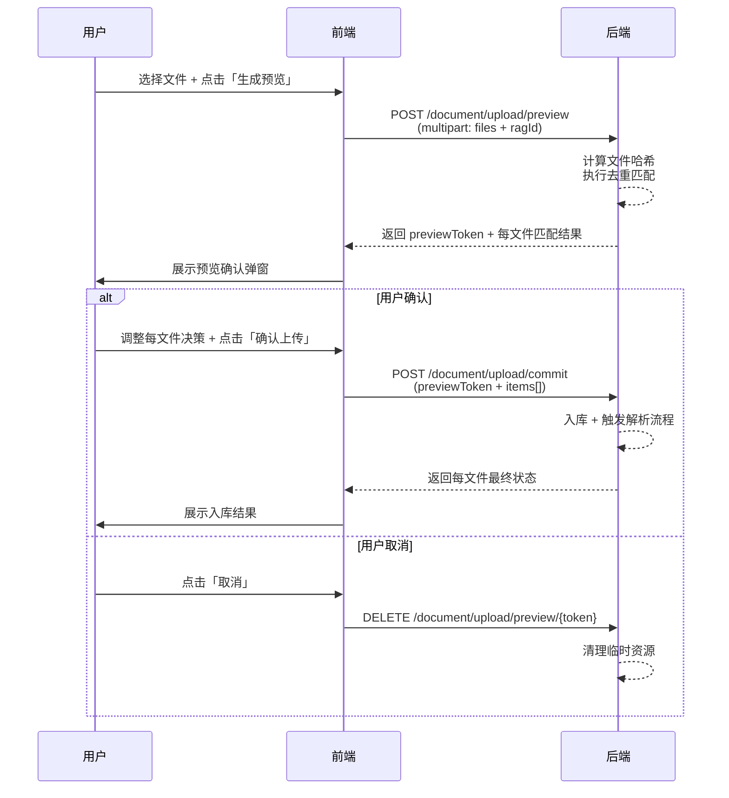
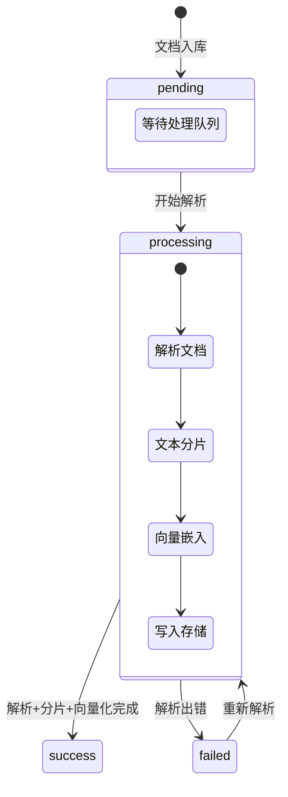

# 文档管理

文档是知识库的基础内容单元。每个文档经过「上传 -> 解析 -> 分片 -> 向量化」的处理流程后，其内容即可被检索和引用。

## 支持的文档格式

Snail AI 支持以下 10 种常见文档格式：

| 格式 | 扩展名 | 说明 |
|------|--------|------|
| **PDF** | `.pdf` | 便携式文档格式，支持文本提取与 OCR |
| **Word** | `.docx` `.doc` | Microsoft Word 文档，支持新旧两种格式 |
| **Excel** | `.xlsx` `.xls` | Microsoft Excel 电子表格 |
| **Markdown** | `.md` | 轻量级标记语言文档 |
| **HTML** | `.html` `.htm` | 网页文档 |
| **纯文本** | `.txt` | 纯文本文件 |
| **CSV** | `.csv` | 逗号分隔值文件 |
| **PPT** | `.pptx` | Microsoft PowerPoint 演示文稿 |

> **提示：** 上传文件时系统会自动根据文件扩展名和 MIME 类型判断格式，并选择对应的解析器。

## 文档导入

进入知识库详情页的「文档」标签页，点击「导入文档」按钮即可打开导入窗口。

<!-- screenshot: rag-doc-upload.png — 文档导入弹窗，展示本地上传、URL导入、云端导入三种模式的选择卡片和拖拽上传区域 -->

### 导入方式

系统提供三种导入方式（云端导入开发中）：

| 导入方式 | 说明 |
|----------|------|
| **本地上传** | 拖拽或选择本地文件上传，支持批量多文件 |
| **URL 导入** | 输入文档的公网 URL 地址，系统自动下载并解析 |
| **云端导入** | （开发中）从云端存储服务导入 |

### 本地上传流程

本地上传采用**两阶段提交**设计，确保文档入库前用户可以审核去重匹配结果：



<!-- screenshot: rag-doc-preview.png — 上传预览确认弹窗，展示每个文件的去重匹配结果（NEW/SKIP/OVERWRITE/REJECT），用户可调整每个文件的最终决策 -->

#### 第一阶段：预览（Preview）

上传文件后，系统返回每个文件的去重预测结果：

| 字段 | 说明 |
|------|------|
| `previewToken` | 本次预览的唯一标识 |
| `fileName` | 文件名 |
| `fileType` | 文件类型 |
| `fileSize` | 文件大小 |
| `contentHash` | 文件内容哈希值 |
| `decision` | 预测决策：`NEW`（新文档）/ `SKIP`（跳过）/ `OVERWRITE`（覆盖）/ `REJECT`（拒绝） |
| `matchType` | 匹配类型：`NONE` / `BY_NAME` / `BY_CONTENT` / `BOTH` |
| `conflictDocumentId` | 冲突的已有文档 ID |
| `conflictDocumentName` | 冲突的已有文档名称 |

#### 第二阶段：提交（Commit）

用户确认或调整每个文件的决策后，提交最终入库请求：

```json
{
  "previewToken": "token-xxx",
  "items": [
    { "tempResourceId": 1, "decision": "NEW" },
    { "tempResourceId": 2, "decision": "OVERWRITE" },
    { "tempResourceId": 3, "decision": "SKIP" }
  ]
}
```

提交结果中如果 `conflictChanged` 为 `true`，表示在预览与提交之间有其他用户修改了冲突文档状态（TOCTOU 竞态），需要用户重新确认。

> **提示：** 如果知识库关闭了「上传二次确认」选项，则文件直接上传入库，不经过预览阶段。

### URL 导入

通过 URL 导入文档时，需填写以下信息：

| 字段 | 必填 | 说明 |
|------|------|------|
| 文档 URL | 是 | 需要是可公网访问的文档直链 |
| 文档名称 | 否 | 自定义文档名称，留空则从 URL 自动推断 |

```
POST /document/import/url
Content-Type: application/json

{
  "ragId": 1,
  "url": "https://example.com/document.pdf",
  "name": "产品手册"
}
```

## 文档状态生命周期

文档从上传到可检索需要经历多个处理阶段：

<!-- screenshot: rag-doc-status.png — 文档列表中不同状态的文档：pending（等待中）、processing（解析中，带旋转图标）、success（成功，绿色标签）、failed（失败，红色标签） -->



### 状态说明

| 状态码 | 状态文本 | 显示 | 说明 |
|--------|----------|------|------|
| `0` | `pending` | 等待中 | 文档已入库，等待解析处理 |
| `1` / `2` | `parsing` / `processing` | 解析中 | 正在进行文档解析、分片或向量化，前端显示旋转加载图标 |
| `3` | `success` | 成功 | 所有处理完成，文档可被检索 |
| `4` | `failed` | 失败 | 处理过程中出错，可查看错误信息并重新解析 |

> **提示：** 当存在处理中的文档时，系统每 3 秒自动刷新文档列表状态，无需手动刷新。

## 文档操作

### 文档列表

文档列表以数据表格形式展示，包含以下列：

| 列 | 说明 |
|----|------|
| 文件名 | 带文件类型图标，点击可预览 |
| 状态 | 当前处理状态标签 |
| 分片数 | 该文档生成的分片数量 |
| 文件大小 | 格式化显示（KB/MB/GB） |
| 来源 | 上传方式（本地上传 / URL 导入 / 云端） |
| 文件类型 | PDF / DOCX 等格式标签 |
| 上传时间 | 文档入库时间 |
| 操作 | 预览、查看分片、下载、重新解析、删除 |

### 文档预览

点击文件名或操作菜单中的「预览」，在右侧抽屉中展示文档内容。根据文件类型使用不同的预览方式：

| 文件类型 | 预览方式 |
|----------|----------|
| PDF | iframe 嵌入浏览器原生 PDF 渲染 |
| HTML | iframe 嵌入，启用沙箱模式 |
| Markdown | 使用 markdown-it 渲染为 HTML |
| Word (DOCX) | 使用 mammoth 转换为 HTML |
| Excel (XLSX) | 使用 SheetJS 渲染为 HTML 表格 |
| TXT / CSV | 等宽字体纯文本展示 |
| PPTX 等 | 提供下载按钮 |

### 重新解析

对于解析失败（`failed`）的文档，可在操作菜单中点击「重新解析」触发再次处理：

```
POST /document/{id}/reprocess
```

重新解析会清除原有分片和向量数据，从文档解析阶段重新开始。

### 文档下载

通过操作菜单中的「下载」获取文档原始文件：

```
GET /resource/{resourceId}/preview    -- 预览
GET /resource/{resourceId}/download   -- 下载
```

### 删除文档

删除文档时会同时清除该文档关联的所有分片和向量数据。

```
DELETE /document/{id}
```

## API 接口汇总

| 接口 | 方法 | 说明 |
|------|------|------|
| `/document/page` | GET | 分页查询文档列表，支持 `ragId`、`page`、`size` 参数 |
| `/document/{id}` | GET | 获取文档详情 |
| `/document/upload/preview` | POST | 上传预览（multipart/form-data） |
| `/document/upload/commit` | POST | 上传提交 |
| `/document/upload/preview/{token}` | DELETE | 取消预览，释放临时资源 |
| `/document/import/url` | POST | URL 导入文档 |
| `/document/{id}/reprocess` | POST | 重新解析文档 |
| `/document/{id}` | DELETE | 删除文档 |
| `/resource/{resourceId}/preview` | GET | 文档预览（二进制流） |
| `/resource/{resourceId}/download` | GET | 文档下载（二进制流） |
