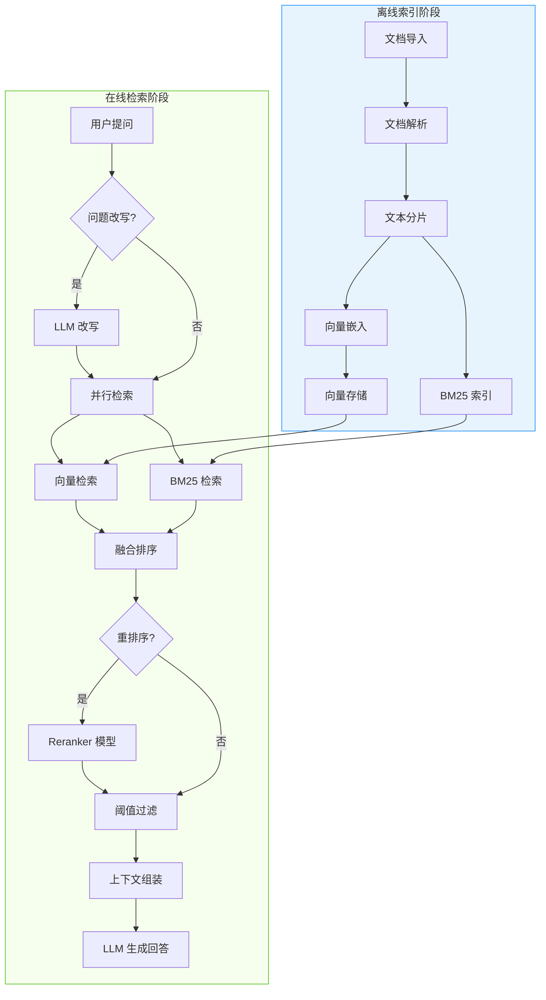

# RAG 知识库

## 什么是 RAG？

RAG（Retrieval-Augmented Generation，检索增强生成）是一种结合**信息检索**与**大语言模型生成**的技术范式。其核心思想是：在大模型回答用户问题之前，先从企业私有知识库中检索出最相关的文档片段，将其作为上下文注入到 Prompt 中，从而让模型基于真实数据生成更准确、更可靠的回答。

相比纯粹依赖模型记忆，RAG 具备以下优势：

- **减少幻觉** -- 回答基于检索到的真实文档，而非模型的训练记忆
- **知识可更新** -- 只需更新知识库中的文档，无需重新训练模型
- **数据可控** -- 企业敏感数据存储在私有向量库中，不会泄露给模型训练
- **可溯源** -- 每次回答都可以追溯到具体的文档来源

## Snail AI 的 RAG 方案

Snail AI 提供了**生产级 RAG 引擎**，覆盖从文档导入到智能问答的完整链路。

RAG 列表页通过知识库卡片展示文档数、切片数、描述和更新时间，并提供搜索与创建入口。

### 核心特性

| 特性 | 说明 |
|------|------|
| **多格式文档支持** | PDF、Word（DOCX/DOC）、Excel（XLSX/XLS）、Markdown、HTML、TXT、CSV、PPTX，共 10+ 格式 |
| **4 种分片策略** | 默认递归切分、自定义分隔符、正则表达式、LLM 智能语义切分 |
| **混合检索** | 向量检索 + BM25 全文检索，支持 RRF / 加权求和两种融合策略 |
| **重排序** | 集成 Reranker 模型对检索结果进行二次精排，显著提升相关性 |
| **文档智能去重** | 按文件名 / 内容哈希 / 名称或内容去重，支持拒绝、跳过、覆盖三种冲突策略 |
| **多向量存储后端** | PgVector、Milvus、Elasticsearch，按需选择 |
| **全链路调试** | 检索调试面板展示 Embedding / 向量检索 / BM25 / 融合 / 重排各阶段耗时 |

### 支持的向量存储

| 存储类型 | 分类 | 说明 |
|----------|------|------|
| **PgVector** | 向量存储 | 基于 PostgreSQL 扩展，适合已有 PG 基础设施的团队，部署简单 |
| **Milvus** | 向量存储 | 专业向量数据库，支持亿级向量，适合大规模生产环境 |
| **Elasticsearch** | 向量存储 / 搜索引擎 | 同时支持向量检索和 BM25 全文检索，一套服务满足混合搜索需求 |
| **PG Fulltext** | 搜索引擎 | 基于 PostgreSQL 的全文搜索，适合轻量级 BM25 检索场景 |

## RAG 处理流水线

完整的 RAG 处理流水线分为**离线索引阶段**和**在线检索阶段**两大部分：

### 流水线各阶段说明

| 阶段 | 说明 | 关键参数 |
|------|------|----------|
| **文档导入** | 支持本地上传、URL 导入，上传前可配置去重策略和二次确认 | `dedupStrategy`、`dedupAction`、`uploadConfirm` |
| **文档解析** | 根据文件类型自动选择解析器，提取纯文本内容 | 支持 OCR 识别图片中的文字 |
| **文本分片** | 将长文本切分为适合检索的片段，4 种策略可选 | `maxChunkTokens`、`chunkOverlap`、`chunkMode` |
| **向量嵌入** | 调用 Embedding 模型将文本片段转换为向量 | `embeddingModelId`、`dimensionOfVectorModel` |
| **向量存储** | 将向量写入向量数据库，建立索引 | `vectorStoreInstanceId` |
| **BM25 索引** | 将文本写入搜索引擎，建立全文索引（混合搜索开启时） | `searchEngineInstanceId` |
| **检索** | 根据用户问题并行执行向量检索和 BM25 检索 | `resultCount`、`threshold` |
| **融合排序** | 将两路检索结果合并排序 | `fusionStrategy`（RRF / WEIGHTED_SUM）、`rrfK`、`denseWeight` |
| **重排序** | 使用 Reranker 模型对候选结果精排 | `rerankModelId`、`enterRerankCount` |
| **LLM 生成** | 将检索到的片段注入 Prompt，调用对话模型生成回答 | `modelId`、`nearbySliceCount`、`prompt` |

## 功能模块导航

RAG 知识库由以下子模块组成，点击跳转到对应文档：

| 模块 | 说明 |
|------|------|
| [知识库管理](./knowledge-base.md) | 创建、编辑、删除知识库，配置 Embedding 模型、向量存储、去重策略等 |
| [文档管理](./document.md) | 文档上传（本地 / URL）、去重预览、解析状态监控、预览与下载 |
| [分片管理](./chunk.md) | 4 种分片策略配置，分片列表浏览、手动新增/编辑/删除分片 |
| [检索配置](./search.md) | 混合检索参数调优、融合策略、重排序、阈值过滤、检索调试 |
| [问答对话](./qa.md) | 基于知识库的流式问答、模型参数配置、Prompt 模板、对话上下文 |
| [存储实例管理](./store-instance.md) | 向量库 / 搜索引擎实例的创建、连接测试、默认实例设置 |

## 快速开始

### 1. 创建存储实例

首先需要在「存储实例管理」中创建至少一个向量存储实例（如 PgVector），如果需要混合检索还需创建搜索引擎实例。

### 2. 创建知识库

在知识库列表页点击「新建知识库」，填写名称，选择 Embedding 模型和向量存储实例，配置分片策略。

### 3. 导入文档

进入知识库详情，在「文档」标签页点击「导入文档」，选择本地上传或 URL 导入方式。

### 4. 等待处理

系统自动完成 解析 -> 分片 -> 向量化 流程，文档状态变为「成功」即可。

### 5. 测试检索

切换到「检索」标签页，输入测试问题，查看检索结果和调试指标。

### 6. 开始问答

切换到「问答」标签页，配置对话模型和 Prompt 模板，即可基于知识库进行智能问答。
