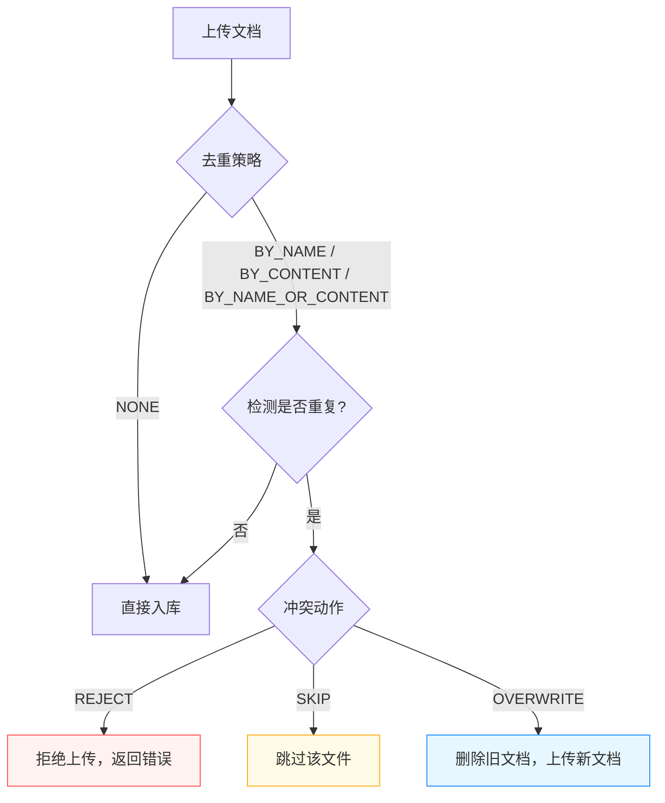

# 知识库管理

知识库是 RAG 模块的核心组织单元。每个知识库对应一个独立的向量索引空间，拥有独立的 Embedding 模型、向量存储、分片策略和检索配置。

<!-- screenshot: rag-create.png — 创建知识库的抽屉表单，展示基础信息、向量存储选择、混合搜索开关、去重策略和分片策略配置 -->

## 知识库列表

知识库列表以卡片网格形式展示，每张卡片包含：

- 知识库名称与描述
- 文档数量和分片数量统计
- 当前分片策略标签（默认递归 / 分隔符 / 正则 / 智能）
- 最后更新时间

顶部工具栏展示全局统计（知识库总数、文档总数、分片总数），并提供关键字搜索功能，支持按名称和描述模糊匹配。

## 创建知识库

点击「新建知识库」按钮，在右侧抽屉中填写以下配置：

### 基础信息

| 字段 | 必填 | 说明 |
|------|------|------|
| 知识库名称 | 是 | 最大长度 128 字符，需唯一 |
| 描述 | 否 | 知识库用途说明 |

### Embedding 模型配置

| 字段 | 必填 | 说明 |
|------|------|------|
| Embedding 模型 | 是 | 从系统已配置的 EMBEDDING 类型模型中选择 |
| 向量维度 | 自动 | 默认 1536 维，随模型自动设置 |

> **注意：** 知识库创建后不建议更换 Embedding 模型，因为不同模型生成的向量维度和语义空间不同，更换后需要重新处理所有文档。

### 向量存储配置

| 字段 | 必填 | 说明 |
|------|------|------|
| 向量存储实例 | 是 | 从已创建的向量存储实例中选择（PgVector / Milvus / Elasticsearch） |

如果尚未创建向量存储实例，可点击旁边的「+」按钮跳转到 [存储实例管理](./store-instance.md) 页面创建。

### 混合搜索配置

| 字段 | 必填 | 说明 |
|------|------|------|
| 混合搜索开关 | 否 | 开启后同时使用向量检索和 BM25 全文检索 |
| 搜索引擎实例 | 混合搜索开启时必填 | 选择 Elasticsearch 或 PG Fulltext 实例 |

混合搜索通过融合向量语义检索和关键词检索的结果，可以显著提高检索的召回率和准确性。详见 [检索配置](./search.md)。

### 上传去重配置

文档去重用于控制同一知识库内重复文档的判定与处理方式。

#### 去重策略（dedupStrategy）

| 策略值 | 策略名称 | 说明 |
|--------|----------|------|
| `0` / `NONE` | 不去重 | 允许上传任意文档，不做重复检查 |
| `1` / `BY_NAME` | 按文件名 | 当文件名完全相同时判定为重复 |
| `2` / `BY_CONTENT` | 按文件内容 | 计算文件内容哈希，哈希相同时判定为重复（**默认值**） |
| `3` / `BY_NAME_OR_CONTENT` | 按文件名或内容 | 文件名相同**或**内容哈希相同时判定为重复 |

#### 冲突动作（dedupAction）

当检测到文档重复时，系统按照以下配置处理：

| 动作值 | 动作名称 | 说明 |
|--------|----------|------|
| `0` / `REJECT` | 拒绝（报错） | 直接拒绝上传，返回错误信息（**默认值**） |
| `1` / `SKIP` | 跳过（不入库） | 静默跳过该文件，不影响其他文件上传 |
| `2` / `OVERWRITE` | 覆盖（替换旧文档） | 删除原有文档及其分片，用新文档替换 |



#### 上传二次确认（uploadConfirm）

| 状态 | 说明 |
|------|------|
| 开启（默认） | 上传文件时先生成预览，展示每个文件的去重匹配结果，用户确认后再入库 |
| 关闭 | 直接上传入库，不弹出预览确认窗口 |

> **推荐：** 保持上传二次确认开启状态，特别是在使用 `OVERWRITE` 冲突动作时，可以在入库前再次确认要替换的文档。

### 分片策略配置

分片策略决定了文档文本如何被切分为检索单元。详细配置说明见 [分片管理](./chunk.md)。创建知识库时可选择以下四种策略之一：

| 策略 | 说明 |
|------|------|
| **默认递归** | 按字符长度递归切分，最通用的策略 |
| **分隔符** | 按指定分隔符（换行、句号等）进行一级切分 |
| **正则表达式** | 按自定义正则表达式进行一级切分 |
| **智能切分** | 调用大语言模型进行语义级别的智能切分 |

## 编辑知识库

在知识库卡片上点击编辑按钮，即可在抽屉中修改知识库配置。可编辑项与创建时一致，包括：

- 基础信息（名称、描述）
- Embedding 模型
- 向量存储实例
- 混合搜索开关
- 去重策略与冲突动作
- 上传确认开关
- 分片策略

> **注意：** 修改分片策略只影响后续新上传的文档，已有文档的分片不会自动重新生成。如需对已有文档应用新策略，请在文档管理中使用「重新解析」功能。

## 删除知识库

在知识库卡片上点击删除按钮，确认后将删除该知识库及其所有文档、分片和向量数据。

> **警告：** 此操作不可逆，请谨慎操作。删除知识库会同时清除向量存储中对应的索引数据。

## API 接口

### 获取知识库列表

```
GET /rag/page?page=1&size=10
```

### 获取知识库详情

```
GET /rag/{id}
```

### 创建知识库

```
POST /rag
Content-Type: application/json

{
  "name": "产品文档库",
  "description": "存放产品使用手册和FAQ",
  "embeddingModelId": 1,
  "vectorStoreInstanceId": 1,
  "searchEngineEnable": true,
  "searchEngineInstanceId": 2,
  "chunkMode": "default",
  "maxChunkTokens": 600,
  "chunkOverlap": 16,
  "mergeShortSegments": true,
  "dedupStrategy": 2,
  "dedupAction": 0,
  "uploadConfirm": true
}
```

### 更新知识库

```
PUT /rag/{id}
Content-Type: application/json

{
  "name": "产品文档库（更新）",
  "description": "更新后的描述"
}
```

### 保存检索/问答配置

```
PUT /rag/{id}/config
Content-Type: application/json

{
  "searchParams": { ... },
  "modelParams": { ... }
}
```

### 删除知识库

```
DELETE /rag/{id}
```
