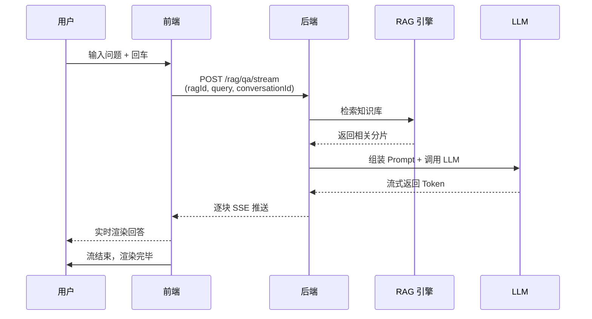
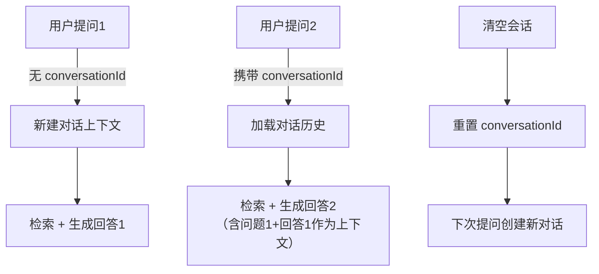

# 问答对话

问答是 RAG 知识库的最终交互形式。用户提出问题后，系统自动从知识库检索相关内容，将检索到的文档片段注入 Prompt，调用大语言模型生成基于知识库内容的回答。

知识问答页面左侧复用检索参数和模型回答参数，右侧提供对话区域、清空会话和问题输入框。


## 界面布局

问答界面采用**左侧参数面板 + 右侧对话区**的双栏布局：

| 区域 | 说明 |
|------|------|
| **左侧参数面板** | 检索参数配置 + 模型回答参数配置，配置变更自动保存 |
| **右侧对话区** | 聊天式对话界面，支持流式输出，Markdown 格式渲染 |

## 流式问答

Snail AI 的 RAG 问答采用**流式输出**（Streaming），回答内容逐字逐句实时展示，无需等待完整生成。

### 流式实现

前端通过原生 `fetch` + `ReadableStream` 接收后端的流式响应，实现逐块渲染：



### API 接口

```
POST /rag/qa/stream
Content-Type: application/json
Snail-Ai-Auth: {token}

{
  "ragId": 1,
  "query": "如何配置向量存储？",
  "conversationId": "conv-xxx"
}
```

| 参数 | 类型 | 必填 | 说明 |
|------|------|------|------|
| `ragId` | number | 是 | 知识库 ID |
| `query` | string | 是 | 用户问题，最大长度 8000 字符 |
| `conversationId` | string | 否 | 对话 ID，用于多轮对话上下文关联。首次对话不传 |

返回格式为 `text/event-stream`，前端通过 ReadableStream 逐块读取纯文本内容。

## 对话上下文

问答支持多轮对话，通过 `conversationId` 参数关联上下文：

- **首次提问：** 不传 `conversationId`，后端生成新的对话 ID
- **后续提问：** 传入之前的 `conversationId`，后端将历史对话作为上下文传递给 LLM
- **清空对话：** 点击「清空会话」按钮，清除前端消息列表并重置 `conversationId`



## 模型回答参数

模型回答参数控制 LLM 如何基于检索结果生成回答。

### 参数配置

| 参数 | 类型 | 默认值 | 范围 | 说明 |
|------|------|--------|------|------|
| `modelId` | number | - | - | 对话模型 ID，从系统已配置的 CHAT 类型模型中选择 |
| `nearbySliceCount` | number | 5 | 0 ~ 20 | 上下文窗口中引用的分片数量。值越大引入的参考资料越多，但可能增加噪声和 Token 消耗 |
| `prompt` | string | （见下方） | - | 系统提示词模板，定义 LLM 的回答行为和风格 |

### 模型选择

从系统模型管理中已配置的 CHAT 类型模型中选择。不同模型在回答质量、速度和成本上有所差异：

| 考量因素 | 说明 |
|----------|------|
| 回答质量 | GPT-4 / Claude 等大参数模型质量更高 |
| 响应速度 | 小参数模型或本地部署模型速度更快 |
| Token 成本 | 注意 Prompt 模板 + 检索结果 + 用户问题的总 Token 消耗 |

### nearbySliceCount（上下文分片数）

控制检索后注入 Prompt 的分片数量：

| 值 | 说明 |
|----|------|
| `0` | 不引用知识库内容，LLM 仅基于自身知识回答（不推荐） |
| `3 ~ 5` | 适合简短问答，上下文精简，回答速度快 |
| `5 ~ 10` | 适合大多数场景，平衡准确性和效率 |
| `10 ~ 20` | 适合复杂问题，需要大量上下文支撑 |

> **提示：** `nearbySliceCount` 应不大于检索参数中的 `resultCount`，否则检索结果不足以填充。

### Prompt 模板

Prompt 模板定义了 LLM 的行为指令和回答风格。模板中可使用 `<Documents>` 占位符，系统会在运行时将其替换为检索到的文档片段内容。

**默认模板：**

```
# 任务
你是一位在线客服，你的首要任务是通过巧妙的话术回复用户的问题，
你需要根据「参考资料」来回答接下来的「用户问题」，
这些信息可以帮助你生成更准确的回复。

# 参考资料
<Documents>

# 注意事项
1. 请根据参考资料回答用户问题
2. 如果参考资料中没有相关内容，请诚实告知用户
3. 回答要简洁明了，避免冗余
```

**模板编写建议：**

| 要点 | 说明 |
|------|------|
| 角色定义 | 明确 LLM 的角色（如客服、技术专家、分析师） |
| 参考资料占位 | 必须包含 `<Documents>` 标签，系统自动替换为检索内容 |
| 回答约束 | 指导模型如何处理「无法从参考资料中找到答案」的情况 |
| 格式要求 | 可要求模型使用特定格式回答（如 Markdown 列表、表格等） |
| 语言风格 | 根据业务需要设定回答的语气和专业程度 |

**Prompt 模板示例 -- 技术文档问答：**

```
# 角色
你是一位资深技术支持工程师，负责回答用户关于产品使用的技术问题。

# 参考文档
<Documents>

# 回答规范
1. 基于参考文档内容回答，引用关键信息时标注来源
2. 如果文档中没有相关内容，明确告知用户并建议查阅其他文档
3. 对于操作步骤类问题，使用编号列表清晰列出
4. 对于配置类问题，提供具体的参数和代码示例
5. 回答使用简体中文
```

**Prompt 模板示例 -- FAQ 客服：**

```
# 任务
你是公司的在线客服机器人，使用友好专业的语气回答客户咨询。

# 知识库内容
<Documents>

# 规则
- 仅根据知识库内容回答，不要编造信息
- 如果无法回答，引导用户联系人工客服：400-xxx-xxxx
- 回答控制在 200 字以内
- 使用简洁的口语化表达
```

## 对话界面功能

### 消息展示

- **用户消息：** 右对齐，紫色背景气泡
- **AI 回答：** 左对齐，白色背景气泡，支持 Markdown 渲染（标题、列表、代码块、表格、引用等）
- **加载状态：** AI 思考时显示旋转图标和「思考中...」文字提示，带呼吸动画

### 输入区域

| 功能 | 说明 |
|------|------|
| 文本输入 | 支持多行输入，自适应高度（2~5 行），最大 8000 字符 |
| 快捷发送 | 按 Enter 键直接发送 |
| 字符计数 | 实时显示已输入字符数 / 最大字符数 |
| 发送按钮 | 圆形按钮，输入内容为空时禁用 |
| 清空会话 | 清除所有消息历史，重置对话上下文 |

### 中断回答

在 AI 正在生成回答时，可以通过发送新问题来中断当前回答。系统会 Abort 上一次请求，并开始处理新问题。

## 配置持久化

问答页面的所有参数配置（检索参数 + 模型回答参数）在修改后自动保存到后端：

```
PUT /rag/{id}/config
Content-Type: application/json

{
  "searchParams": {
    "resultCount": 20,
    "rerankEnabled": true,
    "rerankModelId": 5,
    "enterRerankCount": 30,
    "thresholdEnabled": false,
    "threshold": 0.5,
    "fusionStrategy": "RRF",
    "rrfK": 60,
    "questionRewrite": false
  },
  "modelParams": {
    "modelId": 3,
    "nearbySliceCount": 5,
    "prompt": "..."
  }
}
```

配置保存使用 1 秒防抖策略，避免频繁调参时产生过多 API 请求。再次打开知识库时会自动加载上次保存的配置。
