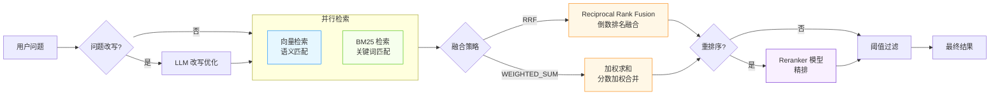
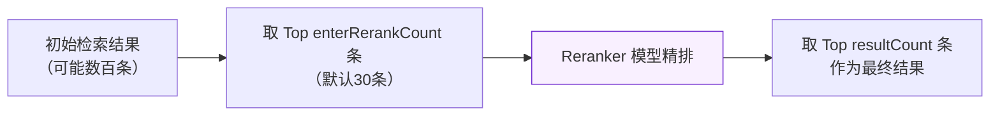
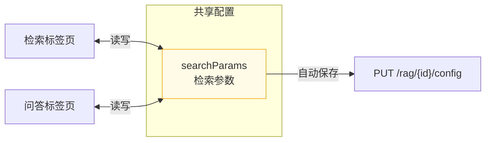

# 检索配置

检索是 RAG 流水线中连接知识库与大模型的关键环节。Snail AI 提供了**混合检索**方案，同时运用向量语义检索和 BM25 关键词检索，并通过融合排序和重排序机制，最大化检索的准确性和召回率。

## 检索架构

<!-- screenshot: rag-search-config.png — 检索配置侧边栏，展示结果数量滑块、问题改写开关、重排序模型选择、阈值过滤、融合策略等参数配置 -->



## 混合检索

混合检索结合了两种互补的检索方式：

### 向量检索（Dense Retrieval）

将用户问题通过 Embedding 模型转换为向量，在向量数据库中进行相似度搜索（如余弦相似度或内积）。

**优势：**
- 理解语义，能匹配意思相近但措辞不同的内容
- 适合自然语言问题

**劣势：**
- 对专有名词、缩写、ID 编号等精确匹配能力较弱

### BM25 检索（Sparse Retrieval）

使用经典的 BM25 算法进行全文关键词检索，基于词频和逆文档频率计算相关性。

**优势：**
- 精确匹配关键词、专有名词、编号等
- 不依赖模型，速度极快

**劣势：**
- 无法理解语义，同义词和改述可能被遗漏

> **提示：** 需要在创建知识库时开启「混合搜索」并配置搜索引擎实例，BM25 检索才会生效。未开启时仅使用向量检索。

## 融合策略

当两路检索返回结果后，需要将它们合并排序。Snail AI 支持两种融合策略：

### RRF（Reciprocal Rank Fusion）

**倒数排名融合**，是目前业界使用最广泛的混合检索融合算法。

**公式：**

```
RRFscore(d) = Σ 1 / (k + rank_i(d))
```

其中 `k` 是平滑参数，`rank_i(d)` 是文档 `d` 在第 `i` 个检索结果中的排名。

**特点：**
- 不依赖分数的绝对值，只使用排名信息
- 对不同检索系统的分数分布差异天然免疫
- 平滑参数 `k` 控制高排名结果的优势程度

| 参数 | 类型 | 默认值 | 范围 | 说明 |
|------|------|--------|------|------|
| `rrfK` | number | 60 | 1 ~ 200 | RRF 平滑参数。值越小，排名靠前的结果优势越大；值越大，排名影响越平均。常用值 60 |

### WEIGHTED_SUM（加权求和）

**加权分数融合**，直接对两路检索的相似度分数进行加权求和。

**公式：**

```
FinalScore(d) = denseWeight * vectorScore(d) + (1 - denseWeight) * bm25Score(d)
```

| 参数 | 类型 | 默认值 | 范围 | 说明 |
|------|------|--------|------|------|
| `denseWeight` | number | 0.5 | 0 ~ 1 | 向量检索分数的权重。0.5 表示两路等权重；0.7 表示偏重语义检索；0.3 表示偏重关键词检索 |

**权重调优建议：**

| 场景 | 推荐权重 | 说明 |
|------|----------|------|
| 通用文档问答 | 0.5 ~ 0.6 | 平衡语义和关键词 |
| 专业术语密集 | 0.3 ~ 0.4 | 偏重 BM25 精确匹配 |
| 自然语言问答 | 0.6 ~ 0.8 | 偏重向量语义理解 |

### 策略选择建议

| 维度 | RRF | WEIGHTED_SUM |
|------|-----|--------------|
| 对分数分布的敏感性 | 不敏感（只用排名） | 敏感（直接用分数） |
| 调参难度 | 低（k=60 通常就很好） | 中（需要根据场景调整权重） |
| 适用场景 | 通用场景首选 | 需要精细控制两路权重时 |
| 推荐度 | 推荐 | 高级用户 |

## 检索参数

### 基础参数

| 参数 | 类型 | 默认值 | 范围 | 说明 |
|------|------|--------|------|------|
| `resultCount` | number | 20 | 1 ~ 500 | 最终返回的检索结果数量。值越大召回越全但可能引入噪声 |

### 问题改写（questionRewrite）

| 参数 | 类型 | 默认值 | 说明 |
|------|------|--------|------|
| `questionRewrite` | boolean | false | 是否在检索前使用 LLM 对用户问题进行改写优化 |

**工作原理：** 将用户的原始问题发送给对话模型，让模型基于上下文和语义理解，将问题改写为更适合检索的形式。

**示例：**

| 原始问题 | 改写后 |
|----------|--------|
| "怎么退货" | "退货流程是什么？退货申请的步骤和条件有哪些？" |
| "AI 那个东西" | "AI 人工智能技术是什么？有哪些应用场景？" |

### 重排序（Reranking）

重排序使用专门的 Reranker 模型对初始检索结果进行二次精排。Reranker 模型直接评估「问题-文档对」的相关性，比纯向量相似度更准确。

| 参数 | 类型 | 默认值 | 范围 | 说明 |
|------|------|--------|------|------|
| `rerankEnabled` | boolean | false | - | 是否启用重排序 |
| `rerankModelId` | number | - | - | Reranker 模型 ID，从系统已配置的 RERANKER 类型模型中选择 |
| `enterRerankCount` | number | 30 | 1 ~ 500 | 进入重排序的候选数量。初始检索结果中取 Top N 条送入 Reranker |



**调优建议：**
- `enterRerankCount` 应大于 `resultCount`，推荐 2~3 倍
- Reranker 候选数越多，精排质量越好，但耗时也越长
- 最小值为 1，最大值为 500

### 阈值过滤（Threshold）

| 参数 | 类型 | 默认值 | 范围 | 说明 |
|------|------|--------|------|------|
| `thresholdEnabled` | boolean | false | - | 是否启用相似度阈值过滤 |
| `threshold` | number | 0.5 | 0 ~ 1 | 相似度阈值，低于此分数的结果将被过滤 |

**调优建议：**
- 0.3 ~ 0.5：宽松过滤，保留更多结果
- 0.5 ~ 0.7：标准过滤
- 0.7 ~ 0.9：严格过滤，只保留高相关结果

> **注意：** 阈值过高可能导致所有结果被过滤，返回空结果集。建议先在调试模式下观察分数分布后再设定阈值。

## 检索调试

检索调试功能用于测试和优化检索参数。在知识库详情页的「检索」标签页中，输入测试问题并点击搜索，即可查看检索结果和详细的性能指标。

<!-- screenshot: rag-search-debug.png — 检索调试界面，上方显示搜索输入框，中部显示各阶段耗时标签（Embedding、Vector、BM25、Fusion、Rerank、Total），下方展示检索结果列表（每条包含序号、相似度、来源文档、内容预览） -->

### 调试指标

搜索请求需要设置 `debug: true` 来获取详细的性能指标：

```
POST /rag/search
Content-Type: application/json

{
  "ragId": 1,
  "query": "如何配置知识库检索参数",
  "debug": true
}
```

返回的 `metrics` 对象包含各阶段的耗时和命中数：

| 指标 | 单位 | 说明 |
|------|------|------|
| `embeddingMs` | ms | Embedding 模型向量化用户问题的耗时 |
| `vectorSearchMs` | ms | 向量数据库检索耗时 |
| `vectorHitCount` | 条 | 向量检索命中数量 |
| `bm25SearchMs` | ms | BM25 全文检索耗时（未开启混合搜索时为 0） |
| `bm25HitCount` | 条 | BM25 检索命中数量 |
| `fusionMs` | ms | 融合排序耗时 |
| `finalCount` | 条 | 融合后的结果数量 |
| `rerankMs` | ms | Reranker 模型重排序耗时（未开启时为 0） |
| `totalMs` | ms | 端到端总耗时 |

**示例返回：**

```json
{
  "results": [
    {
      "chunkId": 42,
      "content": "检索参数配置包括结果数量、融合策略...",
      "score": 0.873,
      "documentId": 5,
      "documentName": "RAG使用指南.pdf"
    }
  ],
  "metrics": {
    "embeddingMs": 85,
    "vectorSearchMs": 12,
    "vectorHitCount": 50,
    "bm25SearchMs": 8,
    "bm25HitCount": 35,
    "fusionMs": 3,
    "finalCount": 62,
    "rerankMs": 156,
    "totalMs": 264
  }
}
```

### 调试面板指标展示

调试面板使用彩色标签展示各阶段耗时：

| 标签颜色 | 指标 | 说明 |
|----------|------|------|
| 蓝色 | Embedding | 向量化耗时 |
| 绿色 | Vector | 向量检索耗时和命中数 |
| 黄色 | BM25 | 全文检索耗时和命中数 |
| 灰色 | Fusion | 融合排序耗时和最终数量 |
| 蓝色 | Rerank | 重排序耗时（仅开启时显示） |
| 红色 | Total | 端到端总耗时 |

### 检索结果

每条检索结果包含：

| 字段 | 说明 |
|------|------|
| 排名序号 | 按相关性排序的序号 |
| 相似度 | 相关性分数，以百分比显示 |
| 来源文档 | 该分片所属的文档名称 |
| 内容 | 分片的文本内容 |

## 参数配置联动

检索参数配置在「检索」和「问答」两个标签页之间是**共享的**。在检索标签页调整的参数会自动同步到问答标签页，反之亦然。配置修改后自动保存（1 秒防抖）。



## 完整参数一览

| 参数 | 默认值 | 作用 |
|------|--------|------|
| `resultCount` | 20 | 返回结果数量 |
| `questionRewrite` | false | 问题改写 |
| `rerankEnabled` | false | 启用重排序 |
| `rerankModelId` | - | Reranker 模型 |
| `enterRerankCount` | 30 | 进入重排数量 |
| `thresholdEnabled` | false | 启用阈值过滤 |
| `threshold` | 0.5 | 相似度阈值 |
| `fusionStrategy` | `RRF` | 融合策略 |
| `denseWeight` | 0.5 | 向量权重（WEIGHTED_SUM 时） |
| `rrfK` | 60 | RRF 平滑参数 |
