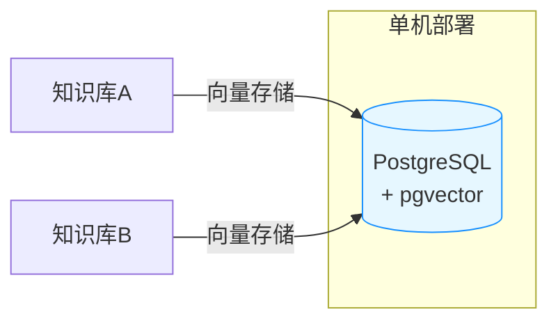
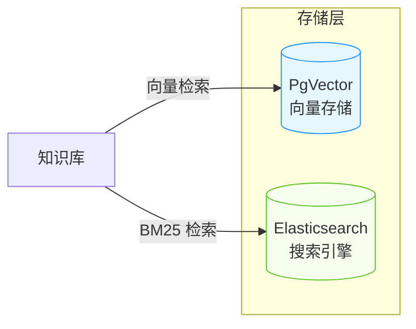
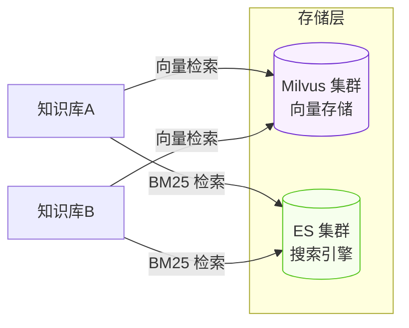

# 存储实例管理

存储实例是 RAG 知识库的底层基础设施。每个知识库需要绑定一个**向量存储**实例用于存放文档向量，如果开启混合搜索还需要绑定一个**搜索引擎**实例用于 BM25 全文检索。

<!-- screenshot: rag-store-instance.png — 存储实例管理抽屉，顶部展示「向量存储」和「搜索引擎」两个 Tab 切换，中部展示实例列表表格（名称、类型、状态、是否默认），底部展示创建/编辑实例的嵌套抽屉表单 -->

## 实例分类

存储实例分为两大类：

| 分类 | 编码 | 说明 |
|------|------|------|
| **向量存储** | `VECTOR_STORE` | 存储文档向量，支持向量相似度检索 |
| **搜索引擎** | `SEARCH_ENGINE` | 存储文档全文，支持 BM25 关键词检索 |

页面顶部使用 Segment Tab 切换两个分类，每个分类独立展示其实例列表。

## 支持的存储类型

### 向量存储（VECTOR_STORE）

| 类型 | 编码 | 说明 |
|------|------|------|
| **PgVector** | `PG_VECTOR` | PostgreSQL 向量扩展，利用已有 PG 数据库，部署成本最低 |
| **Milvus** | `MILVUS` | 专业分布式向量数据库，支持亿级向量，适合大规模生产 |
| **Elasticsearch** | `ELASTICSEARCH` | ES 8.x+ 支持向量检索，同时兼顾全文搜索 |

### 搜索引擎（SEARCH_ENGINE）

| 类型 | 编码 | 说明 |
|------|------|------|
| **Elasticsearch** | `ELASTICSEARCH` | 业界主流全文搜索引擎，BM25 检索能力强大 |
| **PG Fulltext** | `PG_FULLTEXT` | 基于 PostgreSQL 的全文搜索，轻量级方案（开发中） |

> **提示：** Elasticsearch 同时支持向量存储和搜索引擎两种分类。如果选用 ES 作为向量存储，可以用同一套 ES 集群同时充当搜索引擎，简化部署架构。

## 实例管理

### 创建实例

点击「新建实例」按钮，在嵌套抽屉中填写以下信息：

| 字段 | 必填 | 说明 |
|------|------|------|
| 实例名称 | 是 | 自定义名称，便于识别 |
| 存储类型 | 是 | 根据当前分类自动过滤可选类型 |
| 连接配置 | 是 | 根据存储类型动态渲染不同的配置字段 |
| 设为默认 | 否 | 新建知识库时自动选用该实例 |

### 连接配置

不同存储类型需要配置不同的连接参数：

#### PgVector 配置

| 参数 | 类型 | 默认值 | 说明 |
|------|------|--------|------|
| `host` | string | `localhost` | PostgreSQL 主机地址 |
| `port` | number | `5432` | 端口号 |
| `database` | string | `snail_ai` | 数据库名称 |
| `username` | string | - | 数据库用户名 |
| `password` | password | - | 数据库密码 |
| `sslEnabled` | boolean | `false` | 是否启用 SSL 连接 |

**前置条件：** PostgreSQL 需要安装 `pgvector` 扩展：

```sql
CREATE EXTENSION IF NOT EXISTS vector;
```

#### Milvus 配置

| 参数 | 类型 | 默认值 | 说明 |
|------|------|--------|------|
| `host` | string | `localhost` | Milvus 服务地址 |
| `port` | number | `19530` | gRPC 端口号 |
| `token` | password | - | 认证 Token（Milvus Cloud 或启用认证时需要） |
| `database` | string | `default` | 数据库名称 |

#### Elasticsearch 配置

| 参数 | 类型 | 默认值 | 说明 |
|------|------|--------|------|
| `host` | string | `localhost` | ES 节点地址 |
| `port` | number | `9200` | HTTP 端口号 |
| `scheme` | select | `http` | 协议类型：`http` 或 `https` |
| `username` | string | - | 用户名（开启认证时需要） |
| `password` | password | - | 密码 |

**版本要求：** Elasticsearch 8.x 以上才支持 kNN 向量检索功能。

#### PG Fulltext 配置

| 参数 | 类型 | 默认值 | 说明 |
|------|------|--------|------|
| `host` | string | `localhost` | PostgreSQL 主机地址 |
| `port` | number | `5432` | 端口号 |
| `database` | string | `snail_ai` | 数据库名称 |
| `username` | string | - | 数据库用户名 |
| `password` | password | - | 数据库密码 |

### 连接测试

填写连接配置后，点击「测试连接」按钮验证配置是否正确：

```
POST /store-instance/test
Content-Type: application/json

{
  "type": "PG_VECTOR",
  "config": {
    "host": "localhost",
    "port": 5432,
    "database": "snail_ai",
    "username": "postgres",
    "password": "your_password",
    "sslEnabled": false
  }
}
```

| 结果 | 说明 |
|------|------|
| 连接成功 | 配置正确，可以保存实例 |
| 连接失败 | 检查网络连通性、地址端口、认证信息是否正确 |

> **建议：** 每次创建或修改实例配置后，务必先进行连接测试再保存。

### 编辑实例

在实例列表中点击「编辑」按钮，即可在抽屉中修改实例配置。修改后的连接参数会在下次使用时生效。

> **注意：** 如果已有知识库正在使用该实例，修改连接配置可能影响正在进行的文档处理任务。

### 删除实例

在实例列表中点击「删除」按钮并确认：

```
DELETE /store-instance/{id}
```

> **注意：** 如果有知识库正在使用该实例，删除前需要先将相关知识库切换到其他实例。

## 默认实例

每个分类下可以设置一个**默认实例**。创建知识库时，系统会自动填充默认的向量存储和搜索引擎实例，减少重复选择。

在创建或编辑实例时，开启「设为默认」开关即可：

| 字段 | 说明 |
|------|------|
| `isDefault` | 设为 `true` 后，该实例成为所属分类的默认实例。同一分类下只有一个默认实例 |

## 实例状态

| 状态 | 编码 | 说明 |
|------|------|------|
| **启用** | `ACTIVE` | 正常使用状态 |
| **停用** | `INACTIVE` | 已停用，不可被新知识库选用 |

## 部署架构建议

### 轻量部署（个人/小团队）



使用 PostgreSQL + pgvector 扩展，一个数据库同时承担业务数据和向量存储，部署最简单。

### 标准部署（中小企业）



PgVector 负责向量存储，Elasticsearch 负责 BM25 全文检索，开启混合搜索获得最佳检索效果。

### 大规模部署（大型企业）



Milvus 集群处理亿级向量，Elasticsearch 集群承担全文检索，适合大数据量场景。

## API 接口汇总

| 接口 | 方法 | 说明 |
|------|------|------|
| `/store-instance` | GET | 获取实例列表，支持 `category` 参数过滤 |
| `/store-instance/page` | GET | 分页查询实例列表 |
| `/store-instance/{id}` | GET | 获取实例详情 |
| `/store-instance` | POST | 创建实例 |
| `/store-instance/{id}` | PUT | 更新实例 |
| `/store-instance/{id}` | DELETE | 删除实例 |
| `/store-instance/test` | POST | 测试连接 |

### 创建实例请求示例

```json
{
  "name": "生产环境 PgVector",
  "category": 1,
  "type": 1,
  "config": {
    "host": "pg.example.com",
    "port": 5432,
    "database": "snail_ai",
    "username": "postgres",
    "password": "your_password",
    "sslEnabled": true
  },
  "isDefault": true
}
```

> **注意：** API 请求中 `category` 和 `type` 使用数字编码：
>
> | 字段 | 数字 | 文本 |
> |------|------|------|
> | category | `1` | `VECTOR_STORE` |
> | category | `2` | `SEARCH_ENGINE` |
> | type | `1` | `PG_VECTOR` |
> | type | `2` | `MILVUS` |
> | type | `3` | `ELASTICSEARCH` |
> | type | `4` | `PG_FULLTEXT` |
