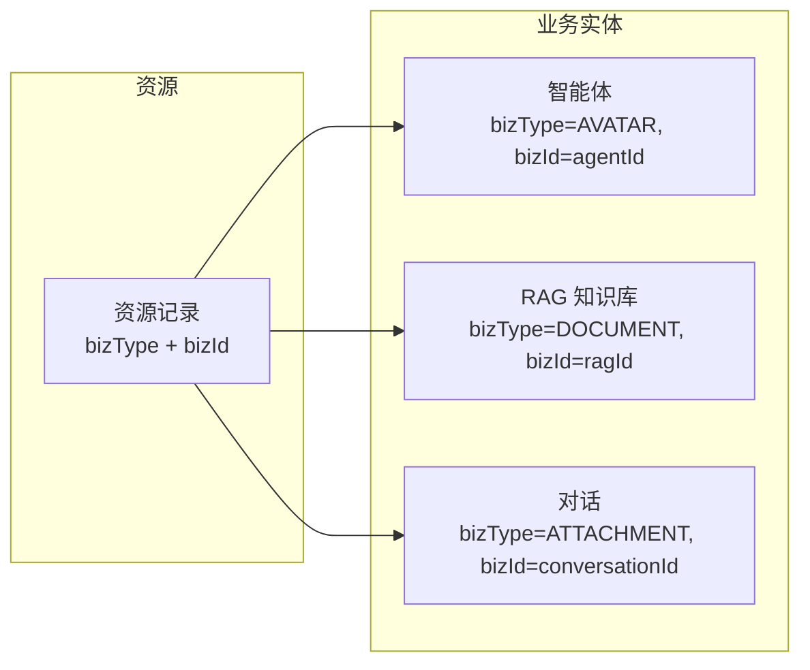
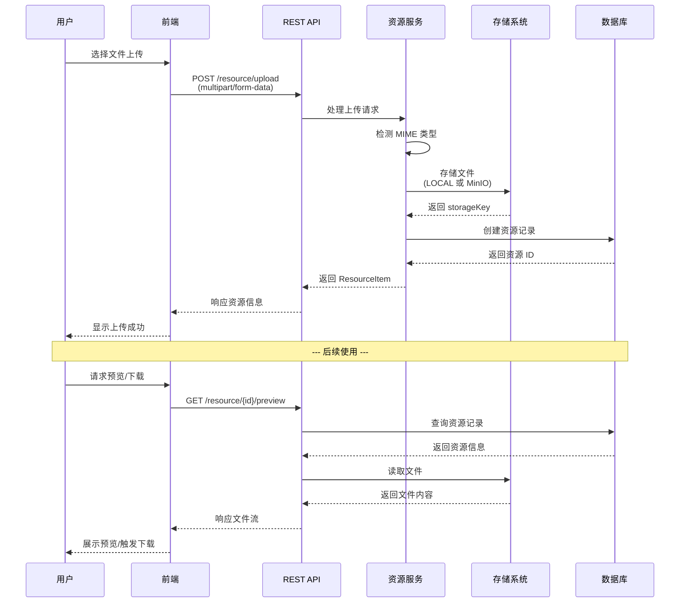

# 资源管理

资源管理模块为 Snail AI 平台提供统一的文件存储与管理能力，涵盖文件上传、下载、预览和生命周期管理。所有需要文件存储的功能模块（智能体头像、RAG 文档、对话附件等）均通过资源管理模块进行统一处理。

## 核心概念

### 资源实体

每个上传到系统的文件都会创建一条资源记录（Resource），包含以下核心属性：

| 字段 | 说明 |
|------|------|
| **id** | 资源唯一 ID，系统自动生成 |
| **storageKey** | 文件在存储系统中的唯一标识键 |
| **originalName** | 文件原始名称（用户上传时的文件名） |
| **fileSize** | 文件大小（字节） |
| **mimeType** | 文件 MIME 类型，系统自动检测 |
| **storageType** | 存储类型：LOCAL 或 MINIO |
| **accessUrl** | 文件访问 URL |
| **bizType** | 业务类型标识 |
| **bizId** | 关联的业务实体 ID |
| **creatorId** | 上传者用户 ID |
| **createDt** | 创建时间 |

### 资源类型 (Resource Type)

Snail AI 根据文件的用途将资源分为以下类型：

| 资源类型 | 标识 | 说明 | 典型使用场景 |
|----------|------|------|-------------|
| **头像** | `AVATAR` | 智能体或用户的头像图片 | 智能体配置页上传头像 |
| **附件** | `ATTACHMENT` | 对话过程中上传的文件附件 | 用户在对话中发送的图片、文档等 |
| **文档** | `DOCUMENT` | RAG 知识库中的源文档 | 知识库文档上传和管理 |
| **通用** | `GENERAL` | 其他通用文件 | 系统配置文件、导入导出文件等 |

### 业务关联 (Biz Type / Biz ID)

资源管理通过 `bizType`（业务类型）和 `bizId`（业务实体 ID）两个字段实现资源与业务实体的关联，使得每个资源都有明确的归属：



#### 关联示例

| 场景 | bizType | bizId | 说明 |
|------|---------|-------|------|
| 智能体头像 | `AVATAR` | 智能体 ID | 头像图片关联到对应的智能体 |
| RAG 文档 | `DOCUMENT` | 知识库 ID | 源文档关联到所属的 RAG 知识库 |
| 对话附件 | `ATTACHMENT` | 会话 ID | 附件关联到对应的对话会话 |
| 通用资源 | `GENERAL` | null | 不关联任何业务实体 |

## 存储类型

Snail AI 支持两种文件存储方式，可根据部署环境和需求灵活选择。

### LOCAL（本地文件系统）

| 属性 | 说明 |
|------|------|
| **存储方式** | 文件直接存储在服务端所在主机的文件系统中 |
| **适用场景** | 开发环境、单机部署、文件量较小的场景 |
| **优势** | 配置简单，无需额外依赖 |
| **劣势** | 不支持多节点共享访问，无内置冗余 |
| **访问方式** | 通过服务端 API 代理访问 |

本地存储的文件通过 `/resource/{id}/preview` 和 `/resource/{id}/download` 接口进行访问，服务端负责读取本地文件并返回给客户端。

### MinIO（对象存储）

| 属性 | 说明 |
|------|------|
| **存储方式** | 文件存储到 MinIO 对象存储服务 |
| **适用场景** | 生产环境、分布式部署、大量文件存储 |
| **优势** | 支持分布式存储和多节点访问，高可用、可扩展 |
| **劣势** | 需要部署和维护 MinIO 服务 |
| **访问方式** | 可通过 MinIO 直接访问或通过服务端代理访问 |

::: tip 存储选择建议
- **开发和测试环境**：使用 LOCAL 本地存储即可，配置简单快速
- **生产环境**：推荐使用 MinIO 对象存储，确保文件的高可用和分布式访问
- **混合部署**：可以根据文件类型选择不同的存储，如头像存本地、文档存 MinIO
:::

## MIME 类型检测

资源管理模块在文件上传时自动检测文件的 MIME 类型，用于：

- **文件预览**：根据 MIME 类型选择合适的预览方式（图片直接展示、PDF 在线预览等）
- **文件图标**：在列表中根据 MIME 类型显示对应的文件类型图标
- **安全校验**：防止上传不允许的文件类型
- **下载响应头**：设置正确的 `Content-Type` 响应头

常见的 MIME 类型映射：

| 文件类型 | MIME 类型 |
|----------|-----------|
| PNG 图片 | `image/png` |
| JPEG 图片 | `image/jpeg` |
| PDF 文档 | `application/pdf` |
| Word 文档 | `application/vnd.openxmlformats-officedocument.wordprocessingml.document` |
| Excel 表格 | `application/vnd.openxmlformats-officedocument.spreadsheetml.sheet` |
| Markdown | `text/markdown` |
| 纯文本 | `text/plain` |
| CSV | `text/csv` |

## 功能操作

### 上传资源

上传文件到资源管理系统，支持指定业务类型和业务 ID 进行关联。

**API 接口：**

```
POST /resource/upload
Content-Type: multipart/form-data
```

**请求参数：**

| 参数 | 类型 | 必填 | 说明 |
|------|------|------|------|
| `file` | File | 是 | 上传的文件 |
| `bizType` | string | 否 | 业务类型（AVATAR / ATTACHMENT / DOCUMENT / GENERAL） |
| `bizId` | number | 否 | 关联的业务实体 ID |

**响应示例：**

```json
{
  "id": 42,
  "storageKey": "2025/01/15/abc123def456.png",
  "originalName": "agent-avatar.png",
  "fileSize": 102400,
  "mimeType": "image/png",
  "storageType": "MINIO",
  "accessUrl": "https://minio.example.com/snail-ai/2025/01/15/abc123def456.png",
  "bizType": "AVATAR",
  "bizId": 1,
  "creatorId": 1,
  "createDt": "2025-01-15 10:30:00"
}
```

### 下载资源

下载指定 ID 的资源文件，以 Blob 形式返回。

**API 接口：**

```
GET /resource/{id}/download
```

下载接口需要携带认证 Token（`Snail-Ai-Auth` 请求头），返回文件的二进制内容。

### 预览资源

预览指定 ID 的资源文件。对于图片等可直接预览的文件类型，直接返回文件内容；对于其他类型则返回文件元信息。

**API 接口：**

```
GET /resource/{id}/preview
```

前端会根据文件的存储类型生成完整的预览 URL：
- 如果 `accessUrl` 以 `http` 开头（MinIO 直接访问），直接使用该 URL
- 否则通过服务端代理接口 `/resource/{id}/preview` 获取

### 删除资源

删除指定 ID 的资源记录及其对应的存储文件。

**API 接口：**

```
DELETE /resource/{id}
```

::: warning 注意
删除资源操作不可逆。删除后，关联的物理文件也会从存储系统中移除。请确认该资源不再被任何业务实体引用后再执行删除。
:::

### 分页查询

查询资源列表，支持多维度筛选条件。

**API 接口：**

```
GET /resource/page
```

**查询参数：**

| 参数 | 类型 | 说明 |
|------|------|------|
| `page` | number | 页码 |
| `size` | number | 每页大小 |
| `bizType` | string | 按业务类型筛选 |
| `bizId` | number | 按业务实体 ID 筛选 |
| `originalName` | string | 按文件名模糊搜索 |
| `datetimeRange` | [string, string] | 按创建时间范围筛选 |

## 数据流程

以下展示了一个文件从上传到使用的完整流程：



## 与其他模块的集成

资源管理作为平台的基础设施模块，被多个业务模块所依赖：

| 使用模块 | 集成方式 | 说明 |
|----------|----------|------|
| **智能体管理** | 通过 `bizType=AVATAR` 管理头像 | 创建/编辑智能体时上传头像图片 |
| **RAG 知识库** | 通过 `bizType=DOCUMENT` 管理源文档 | 知识库文档的上传、预览和下载 |
| **对话交互** | 通过 `bizType=ATTACHMENT` 管理附件 | 对话中上传的图片和文件 |
| **用户管理** | 通过 `bizType=AVATAR` 管理用户头像 | 用户个人信息中的头像上传 |

## 下一步

- [智能体管理](/guide/agent/) -- 了解如何为智能体上传头像
- [RAG 知识库](/guide/rag/) -- 了解知识库文档的上传和管理
- [用户管理](/guide/user/) -- 管理系统用户
