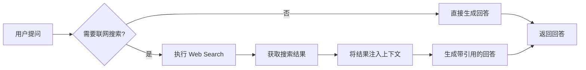
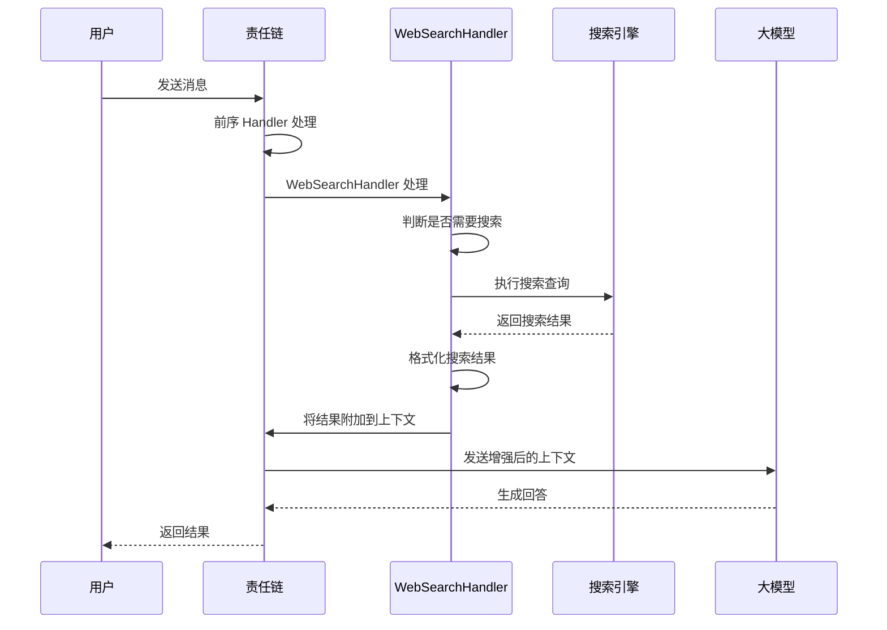
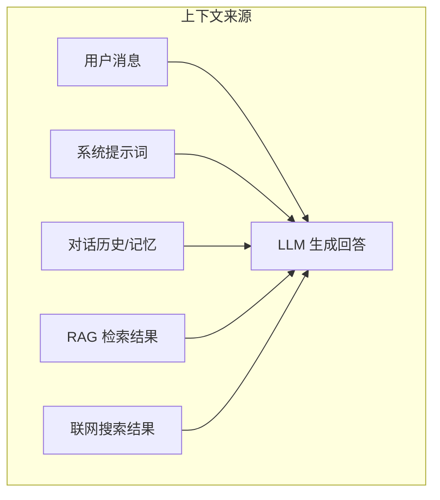

# 联网搜索

联网搜索（Web Search）是 Snail AI 智能体的一项可选能力，启用后允许智能体在对话过程中实时检索互联网信息，将搜索结果作为上下文参考纳入 AI 的回答中。这使得智能体能够回答需要最新信息的问题，突破大模型训练数据的时效性限制。

## 核心概念

### 什么是联网搜索？

在传统的 AI 对话中，大模型只能基于其训练数据中的知识进行回答，无法获取最新的实时信息。联网搜索功能为智能体添加了"上网查资料"的能力：



### 工作原理

联网搜索通过 Snail AI 的**责任链架构（Responsibility Chain）**实现。在智能体的对话处理链中，`WebSearchHandler` 作为一个独立的处理节点参与对话流程：



### WebSearchHandler 在责任链中的位置

Snail AI 的智能体对话采用责任链模式处理，每个 Handler 按顺序处理用户的消息。`WebSearchHandler` 通常位于 RAG 检索和 LLM 调用之间：

```
用户消息 → 输入预处理 → 记忆召回 → RAG 检索 → 联网搜索 → LLM 调用 → 输出后处理 → 返回响应
```

`WebSearchHandler` 的职责是：

1. **判断搜索必要性**：分析用户问题是否需要实时信息（如新闻、天气、最新数据等）
2. **构造搜索查询**：将用户的自然语言问题转化为适合搜索引擎的查询词
3. **执行搜索**：调用配置的搜索引擎 API 获取搜索结果
4. **结果处理**：提取搜索结果的标题、摘要、URL 等关键信息
5. **上下文注入**：将格式化的搜索结果附加到发送给大模型的上下文中

## 启用联网搜索

### 智能体配置

联网搜索是一个**智能体级别的开关**，可以为每个智能体独立控制是否启用。

在智能体配置页面中：

1. 进入智能体详情页的**编辑配置**标签
2. 在能力模块中找到**联网搜索**选项
3. 切换开关启用或关闭

```typescript
// 智能体配置中的联网搜索字段
type AgentItem = {
  // ... 其他字段
  webSearchEnabled?: boolean;   // 联网搜索开关
};

// 更新智能体时设置联网搜索
type UpdateAgentRequest = {
  // ... 其他字段
  webSearchEnabled?: boolean;   // true = 启用, false = 关闭
};
```

### 配置示例

通过 API 为智能体启用联网搜索：

```
PUT /agent/{agentId}
```

```json
{
  "webSearchEnabled": true
}
```

::: tip 何时启用联网搜索
- **推荐启用**：需要回答时事新闻、实时数据、最新政策等时效性问题的智能体
- **不推荐启用**：专注于内部知识库问答的智能体（已有 RAG），或对回答来源有严格控制要求的场景
:::

## 搜索结果的使用

### 结果融合

当联网搜索启用后，搜索结果会作为额外的上下文信息注入到大模型的 prompt 中。大模型在生成回答时会综合考虑以下信息来源：



### 信息来源优先级

当多种信息来源同时存在时，大模型会根据以下一般性原则综合判断：

| 优先级 | 信息来源 | 说明 |
|--------|----------|------|
| 1 | 系统提示词 | 智能体的核心指令和行为约束 |
| 2 | RAG 知识库 | 企业内部知识，通常比互联网信息更权威 |
| 3 | 联网搜索结果 | 实时互联网信息，提供时效性数据 |
| 4 | 对话历史 | 上下文延续性 |
| 5 | 模型内部知识 | 模型训练数据中的知识 |

::: warning 注意
以上优先级仅为一般性参考。实际回答中，大模型会根据问题的具体内容和上下文自主判断各信息来源的权重。通过优化系统提示词，可以引导模型更倾向于使用特定来源的信息。
:::

### 搜索结果与 RAG 的协同

联网搜索和 RAG 知识库可以同时启用，形成互补：

| 场景 | RAG | Web Search | 效果 |
|------|-----|------------|------|
| 内部文档问答 | 启用 | 关闭 | 仅使用企业内部知识回答 |
| 实时信息查询 | 关闭 | 启用 | 仅使用互联网信息回答 |
| 综合问答 | 启用 | 启用 | 内部知识 + 互联网信息综合回答 |
| 纯模型问答 | 关闭 | 关闭 | 仅依赖模型内部知识 |

## 可观测性

联网搜索的执行过程会被完整记录在追踪数据中。在 Trace 详情的观测树中，可以看到 WebSearchHandler 的执行步骤：

- **输入**：用户的原始问题和构造的搜索查询
- **输出**：搜索引擎返回的结果列表
- **耗时**：搜索请求的网络延迟和处理时间
- **状态**：搜索是否成功

通过可观测性数据，可以分析联网搜索对智能体整体响应时间的影响，评估搜索结果的质量和相关性。

## 使用建议

### 提示词优化

当启用联网搜索后，建议在智能体的系统提示词中添加相关指引，帮助模型更好地利用搜索结果：

```
你可以通过联网搜索获取最新信息。在回答中：
1. 优先使用搜索结果中的事实性信息
2. 注明信息来源的可靠性
3. 如果搜索结果与已有知识矛盾，说明两种说法并给出判断
4. 对于无法通过搜索验证的信息，标注为"未经验证"
```

### 性能考量

联网搜索会增加每次对话的响应时间，主要额外耗时来自：

- 搜索引擎 API 的网络延迟（通常 200-1000ms）
- 搜索结果的解析和格式化处理
- 增加的上下文长度导致 LLM 处理时间延长

建议在以下情况下考虑关闭联网搜索：

- 对响应速度有极高要求的实时场景
- 问题类型明确不需要互联网信息的场景
- 网络环境不稳定的部署环境

### 安全与合规

- 联网搜索会向外部搜索引擎发送查询请求，请确保不会泄露敏感信息
- 搜索结果来自互联网，可能包含不准确或有偏见的信息
- 建议在系统提示词中要求模型对搜索结果进行交叉验证
- 对于高安全性要求的场景，建议仅使用 RAG 知识库而非联网搜索

## 下一步

- [智能体管理](/guide/agent/) -- 配置智能体的各项能力
- [RAG 知识库](/guide/rag/) -- 使用内部知识库替代或补充联网搜索
- [可观测性](/guide/observability/) -- 查看联网搜索的追踪数据
