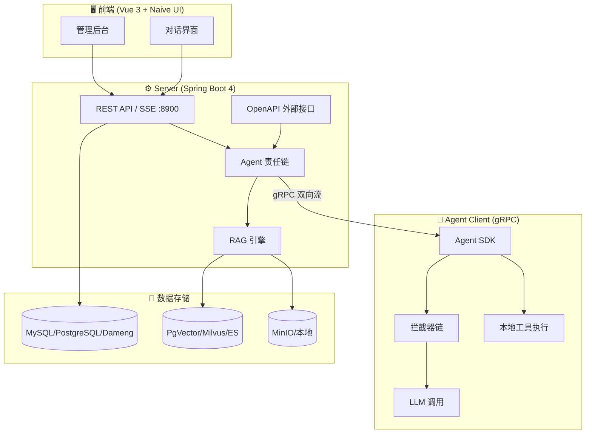

## 系统架构

```mermaid
graph TB
    subgraph 前端["🖥️ 前端 (Vue 3 + Naive UI)"]
        Admin[管理后台]
        Chat[对话界面]
    end

    subgraph 服务端["⚙️ Server (Spring Boot 4)"]
        API[REST API / SSE :8900]
        Chain[Agent 责任链]
        RAG[RAG 引擎]
        OpenAPI[OpenAPI 外部接口]
    end

    subgraph 客户端["🤖 Agent Client (gRPC)"]
        SDK[Agent SDK]
        Interceptor[拦截器链]
        Tools[本地工具执行]
        LLM[LLM 调用]
    end

    subgraph 存储["💾 数据存储"]
        DB[(MySQL/PostgreSQL/Dameng)]
        Vector[(PgVector/Milvus/ES)]
        Storage[(MinIO/本地)]
    end

    Admin --> API
    Chat --> API
    API --> Chain
    Chain -->|gRPC 双向流| SDK
    SDK --> Interceptor --> LLM
    SDK --> Tools
    Chain --> RAG --> Vector
    API --> DB
    OpenAPI --> Chain
    RAG --> Storage
```
